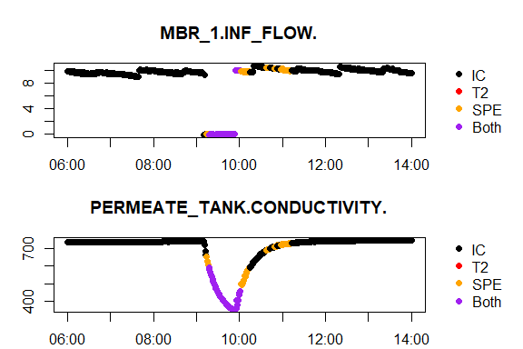
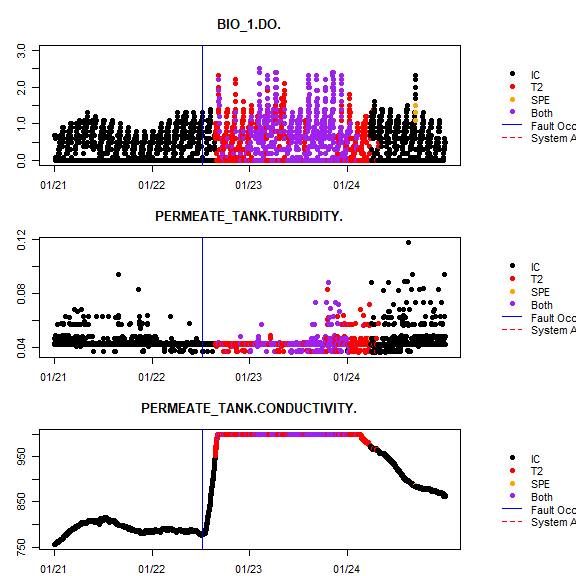

# Data compiling
```{r Case Study Data Compiler, message=FALSE, warning=FALSE, include=FALSE}
rm(list=ls())
library(mvMonitoringv2)
library(ADPCA)

keyword = "testing"
testingDay = as.Date("2018 01 01", format = "%Y %m %d")
days = 7
rollingWindowDays = 7
testMT = TRUE
alphaN = 0.01
statistic = "T2"
by = 1000

case_study_data_compiler <- function(keyword = "testing", testingDay = as.Date("2018 01 01", format = "%Y %m %d"), days = 14, rollingWindowDays = 7, testMT = TRUE, alphaN = 0.01, statistic = "T2", by = "Time") {

# keyword = Data file label
# testingDay = Date to be evaluated with ADPCA model
# days = Numer of days/times the program is run
# rollingWindowDays = Number of days to train on
# Install ADPCA package
# devtools::install_github("KNewhart/ADPCA")

# Number of times model is updated 
updateDays <- rollingWindowDays

# Total number of days to be compiled
nDays <- rollingWindowDays + updateDays

# Set working directory (where results files should be saved)
wd <- "C:/Users/Kate Newhart/Dropbox/Newhart ADPCA Paper/R"
setwd(wd)

# Alpha value for statistical analysis
# alphaN <- 0.01 

# Number of successive OC observations to trigger an alarm
faultsToTriggerAlarm <- 5 

## Data processing parameters##
# Set path of SB-MBR data (location of LogAllData folder)
dataLocation <- "C:/Users/Kate Newhart/odrive/Mines/Data/MP_SBMBR_data/"
# Variables from raw data that will be used to define the state of the bioreactor (BR) and the membrane bioreactor (MT, membrane tank). 
stateVarsBR <- c("BIO_1\\CURRENT_PHASE",
                 "BIO_2\\CURRENT_PHASE",
                 "BIO_BLOWER_1\\RUNNING",
                 "BIO_BLOWER_2\\RUNNING")
stateVarsMT <- c("MBR_1\\CURRENT_MODE",
                 "MBR_2\\CURRENT_MODE",
                 "MBR\\CURRENT_FLUX_MODE",
                 "MBR_1\\CURRENT_STATE",
                 "MBR_2\\CURRENT_STATE",
                 "MBR_1_AIR_SCOUR_VALVE\\COMMAND_1",
                 "MBR_2_AIR_SCOUR_VALVE\\COMMAND_STAT")
# Process variables from raw data that will be used for the BR and MT. 
varsBR <- c("BIO_1\\CURRENT_PHASE",
            "BIO_1\\DO\\PROCESS_VALUE",
            "BIO_2\\CURRENT_PHASE",
            "BIO_2\\DO\\PROCESS_VALUE",
            "BIO_BLOWER_1\\FLOW\\PROCESS_VALUE",
            "BIO_BLOWER_1\\RUNNING",
            "BIO_BLOWER_2\\FLOW\\PROCESS_VALUE",
            "BIO_BLOWER_2\\RUNNING",
            "SEWAGE\\FLOW\\PROCESS_VALUE",
            "SEWAGE\\LEVEL\\PROCESS_VALUE",
            "AMBIENT_TEMP\\PROCESS_VALUE",
            "BIO_1\\LEVEL\\PROCESS_VALUE",
            "BIO_1\\TEMPERATURE\\PROCESS_VALUE",
            "BIO_2\\LEVEL\\PROCESS_VALUE",
            "BIO_2\\TEMPERATURE\\PROCESS_VALUE",
            "RAS_TROUGH\\PH\\PROCESS_VALUE",
            "RAS_TROUGH\\TSS\\PROCESS_VALUE",
            "RAS_TROUGH\\TEMPERATURE\\PROCESS_VALUE")
varsMT <- c("MBR_1\\CURRENT_MODE",
            "MBR_1\\PERM_FLOW\\PROCESS_VALUE",
            "MBR_1\\PERM_PRESS\\PROCESS_VALUE",
            "MBR_2\\CURRENT_MODE",
            "MBR_2\\PERM_FLOW\\PROCESS_VALUE",
            "MBR_2\\PERM_PRESS\\PROCESS_VALUE",
            "MBR\\AIR_SCOUR_FLOW\\PROCESS_VALUE_TANK_1",
            "MBR\\AIR_SCOUR_FLOW\\PROCESS_VALUE_TANK_2",
            "MBR\\CURRENT_FLUX_MODE",
            "MBR_1\\CURRENT_STATE",
            "MBR_2\\CURRENT_STATE",
            "MBR_1\\TRANS_PRESS\\PROCESS_VALUE",
            "MBR_2\\TRANS_PRESS\\PROCESS_VALUE",
            "RAS_TROUGH\\TEMPERATURE\\PROCESS_VALUE",
            "MBR\\AIR_SCOUR_PRESSURE\\PROCESS_VALUE_1",
            "MBR\\AIR_SCOUR_PRESSURE\\PROCESS_VALUE_2",
            "MBR_1_AIR_SCOUR_VALVE\\COMMAND_1",
            "MBR_2_AIR_SCOUR_VALVE\\COMMAND_STAT",
            "MBR\\AIR_SCOUR_PRESSURE\\PROCESS_VALUE",
            "RAS_TROUGH\\DO\\PROCESS_VALUE",
            "RAS_TROUGH\\PH\\PROCESS_VALUE",
            "RAS_TROUGH\\TSS\\PROCESS_VALUE",
            "PERMEATE_TANK\\CONDUCTIVITY\\PROCESS_VALUE",
            "PERMEATE_TANK\\LEVEL\\PROCESS_VALUE",
            "BIO_2\\TSS\\PROCESS_VALUE",
            "BIO_1\\TSS\\PROCESS_VALUE",
            "MBR_1\\INF_FLOW\\PROCESS_VALUE",
            "MBR_1\\LEVEL\\PROCESS_VALUE",
            "MBR_2\\INF_FLOW\\PROCESS_VALUE",
            "MBR_2\\LEVEL\\PROCESS_VALUE",
            "PERMEATE_TANK\\TURBIDITY\\PROCESS_VALUE")


# Collection of alarms throughout all days/times the program is run
just.alarms <- list()
# Set original testing day (i.e., start of loop)
testingDay.org <- testingDay
# Set true or false: enough data to test membranes?

i <- 1

for (i in 1:days) {
  
  # Move testing day forward one day in loop
  testingDay <- testingDay.org + i - 1
  
  # Initialize list of in-control data
  testedData.list <- list()
  
  # If not the initial run of the loop, load previous iternation's results
  if (i != 1) {
    load(file = "trainingDataBR.R")
    load(file = "trainingDataSS.R")
    
    # If there are sufficient observations to include the membrane sub-system, load membrane results too.
      if (testMT) {
        load(file = "trainingDataMT.R")
        trainingData.list <- list(trainingDataSS, trainingDataBR, trainingDataMT)
        alarmData.list <- list(alarmDataSS, alarmDataBR, alarmDataMT)
      } else {
        trainingData.list <- list(trainingDataSS, trainingDataBR)
        alarmData.list <- list(alarmDataSS, alarmDataBR)
      }
    
    # Initialize list of in-control observations for each sub-system
    index.list <- list()
    # For each sub-system in the trainingData.list object:
    for (k in 1:length(trainingData.list)) {
      # Merge different states
      if (is.list(trainingData.list[[k]][[1]][[1]])) {
        blah <- do.call("merge",trainingData.list[[k]][[1]][[1]])
      } else {
        blah <- trainingData.list[[k]][[1]]
      }
      # Keep timestamps
      index.blah <- index(blah)
      # Identify the alarm column
      alarm.col <- which(colnames(alarmData.list[[k]]) == "Alarm")
      # Only keep clean data
      index.blah <- c(index.blah, index(alarmData.list[[k]][which(alarmData.list[[k]][,alarm.col] == 0),]))
      # Add to list of in-control timestamps for each sub-system (objects in list)
      index.list[[k]] <- index.blah
    }
  }
  
  ### Compile & clean raw data
  # loadandcleanDBF returns a dataframe with all days including column names
  rawData <- loadandcleanDBF(dataLocation, testingDay, nDays)
  # convert to xts
  rawData <- xts(rawData[,-1], order.by = rawData[,1])
  rawData <- rawData[paste("/",testingDay,sep="")]
  # Subset data into BR and and MT
  dataBR <- rawData[,varsBR]
  if (testMT) dataMT <- rawData[,varsMT]
  # Clean single state data
  uniqueData <- uniquenessCheck(rawData)
  # Generate 'labelCol'
  uniqueData <- cbind(uniqueData, rep(1,nrow(uniqueData)))
  colnames(uniqueData)[ncol(uniqueData)] <- "labelCol"
  
  if (length(testedData.list) != 0) {
    index.ss <- index.list[[1]][which(index.list[[1]] > paste(testingDay - nDays))]
    if (range(index.ss)[1] > (paste(testingDay - nDays))) {
      index.unique <- index(uniqueData)
      index.unique.before <- index.unique[which(index.unique < range(index.ss)[1])]
      index.ss <- c(index.unique.before, index.ss)
    }
    index.br <- index.list[[2]][which(index.list[[2]] > paste(testingDay - nDays))]
    if (testMT) index.mt <- index.list[[3]][which(index.list[[3]] > paste(testingDay - nDays))]
    
  } else {
    index.ss <- index(uniqueData)
    index.br <- index(rawData)
    if (testMT) index.mt <- index(rawData)
  }

  ### Train ADPCA model
  ### Run multistate function for BR and MT, return xts with test data
  trainingDataBR <- multistate_train(rawData = rawData[index.br],
                                     vars = varsBR,
                                     stateVars = stateVarsBR,
                                     testingDay = testingDay,
                                     rollingWindowDays = rollingWindowDays,
                                     alphaN = alphaN,
                                     faultsToTriggerAlarm = faultsToTriggerAlarm,
                                     statistic = statistic,
                                     by = by)
  if (testMT) {
    trainingDataMT <- multistate_train(rawData = rawData[index.mt],
                                       vars = varsMT,
                                       stateVars = stateVarsMT,
                                       testingDay = testingDay,
                                       rollingWindowDays = rollingWindowDays,
                                       alphaN = alphaN,
                                       faultsToTriggerAlarm = faultsToTriggerAlarm,
                                       statistic = statistic,
                                       by=by)
  }
  
  trainingDataSS <- createTrainingSpecs(data = uniqueData[index.ss],
                                        testingDay = testingDay,
                                        rollingWindowDays = rollingWindowDays,
                                        alpha = alphaN,
                                        faultsToTriggerAlarm = faultsToTriggerAlarm,
                                        statistic = statistic,
                                        by = by)
  
  save(trainingDataBR, file = "trainingDataBR.R")
  if (testMT) save(trainingDataMT, file = "trainingDataMT.R")
  save(trainingDataSS, file = "trainingDataSS.R")
  
  # Create states
  dataBR_ls <- stateGenerator(data = dataBR, stateVars = stateVarsBR, testingDay = testingDay, minObs = 1)
  
  if (testMT) dataMT_ls <- stateGenerator(data = dataMT, stateVars = stateVarsMT, testingDay = testingDay, minObs = 1)
  
  states2keepBR <- as.vector(sapply(trainingDataBR[[1]][[1]], function(x) x[1,ncol(x)]))
  if (testMT) states2keepMT <- as.vector(sapply(trainingDataMT[[1]][[1]], function(x) x[1,ncol(x)]))
  
  # Only include states with training data
  filtered.dataBR_ls <- list()
  for (j in 1:length(states2keepBR)) {
    for (k in 1:length(dataBR_ls)) {
      n <- dataBR_ls[[k]]$labelCol[1]
      if (n == states2keepBR[j]) {
        filtered.dataBR_ls <- c(filtered.dataBR_ls, list(dataBR_ls[[k]]))
      } else {}
    }
  }
  
  if (testMT) {
    filtered.dataMT_ls <- list()
    for (j in 1:length(states2keepMT)) {
      for (k in 1:length(dataMT_ls)) {
        n <- dataMT_ls[[k]]$labelCol[1]
        if (n == states2keepMT[j]) {
          filtered.dataMT_ls <- c(filtered.dataMT_ls, list(dataMT_ls[[k]]))
        } else {}
      }
    }
  }
  
  ### Test ADPCA model
  # Test SS
  alarmDataSS <- testNewObs(data = rawData,
                            trainingSpecs = trainingDataSS,
                            testingDay = testingDay,
                            faultsToTriggerAlarm = faultsToTriggerAlarm)

  
  # Test multistate
  alarmDataBR <- multistate_test(data = filtered.dataBR_ls,
                                          trainingSpec_ls = trainingDataBR[[2]][[1]],
                                          testingDay = trainingDataBR[[3]],
                                          faultsToTriggerAlarm = trainingDataBR[[4]])
  
  if (testMT) {
    
      alarmDataMT <- tryCatch({multistate_test(data = filtered.dataMT_ls,
                                            trainingSpec_ls = trainingDataMT[[2]][[1]],
                                            testingDay = trainingDataMT[[3]],
                                            faultsToTriggerAlarm = trainingDataMT[[4]])}
                              , error = function(err) {
                                for (l in 1:length(filtered.dataMT_ls)) {
                                  if (l == 1) {
                                    alarmData <- as.data.frame(filtered.dataMT_ls[[l]])
                                  } else {
                                    alarmData <- fastmerge(alarmData, as.data.frame(filtered.dataMT_ls[[l]]))
                                  }
                                }
                                timestamps <- as.POSIXct(rownames(alarmData), format = "%Y-%m-%d %H:%M:%S")
                                alarmDataMT <- as.xts(alarmData, order.by = timestamps)
                                alarmDataMT <- cbind(alarmDataMT, rep(0,nrow(alarmDataMT)))
                                colnames(alarmDataMT)[ncol(alarmDataMT)] <- "Alarm"
                                return(alarmDataMT)
                              }
                              )
    }
  
  save(alarmDataBR, file = "alarmDataBR.R")
  if (testMT) save(alarmDataMT, file = "alarmDataMT.R")
  save(alarmDataSS, file = "alarmDataSS.R")
  
  if (length(just.alarms) == 0) {
    # Plot to check for normal operating conditions (i.e., good training data)
    graph_rawData(rawData, paste0("results/",keyword))
    
    alarm.col <- which(colnames(alarmDataSS) == "Alarm")
    alarm.row <- which(alarmDataSS[,alarm.col] != 0)
    just.alarms[[1]] <- alarmDataSS[alarm.row, alarm.col]
    
    alarm.col <- which(colnames(alarmDataBR) == "Alarm")
    alarm.row <- which(alarmDataBR[,alarm.col] != 0)
    just.alarms[[2]] <- alarmDataBR[alarm.row, alarm.col]
    
    if (testMT) {
      alarm.col <- which(colnames(alarmDataMT) == "Alarm")
      alarm.row <- which(alarmDataMT[,alarm.col] != 0)
      if (length(alarm.row) != 0) just.alarms[[3]] <- alarmDataMT[alarm.row, alarm.col]
    }
  } else {
    
    alarm.col <- which(colnames(alarmDataSS) == "Alarm")
    alarm.row <- which(alarmDataSS[,alarm.col] != 0)
    if (length(alarm.row) != 0) just.alarms[[1]] <- c(just.alarms[[1]], alarmDataSS[alarm.row, alarm.col])
    
    alarm.col <- which(colnames(alarmDataBR) == "Alarm")
    alarm.row <- which(alarmDataBR[,alarm.col] != 0)
    if (length(alarm.row) != 0) just.alarms[[2]] <- c(just.alarms[[2]], alarmDataBR[alarm.row, alarm.col])
    
    if (testMT) {
      alarm.col <- which(colnames(alarmDataMT) == "Alarm")
      alarm.row <- which(alarmDataMT[,alarm.col] != 0)
      
      if (length(alarm.row) != 0) {
        if (length(just.alarms) == 3) just.alarms[[3]] <- c(just.alarms[[3]], alarmDataMT[alarm.row, alarm.col])
        if (length(just.alarms) < 3) just.alarms[[3]] <- alarmDataMT[alarm.row, alarm.col]
      }
    }
  }
  
  
}

# setwd(wd)

### Compile & clean raw data
# loadandcleanDBF returns a dataframe with all days including column names
rawData <- loadandcleanDBF(dataLocation, testingDay, days)
# convert to xts
rawData <- xts(rawData[,-1], order.by = rawData[,1])
rawData <- rawData[paste("/",testingDay,sep="")]
# Subset data into BR and and MT
dataBR <- rawData[,varsBR]
if (testMT) dataMT <- rawData[,varsMT]
# Clean single state data
uniqueData <- uniquenessCheck(rawData)
# Generate 'labelCol'
uniqueData <- cbind(uniqueData, rep(1,nrow(uniqueData)))
colnames(uniqueData)[ncol(uniqueData)] <- "labelCol"

ss <- merge(uniqueData, just.alarms[[1]])
ss$Alarm[is.na(ss$Alarm)] <- 0
if (length(just.alarms[[2]]) != 0) {
  br <- merge(dataBR, just.alarms[[2]])
  br$Alarm[is.na(br$Alarm)] <- 0
}
if (testMT) mt <- merge(dataMT, just.alarms[[3]])
if (testMT) mt$Alarm[is.na(mt$Alarm)] <- 0

dir.create(file.path(wd, paste0("results/",keyword, " ", rollingWindowDays, " day")), showWarnings = FALSE)
# graph_alarmData(data = ss, keyword = "results/continuous SS")
save(ss, file = paste0("results/",keyword, " ", rollingWindowDays, " day/ss.RData"))
if (length(just.alarms[[2]]) != 0) {
  # graph_alarmData(data = br, keyword = "results/continuous BR")
  save(br, file = paste0("results/",keyword, " ", rollingWindowDays, " day/br.RData"))
}
if (testMT) {
  save(mt, file = paste0("results/",keyword, " ", rollingWindowDays, " day/mt.RData"))
  # graph_alarmData(data = mt, keyword = "results/continuous MT")
} 
}


```

```{r Aug 2018 3 day, eval=FALSE, message=FALSE, warning=FALSE, include=FALSE, paged.print=FALSE}
case_study_data_compiler(keyword = "Aug 2018 T2", testingDay = as.Date("2018 08 15", format = "%Y %m %d"), days = 17, rollingWindowDays = 3, testMT = FALSE, statistic = "T2") # RUN
case_study_data_compiler(keyword = "Aug 2018 SPE", testingDay = as.Date("2018 08 15", format = "%Y %m %d"), days = 17, 
                         rollingWindowDays = 3, testMT=FALSE, statistic = "SPE") #RUN
```

```{r Aug 2018 5 day, eval=FALSE, message=FALSE, warning=FALSE, include=FALSE, paged.print=FALSE}
case_study_data_compiler(keyword = "Aug 2018 T2", testingDay = as.Date("2018 08 15", format = "%Y %m %d"), days = 17, rollingWindowDays = 5, testMT = FALSE, statistic = "T2") # RUN
case_study_data_compiler(keyword = "Aug 2018 SPE", testingDay = as.Date("2018 08 15", format = "%Y %m %d"), days = 17, 
                         rollingWindowDays =5, testMT=FALSE, statistic = "SPE") 
```

```{r Aug 2018 7 day, eval=FALSE, message=FALSE, warning=FALSE, include=FALSE, paged.print=FALSE}
case_study_data_compiler(keyword = "Aug 2018 T2", testingDay = as.Date("2018 08 15", format = "%Y %m %d"), days = 17, rollingWindowDays = 7, testMT = FALSE, statistic = "T2") # RUN
case_study_data_compiler(keyword = "Aug 2018 SPE", testingDay = as.Date("2018 08 15", format = "%Y %m %d"), days = 17, 
                         rollingWindowDays = 7, testMT=FALSE, statistic = "SPE") #
```


```{r Jan 2018 10 day, eval=FALSE, message=FALSE, warning=FALSE, include=FALSE, paged.print=FALSE}
case_study_data_compiler(keyword = "Jan 2018 T2", testingDay = as.Date("2018 01 01", format = "%Y %m %d"), days = 31, rollingWindowDays = 10, statistic = "T2")
case_study_data_compiler(keyword = "Jan 2018 SPE", testingDay = as.Date("2018 01 01", format = "%Y %m %d"), days = 31, rollingWindowDays = 10, statistic = "SPE")

case_study_data_compiler(keyword = "Jan 2018 T2", testingDay = as.Date("2018 01 01", format = "%Y %m %d"), days = 31, rollingWindowDays = 7, statistic = "T2")
case_study_data_compiler(keyword = "Jan 2018 SPE", testingDay = as.Date("2018 01 01", format = "%Y %m %d"), days = 31, rollingWindowDays = 7, statistic = "SPE")

case_study_data_compiler(keyword = "Jan 2018 T2", testingDay = as.Date("2018 01 01", format = "%Y %m %d"), days = 31, rollingWindowDays = 5, statistic = "T2", testMT=FALSE)
case_study_data_compiler(keyword = "Jan 2018 SPE", testingDay = as.Date("2018 01 01", format = "%Y %m %d"), days = 31, rollingWindowDays = 5, statistic = "SPE", testMT=FALSE)
```

```{r Jan 2018 10 day, eval=FALSE, message=FALSE, warning=FALSE, include=FALSE, paged.print=FALSE}
case_study_data_compiler(keyword = "Jan 2018 T2 500", testingDay = as.Date("2018 01 01", format = "%Y %m %d"), days = 31, rollingWindowDays = 5, statistic = "T2", by = 500, testMT = FALSE)
case_study_data_compiler(keyword = "Jan 2018 SPE 500", testingDay = as.Date("2018 01 01", format = "%Y %m %d"), days = 31, rollingWindowDays = 5, statistic = "SPE", by = 500, testMT = FALSE)

case_study_data_compiler(keyword = "Jan 2018 T2 1000", testingDay = as.Date("2018 01 01", format = "%Y %m %d"), days = 31, rollingWindowDays = 5, statistic = "T2", by = 1000, testMT = FALSE) 
case_study_data_compiler(keyword = "Jan 2018 SPE 1000", testingDay = as.Date("2018 01 01", format = "%Y %m %d"), days = 31, rollingWindowDays = 5, statistic = "SPE", by = 1000, testMT = FALSE)

case_study_data_compiler(keyword = "Jan 2018 T2 1500", testingDay = as.Date("2018 01 01", format = "%Y %m %d"), days = 31, rollingWindowDays = 5, statistic = "T2", by = 1500, testMT = FALSE)
case_study_data_compiler(keyword = "Jan 2018 SPE 1500", testingDay = as.Date("2018 01 01", format = "%Y %m %d"), days = 31, rollingWindowDays = 5, statistic = "SPE", by = 1500, testMT = FALSE)


case_study_data_compiler(keyword = "Jan 2018 T2 500", testingDay = as.Date("2018 01 01", format = "%Y %m %d"), days = 31, rollingWindowDays = 7, statistic = "T2", by = 500)
case_study_data_compiler(keyword = "Jan 2018 SPE 500", testingDay = as.Date("2018 01 01", format = "%Y %m %d"), days = 31, rollingWindowDays = 7, statistic = "SPE", by = 500)

case_study_data_compiler(keyword = "Jan 2018 T2 1000", testingDay = as.Date("2018 01 01", format = "%Y %m %d"), days = 31, rollingWindowDays = 7, statistic = "T2", by = 1000) 
case_study_data_compiler(keyword = "Jan 2018 SPE 1000", testingDay = as.Date("2018 01 01", format = "%Y %m %d"), days = 31, rollingWindowDays = 7, statistic = "SPE", by = 1000)

case_study_data_compiler(keyword = "Jan 2018 T2 1500", testingDay = as.Date("2018 01 01", format = "%Y %m %d"), days = 31, rollingWindowDays = 7, statistic = "T2", by = 1500)
case_study_data_compiler(keyword = "Jan 2018 SPE 1500", testingDay = as.Date("2018 01 01", format = "%Y %m %d"), days = 31, rollingWindowDays = 7, statistic = "SPE", by = 1500)


case_study_data_compiler(keyword = "Jan 2018 T2 500", testingDay = as.Date("2018 01 01", format = "%Y %m %d"), days = 31, rollingWindowDays = 10, statistic = "T2", by = 500)
case_study_data_compiler(keyword = "Jan 2018 SPE 500", testingDay = as.Date("2018 01 01", format = "%Y %m %d"), days = 31, rollingWindowDays = 10, statistic = "SPE", by = 500)

case_study_data_compiler(keyword = "Jan 2018 T2 1000", testingDay = as.Date("2018 01 01", format = "%Y %m %d"), days = 31, rollingWindowDays = 10, statistic = "T2", by = 1000) 
case_study_data_compiler(keyword = "Jan 2018 SPE 1000", testingDay = as.Date("2018 01 01", format = "%Y %m %d"), days = 31, rollingWindowDays = 10, statistic = "SPE", by = 1000)

case_study_data_compiler(keyword = "Jan 2018 T2 1500", testingDay = as.Date("2018 01 01", format = "%Y %m %d"), days = 31, rollingWindowDays = 10, statistic = "T2", by = 1500)
case_study_data_compiler(keyword = "Jan 2018 SPE 1500", testingDay = as.Date("2018 01 01", format = "%Y %m %d"), days = 31, rollingWindowDays = 10, statistic = "SPE", by = 1500)
```


```{r Feb 2018 3 day, eval=FALSE, message=FALSE, warning=FALSE, include=FALSE, paged.print=FALSE}
case_study_data_compiler(keyword = "Feb 2018 T2", testingDay = as.Date("2018 02 01", format = "%Y %m %d"), days = 28, rollingWindowDays = 10, statistic = "T2")
case_study_data_compiler(keyword = "Feb 2018 SPE", testingDay = as.Date("2018 02 01", format = "%Y %m %d"), days = 28, rollingWindowDays = 10, statistic = "SPE")

case_study_data_compiler(keyword = "Feb 2018 T2", testingDay = as.Date("2018 02 01", format = "%Y %m %d"), days = 28, rollingWindowDays = 7, statistic = "T2")
case_study_data_compiler(keyword = "Feb 2018 SPE", testingDay = as.Date("2018 02 01", format = "%Y %m %d"), days = 28, rollingWindowDays = 7, statistic = "SPE")

case_study_data_compiler(keyword = "Feb 2018 T2", testingDay = as.Date("2018 02 01", format = "%Y %m %d"), days = 28, rollingWindowDays = 5, statistic = "T2", testMT = FALSE)
case_study_data_compiler(keyword = "Feb 2018 SPE", testingDay = as.Date("2018 02 01", format = "%Y %m %d"), days = 28, rollingWindowDays = 5, statistic = "SPE", testMT = FALSE)
```

```{r Feb 2018 5 day, eval=FALSE, message=FALSE, warning=FALSE, include=FALSE, paged.print=FALSE}
case_study_data_compiler(keyword = "Feb 2018", testingDay = as.Date("2018 02 01", format = "%Y %m %d"), days = 28, rollingWindowDays = 5)
```


```{r Feb 2018 7 day, eval=FALSE, message=FALSE, warning=FALSE, include=FALSE, paged.print=FALSE}
case_study_data_compiler(keyword = "Feb 2018", testingDay = as.Date("2018 02 01", format = "%Y %m %d"), days = 28, rollingWindowDays = 7)
```


```{r Feb 2018 10 day, eval=FALSE, message=FALSE, warning=FALSE, include=FALSE, paged.print=FALSE}
case_study_data_compiler(keyword = "Feb 2018", testingDay = as.Date("2018 02 01", format = "%Y %m %d"), days = 28, rollingWindowDays = 10)
```

```{r Mar 2018 5 day, eval=FALSE, message=FALSE, warning=FALSE, include=FALSE, paged.print=FALSE}
case_study_data_compiler(keyword = "Mar 2018", testingDay = as.Date("2018 03 01", format = "%Y %m %d"), days = 31, rollingWindowDays = 5)
```

```{r Mar 2018 7 day, eval=FALSE, message=FALSE, warning=FALSE, include=FALSE, paged.print=FALSE}
case_study_data_compiler(keyword = "Mar 2018", testingDay = as.Date("2018 03 01", format = "%Y %m %d"), days = 31, rollingWindowDays = 7) # Error in eigen(R) : infinite or missing values in 'x'
```

```{r Mar 2018 10 day, eval=FALSE, message=FALSE, warning=FALSE, include=FALSE, paged.print=FALSE}
case_study_data_compiler(keyword = "Mar 2018", testingDay = as.Date("2018 03 01", format = "%Y %m %d"), days = 31, rollingWindowDays = 10)
```

```{r Jan 2019 5 day, eval=FALSE, message=FALSE, warning=FALSE, include=FALSE, paged.print=FALSE}
case_study_data_compiler(keyword = "Jan 2019", testingDay = as.Date("2019 01 01", format = "%Y %m %d"), days = 31, rollingWindowDays = 5)
```


# Exploratory data anlysis
```{r RAS TSS Variable Distribution}
windowsFonts(A = windowsFont("Times New Roman"))
variable.normal.curve.plot <- function(data, days) {

# par(mfrow=c(1,3), mar=c(2.1,2.1,2.1,.5), cex.main = 1.1)
par(mar=c(2.1,2.1,3.6,0.6), cex.main = 1.1)

data1 <- data[[1]]
plot(density(data1[which(data1 > 0)]), main = "", xlab = "", ylab = "", family = "A")
# abline(v=mean(data[[1]][which(data[[1]] > 0)]), lty = 2, lwd = 1.5)
curve(dnorm(x, 
            mean=mean(data1), 
            sd=sqrt(var(data1))),
      min(data1),
      max(data1),
      add=T,
      lty = 2, 
      lwd = 1.5)
mtext("Single-State", side = 3, line = .5, cex = .7, family = "A", font = 2)

data1 <- data[[2]]
plot(density(data1[which(data1 > 0)]), main = "", xlab = "", ylab = "", family = "A")
# abline(v=mean(data[[1]][which(data[[1]] > 0)]), lty = 2, lwd = 1.5)
curve(dnorm(x, 
            mean=mean(data1), 
            sd=sqrt(var(data1))),
      min(data1),
      max(data1),
      add=T,
      lty = 2, 
      lwd = 1.5)
mtext("Multistate SBR State", side = 3, line = .5, cex = .7, family = "A", font = 2)
mtext(paste(days, "day training data"), side = 3, line = 1.7, cex = .85, family = "A", font = 2)

data1 <- data[[3]]
plot(density(data1[which(data1 > 0)]), main = "", xlab = "", ylab = "", family = "A")
# abline(v=mean(data[[1]][which(data[[1]] > 0)]), lty = 2, lwd = 1.5)
curve(dnorm(x, 
            mean=mean(data1), 
            sd=sqrt(var(data1))),
      min(data1),
      max(data1),
      add=T,
      lty = 2, 
      lwd = 1.5)
mtext("Multistate MBR State", side = 3, line = .5, cex = .7, family = "A", font = 2)
}

png("results/ADPCA_density_ras.png", units = "in", res=400, width = 6.5, height = 3*1.6)
par(mfrow = c(3,3))
###### 5 Day ######
days <- 5

load(paste0("results/Jan 2018 ",days," day/ss.RData"))
# Kernel density plot
data <- data.frame(ss[paste0(as.Date(index(ss)[1]),"/",(as.Date(index(ss)[1])+days))][,1:(ncol(ss)-2)])
ras.trough.ss <- data$RAS_TROUGH.TSS.PROCESS_VALUE

load(paste0("results/Jan 2018 ",days," day/br.RData"))
stateVarsBR <- c("BIO_1.CURRENT_PHASE",
                 "BIO_2.CURRENT_PHASE",
                 "BIO_BLOWER_1.RUNNING",
                 "BIO_BLOWER_2.RUNNING")
stateCols <- which(colnames(br) %in% stateVarsBR)
data <- stateGenerator(data = br, stateVars = stateVarsBR, testingDay = as.Date(index(br)[1])+(days+1), rollingWindowDays = days)
mostFreqState <- which(unlist(lapply(data, function(x) nrow(x))) == max(unlist(lapply(data, function(x) nrow(x)))))
data <- data.frame(data[[mostFreqState]])
ras.trough.br <- data$RAS_TROUGH.TSS.PROCESS_VALUE


load(paste0("results/Jan 2018 ",days," day/mt.RData"))
stateVarsMT <- c("MBR_1.CURRENT_MODE",
                 "MBR_2.CURRENT_MODE",
                 "MBR.CURRENT_FLUX_MODE",
                 "MBR_1.CURRENT_STATE",
                 "MBR_2.CURRENT_STATE",
                 "MBR_1_AIR_SCOUR_VALVE.COMMAND_1",
                 "MBR_2_AIR_SCOUR_VALVE.COMMAND_STAT")
stateCols <- which(colnames(mt) %in% stateVarsMT)
data <- stateGenerator(data = mt, stateVars = stateVarsMT, testingDay = as.Date(index(mt)[1])+(days+1), rollingWindowDays = days)
mostFreqState <- which(unlist(lapply(data, function(x) nrow(x))) == max(unlist(lapply(data, function(x) nrow(x)))))
data <- data.frame(data[[mostFreqState]])
ras.trough.mt <- data$RAS_TROUGH.TSS.PROCESS_VALUE

variable.normal.curve.plot(data=list(ras.trough.ss, ras.trough.br, ras.trough.mt), days=days)
###### 7 Day ######
days <- 7

load(paste0("results/Jan 2018 ",days," day/ss.RData"))
# Kernel density plot
data <- data.frame(ss[paste0(as.Date(index(ss)[1]),"/",(as.Date(index(ss)[1])+days))][,1:(ncol(ss)-2)])
ras.trough.ss <- data$RAS_TROUGH.TSS.PROCESS_VALUE

load(paste0("results/Jan 2018 ",days," day/br.RData"))
stateVarsBR <- c("BIO_1.CURRENT_PHASE",
                 "BIO_2.CURRENT_PHASE",
                 "BIO_BLOWER_1.RUNNING",
                 "BIO_BLOWER_2.RUNNING")
stateCols <- which(colnames(br) %in% stateVarsBR)
data <- stateGenerator(data = br, stateVars = stateVarsBR, testingDay = as.Date(index(br)[1])+(days+1), rollingWindowDays = days)
mostFreqState <- which(unlist(lapply(data, function(x) nrow(x))) == max(unlist(lapply(data, function(x) nrow(x)))))
data <- data.frame(data[[mostFreqState]])
ras.trough.br <- data$RAS_TROUGH.TSS.PROCESS_VALUE


load(paste0("results/Jan 2018 ",days," day/mt.RData"))
stateVarsMT <- c("MBR_1.CURRENT_MODE",
                 "MBR_2.CURRENT_MODE",
                 "MBR.CURRENT_FLUX_MODE",
                 "MBR_1.CURRENT_STATE",
                 "MBR_2.CURRENT_STATE",
                 "MBR_1_AIR_SCOUR_VALVE.COMMAND_1",
                 "MBR_2_AIR_SCOUR_VALVE.COMMAND_STAT")
stateCols <- which(colnames(mt) %in% stateVarsMT)
data <- stateGenerator(data = mt, stateVars = stateVarsMT, testingDay = as.Date(index(mt)[1])+(days+1), rollingWindowDays = days)
mostFreqState <- which(unlist(lapply(data, function(x) nrow(x))) == max(unlist(lapply(data, function(x) nrow(x)))))
data <- data.frame(data[[mostFreqState]])
ras.trough.mt <- data$RAS_TROUGH.TSS.PROCESS_VALUE

variable.normal.curve.plot(data=list(ras.trough.ss, ras.trough.br, ras.trough.mt), days=days)

###### 10 Day ######
days <- 10

load(paste0("results/Jan 2018 ",days," day/ss.RData"))
# Kernel density plot
data <- data.frame(ss[paste0(as.Date(index(ss)[1]),"/",(as.Date(index(ss)[1])+days))][,1:(ncol(ss)-2)])
ras.trough.ss <- data$RAS_TROUGH.TSS.PROCESS_VALUE

load(paste0("results/Jan 2018 ",days," day/br.RData"))
stateVarsBR <- c("BIO_1.CURRENT_PHASE",
                 "BIO_2.CURRENT_PHASE",
                 "BIO_BLOWER_1.RUNNING",
                 "BIO_BLOWER_2.RUNNING")
stateCols <- which(colnames(br) %in% stateVarsBR)
data <- stateGenerator(data = br, stateVars = stateVarsBR, testingDay = as.Date(index(br)[1])+(days+1), rollingWindowDays = days)
mostFreqState <- which(unlist(lapply(data, function(x) nrow(x))) == max(unlist(lapply(data, function(x) nrow(x)))))
data <- data.frame(data[[mostFreqState]])
ras.trough.br <- data$RAS_TROUGH.TSS.PROCESS_VALUE


load(paste0("results/Jan 2018 ",days," day/mt.RData"))
stateVarsMT <- c("MBR_1.CURRENT_MODE",
                 "MBR_2.CURRENT_MODE",
                 "MBR.CURRENT_FLUX_MODE",
                 "MBR_1.CURRENT_STATE",
                 "MBR_2.CURRENT_STATE",
                 "MBR_1_AIR_SCOUR_VALVE.COMMAND_1",
                 "MBR_2_AIR_SCOUR_VALVE.COMMAND_STAT")
stateCols <- which(colnames(mt) %in% stateVarsMT)
data <- stateGenerator(data = mt, stateVars = stateVarsMT, testingDay = as.Date(index(mt)[1])+(days+1), rollingWindowDays = days)
mostFreqState <- which(unlist(lapply(data, function(x) nrow(x))) == max(unlist(lapply(data, function(x) nrow(x)))))
data <- data.frame(data[[mostFreqState]])
ras.trough.mt <- data$RAS_TROUGH.TSS.PROCESS_VALUE

variable.normal.curve.plot(data=list(ras.trough.ss, ras.trough.br, ras.trough.mt), days=days)
#####
dev.off()
```

```{r}
load("results/Jan 2018 7 day/ss.RData")
# Kernel density plot
data <- data.frame(ss[paste0(as.Date(index(ss)[1]),"/",(as.Date(index(ss)[1])+7))][,1:(ncol(ss)-2)])
ras.trough.ss <- data$RAS_TROUGH.TSS.PROCESS_VALUE

colnames(data) <- sapply(colnames(data), function(x) unlist(strsplit(x, ".PROCESS_VALUE"))[1])
colnames(data) <- stringr::str_replace_all(colnames(data), c("[.]" = " ", "_" = " "))
ndata <- as.numeric(length(colnames(data)))
ncols <- 4
row.height <- 2
page.height <- ndata/ncols
nrows <- ceiling(page.height)

png("results/ADPCA_density_all.png", units = "in", res=300, width = 6.5, height = page.height)
par(mfrow=c(nrows,ncols), mar=c(2.1,2.1,2.1,.5), cex.main = 0.9)
for (i in 1:ndata) {
  plot(density(data[,i]), main = colnames(data)[i], xlab = "", ylab = "", family = "A")
}
dev.off()


load("results/Jan 2018 7 day/br.RData")
stateVarsBR <- c("BIO_1.CURRENT_PHASE",
                 "BIO_2.CURRENT_PHASE",
                 "BIO_BLOWER_1.RUNNING",
                 "BIO_BLOWER_2.RUNNING")
stateCols <- which(colnames(br) %in% stateVarsBR)
data <- stateGenerator(data = br, stateVars = stateVarsBR, testingDay = as.Date(index(br)[1])+8, rollingWindowDays = 7)
mostFreqState <- which(unlist(lapply(data, function(x) nrow(x))) == max(unlist(lapply(data, function(x) nrow(x)))))

# Kernel density plot
data <- data.frame(data[[mostFreqState]])
ras.trough.br <- data$RAS_TROUGH.TSS.PROCESS_VALUE
colnames(data) <- sapply(colnames(data), function(x) unlist(strsplit(x, ".PROCESS_VALUE"))[1])
colnames(data) <- stringr::str_replace_all(colnames(data), c("[.]" = " ", "_" = " "))
ndata <- as.numeric(length(colnames(data)))-1
ncols <- 3
row.height <- 2
page.height <- ndata/ncols
nrows <- ceiling(page.height)

png("results/ADPCA_density_br.png", units = "in", res=300, width = 6.5, height = page.height)
par(mfrow=c(nrows,ncols), mar=c(2.1,2.1,2.1,.5), cex.main = 0.9)
for (i in 1:ndata) {
  plot(density(data[,i]), main = colnames(data)[i], xlab = "", ylab = "", family = "A")
}
dev.off()


load("results/Jan 2018 7 day/mt.RData")
stateVarsMT <- c("MBR_1.CURRENT_MODE",
                 "MBR_2.CURRENT_MODE",
                 "MBR.CURRENT_FLUX_MODE",
                 "MBR_1.CURRENT_STATE",
                 "MBR_2.CURRENT_STATE",
                 "MBR_1_AIR_SCOUR_VALVE.COMMAND_1",
                 "MBR_2_AIR_SCOUR_VALVE.COMMAND_STAT")
stateCols <- which(colnames(mt) %in% stateVarsMT)
data <- stateGenerator(data = mt, stateVars = stateVarsMT, testingDay = as.Date(index(mt)[1])+8, rollingWindowDays = 7)
mostFreqState <- which(unlist(lapply(data, function(x) nrow(x))) == max(unlist(lapply(data, function(x) nrow(x)))))

# Kernel density plot
data <- data.frame(data[[mostFreqState]])
ras.trough.mt <- data$RAS_TROUGH.TSS.PROCESS_VALUE
colnames(data) <- sapply(colnames(data), function(x) unlist(strsplit(x, ".PROCESS_VALUE"))[1])
colnames(data) <- stringr::str_replace_all(colnames(data), c("[.]" = " ", "_" = " "))
ndata <- as.numeric(length(colnames(data)))-1
ncols <- 3
row.height <- 2
page.height <- ndata/ncols
nrows <- ceiling(page.height)

png("results/ADPCA_density_mt.png", units = "in", res=300, width = 6.5, height = page.height)
par(mfrow=c(nrows,ncols), mar=c(2.1,2.1,2.1,.5), cex.main = 0.9)
for (i in 1:ndata) {
  plot(density(data[,i]), main = colnames(data)[i], xlab = "", ylab = "", family = "A")
}
dev.off()

# Compare RAS trough TSS

png("results/ADPCA_density_ras.png", units = "in", res=300, width = 6.5, height = 1.25)
par(mfrow=c(1,3), mar=c(2.1,2.1,2.1,.5), cex.main = 1.1)

data <- ras.trough.ss
plot(density(data[which(data > 0)]), main = "Single-State", xlab = "", ylab = "", family = "A")
# abline(v=mean(ras.trough.ss[which(ras.trough.ss > 0)]), lty = 2, lwd = 1.5)
curve(dnorm(x, 
            mean=mean(data), 
            sd=sqrt(var(data))),
      min(data),
      max(data),
      add=T,
      lty = 2, 
      lwd = 1.5)


data <- ras.trough.br
plot(density(data[which(data > 0)]), main = "Multistate SBR State", xlab = "", ylab = "", family = "A")
# abline(v=mean(ras.trough.ss[which(ras.trough.ss > 0)]), lty = 2, lwd = 1.5)
curve(dnorm(x, 
            mean=mean(data), 
            sd=sqrt(var(data))),
      min(data),
      max(data),
      add=T,
      lty = 2, 
      lwd = 1.5)

data <- ras.trough.mt
plot(density(data[which(data > 0)]), main = "Multistate MBR State", xlab = "", ylab = "", family = "A")
# abline(v=mean(ras.trough.ss[which(ras.trough.ss > 0)]), lty = 2, lwd = 1.5)
curve(dnorm(x, 
            mean=mean(data), 
            sd=sqrt(var(data))),
      min(data),
      max(data),
      add=T,
      lty = 2, 
      lwd = 1.5)

dev.off()


# 
# 
# 
# ncols <- 3
# nrows <- 4
# npages <- 2
# 
# 
# nrows.page <- ceiling((ncol(ss)-2)/ndata.row/npages)
# ndata.page <- ceiling((ncol(ss)-2)/npages)
# 
# png("results/ADPCA_density_01.png", units = "in", res=300, width = 6.5, height = 8)
# par(mfrow=c(nrows,ncols), mar=c(2.1,2.1,2.1,.1), cex.main = 0.9)
# sapply(data[,1:(nrows*ncols)], function(x) plot(density(x), main = colnames(x), xlab = "", ylab = "", family = "A"))
# dev.off()
# 
# png("results/ADPCA_density_02.png", units = "in", res=300, width = 6.5, height = 8)
# par(mfrow=c(nrows,ncols), mar=c(2.1,2.1,2.1,.1), cex.main = 0.9)
# sapply(data[,(nrows*ncols+1):(ndata)], function(x) plot(density(x), main = colnames(x), xlab = "", ylab = "", family = "A"))
# dev.off()
```


# Fault detection statistics

## Alarm rate calculator
```{r message=FALSE, warning=FALSE, include=FALSE, paged.print=FALSE}
# False-detection rate (FDR)
# alarms are signaled when they should not be signaled
# Alarmed IC / IC obs
alarm.rate.calc <- function (data, real.alarms) {
  alarmed.t2.obs <- which(data[,ncol(data)] == 1)
  alarmed.t2.obs <- c(alarmed.t2.obs, which(data[,ncol(data)] == 3))
  
  nonalarmed.t2.obs <- which(data[,ncol(data)] == 0)
  nonalarmed.t2.obs <- c(nonalarmed.t2.obs, which(data[,ncol(data)] == 2))
  
  alarmed.spe.obs <- which(data[,ncol(data)] == 2)
  alarmed.spe.obs <- c(alarmed.spe.obs, which(data[,ncol(data)] == 3))
  
  nonalarmed.spe.obs <- which(data[,ncol(data)] == 0)
  nonalarmed.spe.obs <- c(nonalarmed.spe.obs, which(data[,ncol(data)] == 1))
  
  
  for(i in 1:length(real.alarms)){
    oc.i <- which(index(data)  %within% real.alarms[[i]])
    # oc.obs.n <- round(as.numeric(difftime(int_end(real.alarms[[i]]),int_start(real.alarms[[i]]), units ="mins")))
    if (i == 1) {
      oc.obs <- oc.i
      # oc.total <- oc.obs.n
    } else {
      oc.obs <- c(oc.obs, oc.i)
      # oc.total <- oc.total + oc.obs.n
    }
  }

  ic.obs <- which(!index(data) %in% index(data)[oc.obs])
  
  alarmed.t2.ic.obs <- which(alarmed.t2.obs %in% ic.obs)
  fdr.t2 <- length(alarmed.t2.ic.obs)/length(ic.obs)
  
  alarmed.spe.ic.obs <- which(alarmed.spe.obs %in% ic.obs)
  fdr.spe <- length(alarmed.spe.ic.obs)/length(ic.obs)
    
  nonalarmed.t2.oc.obs <- which(nonalarmed.t2.obs %in% oc.obs)
  ficr.t2 <- length(nonalarmed.t2.oc.obs)/length(oc.obs)
  
  nonalarmed.spe.oc.obs <- which(nonalarmed.spe.obs %in% oc.obs)
  ficr.spe <- length(nonalarmed.spe.oc.obs)/length(oc.obs)
  
  return(c("FDR-T2" = fdr.t2, 
           "FDR-SPE" = fdr.spe, 
           "FICR-T2" = ficr.t2, 
           "FICR-SPE" = ficr.spe))
}


# False IC rate (FICR)
# Alarms are not signaled when they should be signaled
# Non-alarmed OC obs / OC obs


# alarm.calculator <- function(ss, real.alarms) {
#   
# alarms <- ss$Alarm
# #rm(new.alarm)
# for (i in 1:(nrow(alarms)-1)) {
#   if (as.numeric(alarms[i]) != as.numeric(alarms[i+1])) {
#     # if (as.numeric(alarms[i+1]) != 0) {
#       if (!exists("new.alarm")) {
#         new.alarm <- (i+1)
#       } 
#       if (exists("new.alarm")) {
#         new.alarm <- c(new.alarm, (i+1))
#       }
#     # }
#   }
# }
# new.alarm <- new.alarm[!duplicated(new.alarm)]
# # index(ss)[new.alarm]
# 
# all.alarms <- alarms["2018-01-01/2018-01-31"]
# type.alarms <- all.alarms[which(all.alarms$Alarm != 0)]
# all.alarms <- index(all.alarms)[which(all.alarms$Alarm != 0)]
# 
# 
# # sapply(real.alarms, function(x) { mapply(`%within%`, index(ss)[new.alarm], x) })
# for(i in 1:length(real.alarms)){
#   index <- which(all.alarms %within% real.alarms[[i]])
#   if (i == 1) {
#     all.index <- index
#   } else {
#     all.index <- c(all.index, index)
#   }
# }
# print(length(all.index)/length(all.alarms))
# 
# t2.alarms <- type.alarms[c(which(type.alarms$Alarm == 1), which(type.alarms$Alarm == 3))]
# for(i in 1:length(real.alarms)){
#   index <- which(index(t2.alarms) %within% real.alarms[[i]])
#   if (i == 1) {
#     all.index <- index
#   } else {
#     all.index <- c(all.index, index)
#   }
# }
# t2.alarms.true <- t2.alarms[all.index]
# print(length(t2.alarms.true)/length(t2.alarms))
# 
# spe.alarms <- type.alarms[c(which(type.alarms$Alarm == 2), which(type.alarms$Alarm == 3))]
# for(i in 1:length(real.alarms)){
#   index <- which(index(spe.alarms) %within% real.alarms[[i]])
#   if (i == 1) {
#     all.index <- index
#   } else {
#     all.index <- c(all.index, index)
#   }
# }
# spe.alarms.true <- spe.alarms[all.index]
# print(length(spe.alarms.true)/length(spe.alarms))
# }
```

## Alarm rates: January - SS
```{r message=FALSE, warning=FALSE, include=FALSE, paged.print=FALSE}
invisible(library(ADPCA))
library(lubridate)

real.alarms.mt <- c(interval(as.POSIXct("2018-01-05 09:14"),as.POSIXct("2018-01-05 10:56")), interval(as.POSIXct("2018-01-08 19:57:47"),as.POSIXct("2018-01-08 19:58:48")),  
                 interval(as.POSIXct("2018-01-11 11:57:11"),as.POSIXct("2018-01-11 12:48:13"))) # Membrane shutdown
real.alarms.mt <- c(real.alarms.mt, interval("2018-01-18 10:11:57","2018-01-19 02:48:32")) # ???
real.alarms.br <- c(interval("2018-01-29 14:44:31","2018-01-30 13:58:19")) # Septic pump shutdown
# What do consider the flow correction? 
real.alarms.br <- c(real.alarms.br, interval("2018-01-18 10:11:57","2018-01-19 02:48:32")) # ???
real.alarms.mt <- c(real.alarms.mt, interval("2018-01-25 08:03:03","2018-01-29 14:44:00")) # Flow correction
real.alarms.ss <- c(real.alarms.mt, real.alarms.br)

load("results/Jan 2018 5 day/ss.RData")
alarm.stats <- data.frame(alarm.rate.calc(ss, real.alarms.ss))
colnames(alarm.stats) <- "Jan 2018 5 day SS"

load("results/Jan 2018 7 day/ss.RData")
alarm.stats <- cbind(alarm.stats, data.frame(alarm.rate.calc(ss, real.alarms.ss)))
colnames(alarm.stats)[2] <- "Jan 2018 7 day SS"

load("results/Jan 2018 10 day/ss.RData")
alarm.stats <- cbind(alarm.stats, data.frame(alarm.rate.calc(ss, real.alarms.ss)))
colnames(alarm.stats)[3] <- "Jan 2018 10 day SS"

load("results/Jan 2018 5 day/br.RData")
alarm.stats <- cbind(alarm.stats, data.frame(alarm.rate.calc(br, real.alarms.br)))
colnames(alarm.stats)[4] <- "Jan 2018 5 day BR"

load("results/Jan 2018 7 day/br.RData")
alarm.stats <- cbind(alarm.stats, data.frame(alarm.rate.calc(br, real.alarms.br)))
colnames(alarm.stats)[5] <- "Jan 2018 7 day BR"

load("results/Jan 2018 10 day/br.RData")
alarm.stats <- cbind(alarm.stats, data.frame(alarm.rate.calc(br, real.alarms.br)))
colnames(alarm.stats)[6] <- "Jan 2018 10 day BR"

load("results/Jan 2018 5 day/mt.RData")
alarm.stats <- cbind(alarm.stats, data.frame(alarm.rate.calc(mt, real.alarms.mt)))
colnames(alarm.stats)[7] <- "Jan 2018 5 day MT"

load("results/Jan 2018 7 day/mt.RData")
alarm.stats <- cbind(alarm.stats, data.frame(alarm.rate.calc(mt, real.alarms.mt)))
colnames(alarm.stats)[8] <- "Jan 2018 7 day MT"

load("results/Jan 2018 10 day/mt.RData")
alarm.stats <- cbind(alarm.stats, data.frame(alarm.rate.calc(mt, real.alarms.mt)))
colnames(alarm.stats)[9] <- "Jan 2018 10 day MT"

write.csv(alarm.stats, "alarm_stats.csv")
```


```{r}
invisible(library(ADPCA))
graph_rawData <- function (data, keyword="", trueFaultTime = NULL, alarm.interval = NULL) {
  sapply(c("scales", "lubridate"), function(x) packageLoad(x))
  cols <- grep("PROCESS_VALUE", colnames(data))
  data <- data[,cols]
  colnames(data) <- sapply(colnames(data), function(x) unlist(strsplit(x, "PROCESS_VALUE"))[1])
  n <- ncol(data)
  tmp <- grep("TRANS_PRESS", colnames(data))
  do <- grep("DO", colnames(data))
  level <- grep("BIO_1.LEVEL", colnames(data))
  dates <- index(data)
  r <- as.POSIXct(range(dates), format = "%Y-%m-%d %H:%M:%S")
  r.hours <- as.numeric(difftime(r[2], r[1], units = "hours"))
  
  if (keyword=="") {
    filename <- paste("allGraphs",as.Date(r[1]), as.Date(r[2]))
    } else {
      filename <- paste(keyword, "allGraphs",as.Date(r[1]), as.Date(r[2]))
    }
  
  if (!is.null(alarm.interval)) {
    alarm.index <- unlist(sapply(alarm.interval, function(x) which(index(data) %within% x)))
    # nonalarm.index <- unlist(sapply(alarm.interval, function(x) which(!(index(data) %within% x))))
  } else {
    # nonalarm.index <- 1:nrow(data)
  }

  colnames(data) <- stringr::str_replace_all(colnames(data), c("[.]" = " ", "_" = " "))
  
  plot.it <- function() {
    par(mfrow=c(ceiling(n/2),2), mar = c(2.1, 3.1, 2.1, 2.1))

    for (i in 1:n) {

      if (i %in% tmp) {
        plot(x = dates,
             y = data[,i],
             xaxt="n",
             ylim=c(0,7),
             xlab = "",
             ylab = "",
             main = colnames(data)[i],
             pch=20,
             col = "black")
        if(!is.null(alarm.interval)) points(x = index(data[alarm.index]),
                                          y = data[alarm.index,i],
                                          pch=20,
                                          col = "red")
        if (r.hours > 24) {
          axis.POSIXct(1, at = seq(r[1], r[2], by = "days"), cex.axis = 1, format = "%m/%d")
        } else {
          axis.POSIXct(1, at = seq(r[1], r[2], by = "hours"), cex.axis = 1, format = "%H:%M")
        }

        if (!is.null(trueFaultTime)) abline(v=trueFaultTime, col="blue")

      } else {
        if (i %in% do) {
          plot(x = dates,
               y = data[,i],
               xaxt="n",
               ylim=c(0,3),
               xlab = "",
               ylab = "",
               main = colnames(data)[i],
               pch=20,
               col = "black")
        if(!is.null(alarm.interval)) points(x = index(data[alarm.index]),
                                          y = data[alarm.index,i],
                                          pch=20,
                                          col = "red")
          # line.ewma <- ewma(data[,i], n = 1440, alpha = 0.01)
          # points(x = index(line.ewma),
          #        y = line.ewma, col = "red")

          if (r.hours > 24) {
            axis.POSIXct(1, at = seq(r[1], r[2], by = "days"), cex.axis = 1, format = "%m/%d")
          } else {
            axis.POSIXct(1, at = seq(r[1], r[2], by = "hours"), cex.axis = 1, format = "%H:%M")
          }

          if (!is.null(trueFaultTime)) abline(v=trueFaultTime, col="blue")

        } else {
          if (i %in% level) {
               plot(x = dates,
               y = data[,i],
               xaxt="n",
               ylim=c(5,7.5),
               xlab = "",
               ylab = "",
               main = colnames(data)[i],
               pch=20,
               col = "black")
        if(!is.null(alarm.interval)) points(x = index(data[alarm.index]),
                                          y = data[alarm.index,i],
                                          pch=20,
                                          col = "red")
          # line.ewma <- ewma(data[,i], n = 1440, alpha = 0.01)
          # points(x = index(line.ewma),
          #        y = line.ewma, col = "red")

          if (r.hours > 24) {
            axis.POSIXct(1, at = seq(r[1], r[2], by = "days"), cex.axis = 1, format = "%m/%d")
          } else {
            axis.POSIXct(1, at = seq(r[1], r[2], by = "hours"), cex.axis = 1, format = "%H:%M")
          }

          if (!is.null(trueFaultTime)) abline(v=trueFaultTime, col="blue")
          } else {
          plot(x = dates,
               y = data[,i],
               xaxt="n",
               xlab = "",
               ylab = "",
               main = colnames(data)[i],
               pch=20,
               col = "black")
        if(!is.null(alarm.interval)) points(x = index(data[alarm.index]),
                                          y = data[alarm.index,i],
                                          pch=20,
                                          col = "red")
          # line.ewma <- ewma(data[,i])
          # line(x = index(line.ewma),
          #      y = line.ewma)
          if (r.hours > 24) {
            axis.POSIXct(1, at = seq(r[1], r[2], by = "days"), cex.axis = 1, format = "%m/%d")
          } else {
            axis.POSIXct(1, at = seq(r[1], r[2], by = "hours"), cex.axis = 1, format = "%H:%M")
          }
          # axis.POSIXct(1, at = seq(r[1], r[2], by = "days"), cex.axis = 1, format = "%m/%d")
          if (!is.null(trueFaultTime)) abline(v=trueFaultTime, col="blue")
        }
      }
    }
  }
  }
  # png(file = paste(filename, ".png", sep=""), units = "in", res = 96, width = 11, height =n*3)
  # pdf(file = paste(filename,".pdf", sep=''),
  #     width = 30,
  #     height = (n)*2)
  # svg(filename = paste(filename, ".svg", sep=""), width = 8, height =n*2, family = "serif")
  windowsFonts(A = windowsFont("Times New Roman"))
  png(file = paste(filename, ".png", sep=""), units = "in", res = 300, width = 6.5, height = (n-.5), family = "A")
  plot.it()
  dev.off()
  # plot.it() # Margins too large to plot
}

load("results/Jan 2018 5 day/ss.RData")
cols <- c("SEWAGE.LEVEL.PROCESS_VALUE", "AMBIENT_TEMP.PROCESS_VALUE", "BIO_1.LEVEL.PROCESS_VALUE", "BIO_1.TSS.PROCESS_VALUE", "Alarm")
n <- as.numeric(sapply(cols, function(x) which(colnames(ss) == x)))
graph_rawData(data = ss[which(ss[,1] != 0),n], keyword = "images/Jan 2018 raw data testing", alarm.interval = real.alarms.ss)
```


# Case studies
```{r ARL}
# Average run length (ARL)
# How soon after a fault occurs that an alarm is signaled
# Delta(t_alarm - t_OC)
# if never detected, t_alarm = last obs
fault.time.calc <- function(data, t.oc, t.scada.alarm) {
  x <- abs(as.numeric(difftime(t.oc,index(data), units = "mins")))
  t.oc.index <- which(x == min(x))
  
  #t2
  t2.index <- c(which(data$Alarm == 1),which(data$Alarm == 3))
  if (length(t2.index) > 0) {
      x <- abs(as.numeric(difftime(t.oc,index(data)[t2.index], units = "mins")))
      oc.t2.index <- index <- which(x == min(x))
      t.oc.t2 <- index(data)[t2.index][oc.t2.index]
  } else {
    t.oc.t2 <- NA
  }

  
  #spe
  spe.index <- c(which(data$Alarm == 2),which(data$Alarm == 3))
  if (length(spe.index) > 0) {
      x <- abs(as.numeric(difftime(t.oc,index(data)[spe.index], units = "mins")))
      oc.spe.index <- index <- which(x == min(x))
      t.oc.spe <- index(data)[spe.index][oc.spe.index]
  } else {
    t.oc.spe <- NA
  }

  
  return(data.frame("T2 Alarm Time" = t.oc.t2,
                    "SPE Alarm Time" = t.oc.spe,
                    "SCADA Alarm Time" = t.scada.alarm))
}


avg.run.length <- function(data, t.oc, t.scada.alarm, string = ""){
  results <- fault.time.calc(data = data, t.oc = t.oc, t.scada.alarm = t.scada.alarm)
  results2 <- sapply(results, function(x) difftime(t.oc,x,units = "mins")) # Neg time means alarm was triggered after fault occured
  return(data.frame("T2 Alarm Time" = results[1,1],"T2 ARL" = results2[1],
                    "SPE Alarm Time" = results[1,2],"SPE ARL" = results2[2],
                    "SCADA Alarm Time" = results[1,3], "SCADA ARL" = results2[3], row.names = c(string)))
}
```

```{r Plot alarmed data}
graph_alarmData <- function (data,
                             trueFaultTime = NULL,
                             trueAlarmTime = NULL,
                             inset.delta = 0,
                             label = "",
                             letter = "") {
  packageLoad("scales")

  alarms <- data[,which(colnames(data) == "Alarm")]
  cols <- grep("PROCESS_VALUE", colnames(data))
  data <- data[,cols]
  colnames(data) <- sapply(colnames(data), function(x) unlist(strsplit(x, "PROCESS_VALUE"))[1])
  n <- ncol(data)
  tmp <- grep("TRANS_PRESS", colnames(data))
  do <- grep("DO", colnames(data))
  dates <- index(data)
  r <- as.POSIXct(range(dates), format = "%Y-%m-%d %H:%M:%S")
  r.hours <- as.numeric(difftime(r[2], r[1], units = "hours"))
  colnames(data) <- stringr::str_replace_all(colnames(data), c("[.]" = " ", "_" = " "))

  plot.it <- function() {
    # if (is.null(trueAlarmTime)) par(mfrow=c((n),1), mar = c(2.1, 3.1, 3.6, 5.6))
    # if (!is.null(trueAlarmTime)) par(mfrow=c((n),1), mar = c(2.1, 3.1, 3.6, 9.1))

    for (i in 1:n) {

      if (i %in% tmp) {
        plot(x = dates,
             y = data[,i],
             xaxt="n",
             #ylim=c(0,7),
             xlab = "",
             ylab = "",
             main = "",
             pch = 20,
             #col = "black")
             # col = ifelse(alarms == 0, "black", ifelse (alarms == 1, "red", ifelse (alarms == 2, "orange", "purple"))))
             col = ifelse(alarms == 0, "black", ifelse (alarms == 1, "red", ifelse (alarms == 2, "red", "red"))))
        if (r.hours > 49) {
          axis.POSIXct(1, at = seq(r[1], r[2], by = "days"), cex.axis = 1, format = "%m/%d")
        } else {
          axis.POSIXct(1, at = seq(r[1], r[2], by = "hours"), cex.axis = 1, format = "%H:%M")
        }

        if (!is.null(trueFaultTime)) {
          abline(v=trueFaultTime, lty = 1, col = "blue")
        } else {}

        if (!is.null(trueAlarmTime)) {
          abline(v=trueAlarmTime, lty = 2, col = "red")
        } else {}

        # if(is.null(trueAlarmTime)) {
        #   legend("right", inset = c((-.075+inset.delta),0),
        #          legend = c("IC", "T2", "SPE", "Both"),
        #          col = c("black", "red", "orange", "purple"),
        #          pch = 16,
        #          bty = "n",
        #          xpd=NA)
        # }

        # if (!is.null(trueAlarmTime)) {
        #   legend("right", inset = c((-.2+inset.delta),0),
        #          legend = c("IC", "T2", "SPE", "Both","Fault Occurred", "System Alarm"),
        #          col = c("black", "red", "orange", "purple","blue", "red"),
        #          pch = c(16,16,16,16,NA,NA),
        #          lty = c(NA,NA,NA,NA,1,2),
        #          bty = "n",
        #          xpd=NA)
        # }

        
      } else {
        if (i %in% do) {
          plot(x = dates,
               y = data[,i],
               xaxt="n",
               ylim=c(0,3),
               xlab = "",
               ylab = "",
               main = "",
               pch = 20,
               #col = "black")
               # col = ifelse(alarms == 0, "black", ifelse (alarms == 1, "red", ifelse (alarms == 2, "orange", "purple"))))
             col = ifelse(alarms == 0, "black", ifelse (alarms == 1, "red", ifelse (alarms == 2, "red", "red"))))

          # line.ewma <- ewma(data[,i], n = 1440, alpha = 0.01)
          # points(x = index(line.ewma),
          #        y = line.ewma, col = "red")

          if (r.hours > 49) {
            axis.POSIXct(1, at = seq(r[1], r[2], by = "days"), cex.axis = 1, format = "%m/%d")
          } else {
            axis.POSIXct(1, at = seq(r[1], r[2], by = "hours"), cex.axis = 1, format = "%H:%M")
          }

          if (!is.null(trueFaultTime)) {
            abline(v=trueFaultTime, lty = 1, col = "blue")
          } else {}

          if (!is.null(trueAlarmTime)) {
            abline(v=trueAlarmTime, lty = 2, col = "red")
          } else {}

          # if(is.null(trueAlarmTime)) {
          #   legend("right", inset = c((-.075+inset.delta),0),
          #          legend = c("IC", "T2", "SPE", "Both"),
          #          col = c("black", "red", "orange", "purple"),
          #          pch = 16,
          #          bty = "n",
          #          xpd=NA)
          # }
          # 
          # if (!is.null(trueAlarmTime)) {
          #   legend("right", inset = c((-.2+inset.delta),0),
          #          legend = c("IC", "T2", "SPE", "Both","Fault Occurred", "System Alarm"),
          #          col = c("black", "red", "orange", "purple","blue", "red"),
          #          pch = c(16,16,16,16,NA,NA),
          #          lty = c(NA,NA,NA,NA,1,2),
          #          bty = "n",
          #          xpd=NA)
          # }
        } else {
          plot(x = dates,
               y = data[,i],
               xaxt="n",
               xlab = "",
               ylab = "",
               main = "",
               pch = 20,
               #col = "black")
               # col = ifelse(alarms == 0, "black", ifelse (alarms == 1, "red", ifelse (alarms == 2, "orange", "purple"))))
             col = ifelse(alarms == 0, "black", ifelse (alarms == 1, "red", ifelse (alarms == 2, "red", "red"))))

          # line.ewma <- ewma(data[,i])
          # line(x = index(line.ewma),
          #      y = line.ewma)
          if (r.hours > 49) {
            axis.POSIXct(1, at = seq(r[1], r[2], by = "days"), cex.axis = 1, format = "%m/%d")
          } else {
            axis.POSIXct(1, at = seq(r[1], r[2], by = "hours"), cex.axis = 1, format = "%H:%M")
          }
          # axis.POSIXct(1, at = seq(r[1], r[2], by = "days"), cex.axis = 1, format = "%m/%d")
          if (!is.null(trueFaultTime)) {
            abline(v=trueFaultTime, lty = 1, col = "blue")
          } else {}

          if (!is.null(trueAlarmTime)) {
            abline(v=trueAlarmTime, lty = 2, col = "red")
          } else {}

          # if(is.null(trueAlarmTime)) {
          #   legend("right", inset = c((-.075+inset.delta),0),
          #          legend = c("IC", "T2", "SPE", "Both"),
          #          col = c("black", "red", "orange", "purple"),
          #          pch = 16,
          #          bty = "n",
          #          xpd=NA)
          # }
          # 
          # if (!is.null(trueAlarmTime)) {
          #   legend("right", inset = c((-.2+inset.delta),0),
          #          legend = c("IC", "T2", "SPE", "Both","Fault Occurred", "System Alarm"),
          #          col = c("black", "red", "orange", "purple","blue", "red"),
          #          pch = c(16,16,16,16,NA,NA),
          #          lty = c(NA,NA,NA,NA,1,2),
          #          bty = "n",
          #          xpd=NA)
          # }

        }
        if (i == 1) mtext(label, side = 3, line = 1.7, cex = .9, family = "A", font = 2)
        mtext(colnames(data)[i], side = 3, line = .5, cex = .7, family = "A", font = 2)
        mtext(letter, side = 3, line = .5, cex = .7, family = "A", font = 2, adj = 0)
      }
    }

  }


 plot.it()

}
```


# Pump failure
```{r}

trueFaultTime <- as.POSIXct("2018-01-29 08:30 MST")
trueAlarmTime <- as.POSIXct("2018-01-29 17:40:37 MST")
windowsFonts(A = windowsFont("Times New Roman"))

folder.paths <- list.dirs()[grep("results/Jan 2018 SPE",list.dirs())]
png("images/testing.png", units = "in", res = 300, width = 15, height = 8, family = "A")
par(mfcol=c(length(folder.paths)/2,2), mar = c(2.1, 3.1, 3.6, 0.6), oma = c(2,0,0,0))
for(i in folder.paths) {
  load(paste0(i,"/ss.RData"))
  cols <- c("SEWAGE.LEVEL.PROCESS_VALUE", "Alarm")
  n <- as.numeric(sapply(cols, function(x) which(colnames(ss) == x)))
  graph_alarmData(data = ss["2018-01-29/2018-01-29"][,n], trueFaultTime = trueFaultTime, trueAlarmTime = trueAlarmTime, label = substr(i, 11,nchar(i)))

}
dev.off()


folder.paths <- list.dirs()[grep("results/Jan 2018 T2",list.dirs())]
png("images/testing.png", units = "in", res = 300, width = 15, height = 8, family = "A")
par(mfcol=c(round(length(folder.paths)/2),2), mar = c(2.1, 3.1, 3.6, 0.6), oma = c(2,0,0,0))
for(i in folder.paths) {
  load(paste0(i,"/ss.RData"))
  cols <- c("SEWAGE.LEVEL.PROCESS_VALUE", "Alarm")
  n <- as.numeric(sapply(cols, function(x) which(colnames(ss) == x)))
  graph_alarmData(data = ss["2018-01-29/2018-01-29"][,n], trueFaultTime = trueFaultTime, trueAlarmTime = trueAlarmTime, label = substr(i, 11,nchar(i)))

}
dev.off()


folder.paths <- list.dirs()[grep("results/Jan 2018 SPE",list.dirs())]
png("images/testing.png", units = "in", res = 300, width = 15, height = 8, family = "A")
par(mfcol=c(round(length(folder.paths)/2),2), mar = c(2.1, 3.1, 3.6, 0.6), oma = c(2,0,0,0))
for(i in folder.paths) {
  load(paste0(i,"/br.RData"))
  cols <- c("SEWAGE.LEVEL.PROCESS_VALUE", "Alarm")
  n <- as.numeric(sapply(cols, function(x) which(colnames(br) == x)))
  graph_alarmData(data = br["2018-01-29/2018-01-29"][,n], trueFaultTime = trueFaultTime, trueAlarmTime = trueAlarmTime, label = substr(i, 11,nchar(i)))

}
dev.off()

folder.paths <- list.dirs()[grep("results/Jan 2018 T2",list.dirs())]
png("images/testing.png", units = "in", res = 300, width = 15, height = 8, family = "A")
par(mfcol=c(round(length(folder.paths)/2),2), mar = c(2.1, 3.1, 3.6, 0.6), oma = c(2,0,0,0))
for(i in folder.paths) {
  load(paste0(i,"/br.RData"))
  cols <- c("SEWAGE.LEVEL.PROCESS_VALUE", "Alarm")
  n <- as.numeric(sapply(cols, function(x) which(colnames(br) == x)))
  graph_alarmData(data = br["2018-01-29/2018-01-29"][,n], trueFaultTime = trueFaultTime, trueAlarmTime = trueAlarmTime, label = substr(i, 11,nchar(i)))

}
dev.off()

## BR
# SPE has high false alarm rate
# T2 detects prior to system alarm
folder.paths <- c("./results/Jan 2018 SPE 5 day", 
                  "./results/Jan 2018 SPE 7 day", 
                  "./results/Jan 2018 SPE 10 day",
                  "./results/Jan 2018 T2 5 day", 
                  "./results/Jan 2018 T2 7 day", 
                  "./results/Jan 2018 T2 10 day")
png("images/testing.png", units = "in", res = 300, width = 15, height = 8, family = "A")
par(mfcol=c(round(length(folder.paths)/2),2), mar = c(2.1, 3.1, 3.6, 0.6), oma = c(2,0,0,0))
for(i in folder.paths) {
  load(paste0(i,"/br.RData"))
  cols <- c("SEWAGE.LEVEL.PROCESS_VALUE", "Alarm")
  n <- as.numeric(sapply(cols, function(x) which(colnames(br) == x)))
  graph_alarmData(data = br["2018-01-29/2018-01-29"][,n], trueFaultTime = trueFaultTime, trueAlarmTime = trueAlarmTime, label = substr(i, 11,nchar(i)))

}
dev.off()

## SS
# Even more false alarms in SPE than in BR
# T2 detects fault sooner than in BR
folder.paths <- c("./results/Jan 2018 SPE 5 day", 
                  "./results/Jan 2018 SPE 7 day", 
                  "./results/Jan 2018 SPE 10 day",
                  "./results/Jan 2018 T2 5 day", 
                  "./results/Jan 2018 T2 7 day", 
                  "./results/Jan 2018 T2 10 day")
png("images/testing.png", units = "in", res = 300, width = 15, height = 8, family = "A")
par(mfcol=c(round(length(folder.paths)/2),2), mar = c(2.1, 3.1, 3.6, 0.6), oma = c(2,0,0,0))
for(i in folder.paths) {
  load(paste0(i,"/ss.RData"))
  cols <- c("SEWAGE.LEVEL.PROCESS_VALUE", "Alarm")
  n <- as.numeric(sapply(cols, function(x) which(colnames(ss) == x)))
  graph_alarmData(data = ss["2018-01-29/2018-01-29"][,n], trueFaultTime = trueFaultTime, trueAlarmTime = trueAlarmTime, label = substr(i, 11,nchar(i)))

}
dev.off()

## Influent overdose
## SS
# SPE at 5 & 7 days has same response as T2
# T2 at 10 days has stronger response
trueFaultTime <- as.POSIXct("2018-01-18 09:49:56 MST") # Begin dosing
trueAlarmTime <- as.POSIXct("2018-01-18 10:21:57 MST") # Level > 7.5
windowsFonts(A = windowsFont("Times New Roman"))
folder.paths <- c("./results/Jan 2018 SPE 5 day", 
                  "./results/Jan 2018 SPE 7 day", 
                  "./results/Jan 2018 SPE 10 day",
                  "./results/Jan 2018 T2 5 day", 
                  "./results/Jan 2018 T2 7 day", 
                  "./results/Jan 2018 T2 10 day")
png("images/testing.png", units = "in", res = 300, width = 2*6.5, height = 8, family = "A")
par(mfcol=c(round(length(folder.paths)/2),2), mar = c(2.1, 3.1, 3.6, 0.6), oma = c(2,0,0,0))
for(i in folder.paths) {
  load(paste0(i,"/ss.RData"))
  cols <-  c("BIO_1.LEVEL.PROCESS_VALUE", "Alarm")
  n <- as.numeric(sapply(cols, function(x) which(colnames(ss) == x)))
  graph_alarmData(data = ss["2018-01-18 05:00:00/2018-01-18 20:00:00"][,n], trueFaultTime = trueFaultTime, trueAlarmTime = trueAlarmTime, label = substr(i, 11,nchar(i)))

}
dev.off()

## BR
# Not as strong of a response for either T2 or SPE
# Weakest response in 5 days, strongest in 10 days
png("images/testing.png", units = "in", res = 300, width = 2*6.5, height = 8, family = "A")
par(mfcol=c(round(length(folder.paths)/2),2), mar = c(2.1, 3.1, 3.6, 0.6), oma = c(2,0,0,0))
for(i in folder.paths) {
  load(paste0(i,"/br.RData"))
  cols <-  c("BIO_1.LEVEL.PROCESS_VALUE", "Alarm")
  n <- as.numeric(sapply(cols, function(x) which(colnames(br) == x)))
  graph_alarmData(data = br["2018-01-18 05:00:00/2018-01-18 20:00:00"][,n], trueFaultTime = trueFaultTime, trueAlarmTime = trueAlarmTime, label = substr(i, 11,nchar(i)))

}
dev.off()


## Sensor Fault
trueFaultTime <- as.POSIXct("2018-01-05 09:14:00 MST")
trueAlarmTime <- as.POSIXct("2018-01-05 10:56:00 MST")
windowsFonts(A = windowsFont("Times New Roman"))
folder.paths <- c("./results/Jan 2018 SPE 5 day", 
                  "./results/Jan 2018 SPE 7 day", 
                  "./results/Jan 2018 SPE 10 day",
                  "./results/Jan 2018 T2 5 day", 
                  "./results/Jan 2018 T2 7 day", 
                  "./results/Jan 2018 T2 10 day")
png("images/testing.png", units = "in", res = 300, width = 2*6.5, height = 8, family = "A")
par(mfcol=c(round(length(folder.paths)/2),2), mar = c(2.1, 3.1, 3.6, 0.6), oma = c(2,0,0,0))
for(i in folder.paths) {
  load(paste0(i,"/ss.RData"))
  cols <-  c("BIO_1.TSS.PROCESS_VALUE", "Alarm")
  n <- as.numeric(sapply(cols, function(x) which(colnames(ss) == x)))
  plot.data <- ss["2018-01-05 06:00:00/2018-01-05 13:00:00"][,n]
  colnames(plot.data) <- c("MBR_1.TSS.PROCESS_VALUE", "Alarm")
  graph_alarmData(data = plot.data, trueFaultTime = trueFaultTime, trueAlarmTime = trueAlarmTime, label = substr(i, 11,nchar(i)))

}
dev.off()

# BR
png("images/testing.png", units = "in", res = 300, width = 2*6.5, height = 8, family = "A")
par(mfcol=c(round(length(folder.paths)/2),2), mar = c(2.1, 3.1, 3.6, 0.6), oma = c(2,0,0,0))
for(i in folder.paths) {
  load(paste0(i,"/br.RData"))
  cols <-  c("BIO_BLOWER_2.FLOW.PROCESS_VALUE", "Alarm")
  n <- as.numeric(sapply(cols, function(x) which(colnames(br) == x)))
  plot.data <- br["2018-01-05 06:00:00/2018-01-05 13:00:00"][,n]
  graph_alarmData(data = plot.data, trueFaultTime = trueFaultTime, trueAlarmTime = trueAlarmTime, label = substr(i, 11,nchar(i)))

}
dev.off()

#MT
png("images/testing.png", units = "in", res = 300, width = 2*6.5, height = 8, family = "A")
par(mfcol=c(round(length(folder.paths)/2),2), mar = c(2.1, 3.1, 3.6, 0.6), oma = c(2,0,0,0))
for(i in folder.paths) {
  if(file.exists(paste0(i,"/mt.RData"))) {
    load(paste0(i,"/mt.RData"))
    cols <- c("PERMEATE_TANK.CONDUCTIVITY.PROCESS_VALUE", "Alarm")
    n <- as.numeric(sapply(cols, function(x) which(colnames(mt) == x)))
    plot.data <- mt["2018-01-05 06:00:00/2018-01-05 13:00:00"][,n]
    colnames(plot.data) <- c("PERM_CONDUCTIVITY.PROCESS_VALUE", "Alarm")
    graph_alarmData(data = plot.data, trueFaultTime = trueFaultTime, trueAlarmTime = trueAlarmTime, label = substr(i, 11,nchar(i)))
  }
}
dev.off()


par(mfcol=c(3,2), mar = c(2.1, 3.1, 3.6, 0.6), oma = c(2,0,0,0))

##### Pump failure - SS #####
load("results/Jan 2018 SPE 1500 5 day/ss.RData")
# 1. Plot
# cols <- c("SEWAGE.LEVEL.PROCESS_VALUE", "BIO_1.LEVEL.PROCESS_VALUE", "Alarm")
cols <- c("SEWAGE.LEVEL.PROCESS_VALUE", "Alarm")
n <- as.numeric(sapply(cols, function(x) which(colnames(ss) == x)))
# ADPCA::graph_alarmData(data = ss["2018-01-29/2018-01-29"][,n], keyword = "images/5 day SS", w = 11, h = 3, trueFaultTime = trueFaultTime, trueAlarmTime = trueAlarmTime, filetype = "png")
graph_alarmData(data = ss["2018-01-29/2018-01-29"][,n], trueFaultTime = trueFaultTime, trueAlarmTime = trueAlarmTime, label = "SSAD-PCA / 5 d", letter = "(a)")
#2. From plots...
# arl.results <- avg.run.length(data = ss["2018-01-29 12:00:00/"], t.oc = trueFaultTime, t.scada.alarm = trueAlarmTime, string = "SSAD-PCA 5 d")
# 3. Compare results
# print(arl.results)


load("results/Jan 2018 7 day/ss.RData")
# 1. Plot
# cols <- c("SEWAGE.LEVEL.PROCESS_VALUE", "BIO_1.LEVEL.PROCESS_VALUE", "Alarm")
cols <- c("SEWAGE.LEVEL.PROCESS_VALUE", "Alarm")
n <- as.numeric(sapply(cols, function(x) which(colnames(ss) == x)))
# ADPCA::graph_alarmData(data = ss["2018-01-29/2018-01-29"][,n], keyword = "images/7 day SS", w = 11, h = 3, trueFaultTime = trueFaultTime, trueAlarmTime = trueAlarmTime, filetype = "png")
graph_alarmData(data = ss["2018-01-29/2018-01-29"][,n], trueFaultTime = trueFaultTime, trueAlarmTime = trueAlarmTime, label = "SSAD-PCA / 7 d", letter = "(b)")
# 2. From plots, SPE false alarms prior to 12:40 pm
# arl.results <- rbind(arl.results, avg.run.length(data = ss["2018-01-29 12:40:00/"], t.oc = trueFaultTime, t.scada.alarm = trueAlarmTime, string = "SSAD-PCA 7 d"))
# 3. Compare results
# print(arl.results)


load("results/Jan 2018 10 day/ss.RData")
# 1. Plot
# cols <- c("SEWAGE.LEVEL.PROCESS_VALUE", "BIO_1.LEVEL.PROCESS_VALUE", "Alarm")
cols <- c("SEWAGE.LEVEL.PROCESS_VALUE", "Alarm")
n <- as.numeric(sapply(cols, function(x) which(colnames(ss) == x)))
# ADPCA::graph_alarmData(data = ss["2018-01-29/2018-01-29"][,n], keyword = "images/10 day SS", w = 11, h = 3, trueFaultTime = trueFaultTime, trueAlarmTime = trueAlarmTime, filetype = "png")
graph_alarmData(data = ss["2018-01-29/2018-01-29"][,n], trueFaultTime = trueFaultTime, trueAlarmTime = trueAlarmTime, label = "SSAD-PCA / 10 d", letter = "(c)")
# 2. From plots, SPE false alarms prior to 12:40 pm
# arl.results <- rbind(arl.results, avg.run.length(data = ss["2018-01-29 12:00:00/"], t.oc = trueFaultTime, t.scada.alarm = trueAlarmTime, string = "SSAD-PCA 10 d"))
# 3. Compare results
# print(arl.results)


##### Pump failure - BR #####

trueFaultTime <- as.POSIXct("2018-01-29 08:30 MST")
trueAlarmTime <- as.POSIXct("2018-01-29 17:40:37 MST")


load("results/Jan 2018 5 day/br.RData")
# 1. Plot
# cols <- c("SEWAGE.LEVEL.PROCESS_VALUE", "BIO_1.LEVEL.PROCESS_VALUE", "Alarm")
cols <- c("BIO_1.LEVEL.PROCESS_VALUE", "Alarm")
n <- as.numeric(sapply(cols, function(x) which(colnames(br) == x)))
ADPCA::graph_alarmData(data = br["2018-01-29/2018-01-29"][,n], keyword = "images/5 day BR", w = 11, h = 3, trueFaultTime = trueFaultTime, trueAlarmTime = trueAlarmTime, filetype = "png")
graph_alarmData(data = br["2018-01-29/2018-01-29"][,n], trueFaultTime = trueFaultTime, trueAlarmTime = trueAlarmTime, label = "MSAD-PCA SBR / 5 d", letter = "(d)")

#2. From plots...
# arl.results <- rbind(arl.results, avg.run.length(data = br["2018-01-29 12:00:00/"], t.oc = trueFaultTime, t.scada.alarm = trueAlarmTime, string = "MSAD-PCA SBR 5 d"))
# 3. Compare results
# print(arl.results)


load("results/Jan 2018 7 day/br.RData")
# 1. Plot
# cols <- c("SEWAGE.LEVEL.PROCESS_VALUE", "BIO_1.LEVEL.PROCESS_VALUE", "Alarm")
cols <- c("BIO_1.LEVEL.PROCESS_VALUE", "Alarm")
n <- as.numeric(sapply(cols, function(x) which(colnames(br) == x)))
# ADPCA::graph_alarmData(data = br["2018-01-29/2018-01-29"][,n], keyword = "images/7 day BR", w = 11, h = 3, trueFaultTime = trueFaultTime, trueAlarmTime = trueAlarmTime, filetype = "png")
graph_alarmData(data = br["2018-01-29/2018-01-29"][,n], trueFaultTime = trueFaultTime, trueAlarmTime = trueAlarmTime, label = "MSAD-PCA SBR / 7 d", letter = "(e)")
# 2. From plots, SPE false alarms prior to 12:40 pm
# arl.results <- rbind(arl.results, avg.run.length(data = br["2018-01-29 12:40:00/"], t.oc = trueFaultTime, t.scada.alarm = trueAlarmTime, string = "MSAD-PCA SBR 7 d"))
# 3. Compare results
# print(arl.results)


load("results/Jan 2018 10 day/br.RData")
# 1. Plot
# cols <- c("SEWAGE.LEVEL.PROCESS_VALUE", "BIO_1.LEVEL.PROCESS_VALUE", "Alarm")
cols <- c("BIO_1.LEVEL.PROCESS_VALUE", "Alarm")
n <- as.numeric(sapply(cols, function(x) which(colnames(br) == x)))
# ADPCA::graph_alarmData(data = br["2018-01-29/2018-01-29"][,n], keyword = "images/10 day BR", w = 11, h = 3, trueFaultTime = trueFaultTime, trueAlarmTime = trueAlarmTime, filetype = "png")
graph_alarmData(data = br["2018-01-29/2018-01-29"][,n], trueFaultTime = trueFaultTime, trueAlarmTime = trueAlarmTime, label = "MSAD-PCA SBR / 10 d", letter = "(f)")
# 2. From plots, SPE false alarms prior to 12:40 pm
# arl.results <- rbind(arl.results, avg.run.length(data = br["2018-01-29 12:00:00/"], t.oc = trueFaultTime, t.scada.alarm = trueAlarmTime, string = "MSAD-PCA SBR 10 d"))
# 3. Compare results
# print(arl.results[,-c(3,4)]) # High SPE false alarms

legend(x="bottomleft", 
       inset = c(-1.25,-1.05),
       legend = c("IC", "T2", "SPE", "Both","Fault Occurred", "System Alarm"),
       col = c("black", "red", "orange", "purple","blue", "red"),
       pch = c(16,16,16,16,NA,NA),
       lty = c(NA,NA,NA,NA,1,2),
       bty = "n",
       xpd=NA, 
       horiz = TRUE)

dev.off()
```


# Influent overdose
```{r}
trueFaultTime <- as.POSIXct("2018-01-18 09:49:56 MST") # Begin dosing
trueAlarmTime <- as.POSIXct("2018-01-18 10:21:57 MST") # Level > 7.5

windowsFonts(A = windowsFont("Times New Roman"))
png("images/testing.png", units = "in", res = 300, width = 6.5, height = 8/2, family = "A")
par(mfcol=c(3,3), mar = c(2.1, 3.1, 3.6, 0.6), oma = c(2,0,0,0))


load("results/Jan 2018 5 day/ss.RData")
# 1. Plot
# cols <- c("BIO_1.LEVEL.PROCESS_VALUE", "BIO_2.TSS.PROCESS_VALUE", "Alarm")
cols <-  c("BIO_1.LEVEL.PROCESS_VALUE", "Alarm")
n <- as.numeric(sapply(cols, function(x) which(colnames(ss) == x)))
plot.data <- ss["2018-01-18 05:00:00/2018-01-18 20:00:00"][,n]
# ADPCA::graph_alarmData(data = plot.data, keyword = "images/5 day SS", w = 6, h = 2, filetype = "png", inset.delta = -.15, trueFaultTime = trueFaultTime, trueAlarmTime = trueAlarmTime)
graph_alarmData(data = plot.data, trueFaultTime = trueFaultTime, trueAlarmTime = trueAlarmTime, label = "SSAD-PCA / 5 d", letter = "(a)")
#2. From plots...
# arl.results <- avg.run.length(data = ss["2018-01-18 05:00:00/2018-01-18 20:00:00"], t.oc = trueFaultTime, t.scada.alarm = trueAlarmTime, string = "SSAD-PCA 5 d")
# 3. Compare results
# print(arl.results)


load("results/Jan 2018 7 day/ss.RData")
# 1. Plot
# cols <- c("BIO_1.LEVEL.PROCESS_VALUE", "BIO_2.TSS.PROCESS_VALUE", "Alarm")
cols <-  c("BIO_1.LEVEL.PROCESS_VALUE", "Alarm")
n <- as.numeric(sapply(cols, function(x) which(colnames(ss) == x)))
plot.data <- ss["2018-01-18 05:00:00/2018-01-18 20:00:00"][,n]
# ADPCA::graph_alarmData(data = plot.data, keyword = "images/7 day SS", w = 6, h = 2, filetype = "png", inset.delta = -.15, trueFaultTime = trueFaultTime, trueAlarmTime = trueAlarmTime)
graph_alarmData(data = plot.data, trueFaultTime = trueFaultTime, trueAlarmTime = trueAlarmTime, label = "SSAD-PCA / 7 d", letter = "(b)")
#2. From plots...
# arl.results <- rbind(arl.results, avg.run.length(data = ss["2018-01-18 05:00:00/2018-01-18 20:00:00"], t.oc = trueFaultTime, t.scada.alarm = trueAlarmTime, string = "SSAD-PCA 7 d"))
# 3. Compare results
# print(arl.results)


load("results/Jan 2018 10 day/ss.RData")
# 1. Plot
# cols <- c("BIO_1.LEVEL.PROCESS_VALUE", "BIO_2.TSS.PROCESS_VALUE", "Alarm")
cols <-  c("BIO_1.LEVEL.PROCESS_VALUE", "Alarm")
n <- as.numeric(sapply(cols, function(x) which(colnames(ss) == x)))
plot.data <- ss["2018-01-18 05:00:00/2018-01-18 20:00:00"][,n]
# colnames(plot.data) <- c("BIO_1.LEVEL.PROCESS_VALUE", "MBR_2.TSS.PROCESS_VALUE", "Alarm")
# ADPCA::graph_alarmData(data = plot.data, keyword = "images/10 day SS", w = 6, h = 2, filetype = "png", inset.delta = -.15, trueFaultTime = trueFaultTime, trueAlarmTime = trueAlarmTime)
graph_alarmData(data = plot.data, trueFaultTime = trueFaultTime, trueAlarmTime = trueAlarmTime, label = "SSAD-PCA / 10 d", letter = "(c)")
#2. From plots...
# arl.results <- rbind(arl.results, avg.run.length(data = ss["2018-01-18 05:00:00/2018-01-18 20:00:00"], t.oc = trueFaultTime, t.scada.alarm = trueAlarmTime, string = "SSAD-PCA 10 d"))
# 3. Compare results
# print(arl.results)


##### Influent overdose - BR #####

load("results/Jan 2018 5 day/br.RData")
# 1. Plot
# cols <-  c("BIO_1.LEVEL.PROCESS_VALUE", "BIO_BLOWER_1.FLOW.PROCESS_VALUE", "Alarm")
cols <-  c("BIO_2.LEVEL.PROCESS_VALUE", "Alarm")
n <- as.numeric(sapply(cols, function(x) which(colnames(br) == x)))
plot.data <- br["2018-01-18 05:00:00/2018-01-18 20:00:00"][,n]
# colnames(plot.data) <-  c("BIO_1.LEVEL.PROCESS_VALUE", "BIO_BLOWER_1.FLOW.PROCESS_VALUE", "Alarm")
# ADPCA::graph_alarmData(data = plot.data, keyword = "images/5 day BR", w = 6, h = 2, filetype = "png", inset.delta = -.15, trueFaultTime = trueFaultTime, trueAlarmTime = trueAlarmTime)
graph_alarmData(data = plot.data, trueFaultTime = trueFaultTime, trueAlarmTime = trueAlarmTime, label = "MSAD-PCA SBR / 5 d", letter = "(d)")
#2. From plots...
# arl.results <- rbind(arl.results, avg.run.length(data = br["2018-01-18 05:00:00/2018-01-18 20:00:00"], t.oc = trueFaultTime, t.scada.alarm = trueAlarmTime, string = "MSAD-PCA SBR 5 d"))
# 3. Compare results
# print(arl.results)


load("results/Jan 2018 7 day/br.RData")
# 1. Plot
# cols <-  c("BIO_1.LEVEL.PROCESS_VALUE", "BIO_BLOWER_1.FLOW.PROCESS_VALUE", "Alarm")
cols <-  c("BIO_2.LEVEL.PROCESS_VALUE", "Alarm")
n <- as.numeric(sapply(cols, function(x) which(colnames(br) == x)))
plot.data <- br["2018-01-18 05:00:00/2018-01-18 20:00:00"][,n]
# colnames(plot.data) <-  c("BIO_1.LEVEL.PROCESS_VALUE", "BIO_BLOWER_1.FLOW.PROCESS_VALUE", "Alarm")
# ADPCA::graph_alarmData(data = plot.data, keyword = "images/7 day BR", w = 6, h = 2, filetype = "png", inset.delta = -.15, trueFaultTime = trueFaultTime, trueAlarmTime = trueAlarmTime)
graph_alarmData(data = plot.data, trueFaultTime = trueFaultTime, trueAlarmTime = trueAlarmTime, label = "MSAD-PCA SBR / 7 d", letter = "(e)")
#2. From plots...
# arl.results <- rbind(arl.results, avg.run.length(data = br["2018-01-18 05:00:00/2018-01-18 20:00:00"], t.oc = trueFaultTime, t.scada.alarm = trueAlarmTime, string = "MSAD-PCA SBR 7 d"))
# 3. Compare results
# print(arl.results)


load("results/Jan 2018 10 day/br.RData")
# 1. Plot
# cols <-  c("BIO_1.LEVEL.PROCESS_VALUE", "BIO_BLOWER_1.FLOW.PROCESS_VALUE", "Alarm")
cols <-  c("BIO_2.LEVEL.PROCESS_VALUE", "Alarm")
n <- as.numeric(sapply(cols, function(x) which(colnames(br) == x)))
plot.data <- br["2018-01-18 05:00:00/2018-01-18 20:00:00"][,n]
# colnames(plot.data) <-  c("BIO_1.LEVEL.PROCESS_VALUE", "BIO_BLOWER_1.FLOW.PROCESS_VALUE", "Alarm")
# ADPCA::graph_alarmData(data = plot.data, keyword = "images/10 day BR", w = 6, h = 2, filetype = "png", inset.delta = -.15, trueFaultTime = trueFaultTime, trueAlarmTime = trueAlarmTime)
graph_alarmData(data = plot.data, trueFaultTime = trueFaultTime, trueAlarmTime = trueAlarmTime, label = "MSAD-PCA SBR / 10 d", letter = "(f)")
#2. From plots...
# arl.results <- rbind(arl.results, avg.run.length(data = br["2018-01-18 05:00:00/2018-01-18 20:00:00"], t.oc = trueFaultTime, t.scada.alarm = trueAlarmTime, string = "MSAD-PCA SBR 10 d"))
# 3. Compare results
# print(arl.results)


###### Influent overdose - MT #####

load("results/Jan 2018 5 day/mt.RData")
# 1. Plot
# cols <- c("BIO_1.TSS.PROCESS_VALUE", "MBR_1.INF_FLOW.PROCESS_VALUE", "Alarm")
cols <- c("BIO_2.TSS.PROCESS_VALUE", "Alarm")
n <- as.numeric(sapply(cols, function(x) which(colnames(mt) == x)))
plot.data <- mt["2018-01-18 05:00:00/2018-01-18 20:00:00"][,n]
colnames(plot.data) <- c("MBR_2.TSS.PROCESS_VALUE", "Alarm")
# colnames(plot.data) <- c("MBR_1.TSS.PROCESS_VALUE", "MBR_1.INF_FLOW.PROCESS_VALUE", "Alarm")
# ADPCA::graph_alarmData(data = plot.data, keyword = "images/5 day MT", w = 6, h = 2, filetype = "png", inset.delta = -.15, trueFaultTime = trueFaultTime, trueAlarmTime = trueAlarmTime)
graph_alarmData(data = plot.data, trueFaultTime = trueFaultTime, trueAlarmTime = trueAlarmTime, label = "MSAD-PCA MBR / 5 d", letter = "(g)")
#2. From plots...
# arl.results <- rbind(arl.results, avg.run.length(data = mt["2018-01-18 05:00:00/2018-01-18 20:00:00"], t.oc = trueFaultTime, t.scada.alarm = trueAlarmTime, string = "MSAD-PCA MBR 5 d"))
# 3. Compare results
# print(arl.results)


load("results/Jan 2018 7 day/mt.RData")
# 1. Plot
# cols <-  c("BIO_1.TSS.PROCESS_VALUE", "MBR_1.INF_FLOW.PROCESS_VALUE", "Alarm")
cols <- c("BIO_2.TSS.PROCESS_VALUE", "Alarm")
n <- as.numeric(sapply(cols, function(x) which(colnames(mt) == x)))
plot.data <- mt["2018-01-18 05:00:00/2018-01-18 20:00:00"][,n]
colnames(plot.data) <- c("MBR_2.TSS.PROCESS_VALUE", "Alarm")
# colnames(plot.data) <- c("MBR_1.TSS.PROCESS_VALUE", "MBR_1.INF_FLOW.PROCESS_VALUE", "Alarm")
# ADPCA::graph_alarmData(data = plot.data, keyword = "images/7 day MT", w = 6, h = 2, filetype = "png", inset.delta = -.15, trueFaultTime = trueFaultTime, trueAlarmTime = trueAlarmTime)
graph_alarmData(data = plot.data, trueFaultTime = trueFaultTime, trueAlarmTime = trueAlarmTime, label = "MSAD-PCA MBR / 7 d", letter = "(h)")
#2. From plots...
# arl.results <- rbind(arl.results, avg.run.length(data = mt["2018-01-18 05:00:00/2018-01-18 20:00:00"], t.oc = trueFaultTime, t.scada.alarm = trueAlarmTime, string = "MSAD-PCA MBR 7 d"))
# 3. Compare results
# print(arl.results)


load("results/Jan 2018 10 day/mt.RData")
# 1. Plot
# cols <- c("BIO_1.TSS.PROCESS_VALUE", "MBR_1.INF_FLOW.PROCESS_VALUE", "Alarm")
cols <- c("BIO_2.TSS.PROCESS_VALUE", "Alarm")
n <- as.numeric(sapply(cols, function(x) which(colnames(mt) == x)))
plot.data <- mt["2018-01-18 05:00:00/2018-01-18 20:00:00"][,n]
colnames(plot.data) <- c("MBR_2.TSS.PROCESS_VALUE", "Alarm")
# colnames(plot.data) <- c("MBR_1.TSS.PROCESS_VALUE", "MBR_2.TSS.PROCESS_VALUE", "Alarm")
# ADPCA::graph_alarmData(data = plot.data, keyword = "images/10 day MT", w = 6, h = 2, filetype = "png", inset.delta = -.15, trueFaultTime = trueFaultTime, trueAlarmTime = trueAlarmTime)
graph_alarmData(data = plot.data, trueFaultTime = trueFaultTime, trueAlarmTime = trueAlarmTime, label = "MSAD-PCA MBR / 10 d", letter = "(i)")
#2. From plots...
# arl.results <- rbind(arl.results, avg.run.length(data = mt["2018-01-18 05:00:00/2018-01-18 20:00:00"], t.oc = trueFaultTime, t.scada.alarm = trueAlarmTime, string = "MSAD-PCA MBR 10 d"))
# 3. Compare results
# print(arl.results)

legend(x="bottomleft", 
       inset = c(-2.65,-1.05),
       legend = c("IC", "T2", "SPE", "Both","Fault Occurred", "System Alarm"),
       col = c("black", "red", "orange", "purple","blue", "red"),
       pch = c(16,16,16,16,NA,NA),
       lty = c(NA,NA,NA,NA,1,2),
       bty = "n",
       xpd=NA, 
       horiz = TRUE)

dev.off()
```


# Sensor fault - 1
```{r}
trueFaultTime <- as.POSIXct("2018-01-05 09:14:00 MST")
trueAlarmTime <- as.POSIXct("2018-01-05 10:56:00 MST")

windowsFonts(A = windowsFont("Times New Roman"))

png("images/testing.png", units = "in", res = 300, width = 6.5, height = 8/2, family = "A")
par(mfcol=c(3,3), mar = c(2.1, 3.1, 3.6, 0.6), oma = c(2,0,0,0))


load("results/Jan 2018 5 day/ss.RData")
# 1. Plot
cols <-  c("BIO_1.TSS.PROCESS_VALUE", "Alarm")
n <- as.numeric(sapply(cols, function(x) which(colnames(ss) == x)))
plot.data <- ss["2018-01-05 06:00:00/2018-01-05 13:00:00"][,n]
colnames(plot.data) <- c("MBR_1.TSS.PROCESS_VALUE", "Alarm")
# ADPCA::graph_alarmData(data = plot.data, keyword = "images/5 day SS", w = 6, h = 2, filetype = "png", inset.delta = -.15, trueFaultTime = trueFaultTime, trueAlarmTime = trueAlarmTime)
graph_alarmData(data = plot.data, trueFaultTime = trueFaultTime, label = "SSAD-PCA / 5 d", letter = "(a)")
#2. From plots...
# arl.results <- avg.run.length(data = ss["2018-01-05 06:00:00/2018-01-05 13:00:00"], t.oc = trueFaultTime, t.scada.alarm = trueAlarmTime, string = "SSAD-PCA 5 d")
# 3. Compare results
# print(arl.results)


load("results/Jan 2018 7 day/ss.RData")
# 1. Plot
cols <-  c("BIO_1.TSS.PROCESS_VALUE", "Alarm")
n <- as.numeric(sapply(cols, function(x) which(colnames(ss) == x)))
plot.data <- ss["2018-01-05 06:00:00/2018-01-05 13:00:00"][,n]
colnames(plot.data) <- c("MBR_1.TSS.PROCESS_VALUE", "Alarm")
# ADPCA::graph_alarmData(data = plot.data, keyword = "images/7 day SS", w = 6, h = 2, filetype = "png", inset.delta = -.15, trueFaultTime = trueFaultTime, trueAlarmTime = trueAlarmTime)
graph_alarmData(data = plot.data, trueFaultTime = trueFaultTime, label = "SSAD-PCA / 7 d", letter = "(b)")
#2. From plots...
# arl.results <- rbind(arl.results, avg.run.length(data = ss["2018-01-05 06:00:00/2018-01-05 13:00:00"], t.oc = trueFaultTime, t.scada.alarm = trueAlarmTime, string = "SSAD-PCA 7 d"))
# 3. Compare results
# print(arl.results)


load("results/Jan 2018 10 day/ss.RData")
# 1. Plot
cols <-  c("BIO_1.TSS.PROCESS_VALUE", "Alarm")
n <- as.numeric(sapply(cols, function(x) which(colnames(ss) == x)))
plot.data <- ss["2018-01-05 06:00:00/2018-01-05 13:00:00"][,n]
colnames(plot.data) <- c("MBR_1.TSS.PROCESS_VALUE", "Alarm")
# colnames(plot.data) <- c("BIO_1.LEVEL.PROCESS_VALUE", "MBR_2.TSS.PROCESS_VALUE", "Alarm")
# ADPCA::graph_alarmData(data = plot.data, keyword = "images/10 day SS", w = 6, h = 2, filetype = "png", inset.delta = -.15, trueFaultTime = trueFaultTime, trueAlarmTime = trueAlarmTime)
graph_alarmData(data = plot.data, trueFaultTime = trueFaultTime, label = "SSAD-PCA / 10 d", letter = "(c)")
#2. From plots...
# arl.results <- rbind(arl.results, avg.run.length(data = ss["2018-01-05 06:00:00/2018-01-05 13:00:00"], t.oc = trueFaultTime, t.scada.alarm = trueAlarmTime, string = "SSAD-PCA 10 d"))
# 3. Compare results
# print(arl.results)


##### Sensor fault 1 - BR #####

load("results/Jan 2018 5 day/br.RData")
# 1. Plot
cols <-  c("BIO_BLOWER_2.FLOW.PROCESS_VALUE", "Alarm")
n <- as.numeric(sapply(cols, function(x) which(colnames(br) == x)))
plot.data <- br["2018-01-05 06:00:00/2018-01-05 13:00:00"][,n]
# colnames(plot.data) <-  c("BIO_1.LEVEL.PROCESS_VALUE", "BIO_BLOWER_1.FLOW.PROCESS_VALUE", "Alarm")
# ADPCA::graph_alarmData(data = plot.data, keyword = "images/5 day BR", w = 6, h = 2, filetype = "png", inset.delta = -.15, trueFaultTime = trueFaultTime, trueAlarmTime = trueAlarmTime)
graph_alarmData(data = plot.data, trueFaultTime = trueFaultTime, label = "MSAD-PCA SBR / 5 d", letter = "(d)")
#2. From plots...
# arl.results <- rbind(arl.results, avg.run.length(data = br["2018-01-05 06:00:00/2018-01-05 13:00:00"], t.oc = trueFaultTime, t.scada.alarm = trueAlarmTime, string = "MSAD-PCA SBR 5 d"))
# 3. Compare results
# print(arl.results)


load("results/Jan 2018 7 day/br.RData")
# 1. Plot
cols <-  c("BIO_BLOWER_2.FLOW.PROCESS_VALUE", "Alarm")
n <- as.numeric(sapply(cols, function(x) which(colnames(br) == x)))
plot.data <- br["2018-01-05 06:00:00/2018-01-05 13:00:00"][,n]
# colnames(plot.data) <-  c("BIO_1.LEVEL.PROCESS_VALUE", "BIO_BLOWER_1.FLOW.PROCESS_VALUE", "Alarm")
# ADPCA::graph_alarmData(data = plot.data, keyword = "images/7 day BR", w = 6, h = 2, filetype = "png", inset.delta = -.15, trueFaultTime = trueFaultTime, trueAlarmTime = trueAlarmTime)
graph_alarmData(data = plot.data, trueFaultTime = trueFaultTime, label = "MSAD-PCA SBR / 7 d", letter = "(e)")
#2. From plots...
# arl.results <- rbind(arl.results, avg.run.length(data = br["2018-01-05 06:00:00/2018-01-05 13:00:00"], t.oc = trueFaultTime, t.scada.alarm = trueAlarmTime, string = "MSAD-PCA SBR 7 d"))
# 3. Compare results
# print(arl.results)


load("results/Jan 2018 10 day/br.RData")
# 1. Plot
cols <-  c("BIO_BLOWER_2.FLOW.PROCESS_VALUE", "Alarm")
n <- as.numeric(sapply(cols, function(x) which(colnames(br) == x)))
plot.data <- br["2018-01-05 06:00:00/2018-01-05 13:00:00"][,n]
# colnames(plot.data) <-  c("BIO_1.LEVEL.PROCESS_VALUE", "BIO_BLOWER_1.FLOW.PROCESS_VALUE", "Alarm")
# ADPCA::graph_alarmData(data = plot.data, keyword = "images/10 day BR", w = 6, h = 2, filetype = "png", inset.delta = -.15, trueFaultTime = trueFaultTime, trueAlarmTime = trueAlarmTime)
graph_alarmData(data = plot.data, trueFaultTime = trueFaultTime, label = "MSAD-PCA SBR / 10 d", letter = "(f)")
#2. From plots...
# arl.results <- rbind(arl.results, avg.run.length(data = br["2018-01-05 06:00:00/2018-01-05 13:00:00"], t.oc = trueFaultTime, t.scada.alarm = trueAlarmTime, string = "MSAD-PCA SBR 10 d"))
# 3. Compare results
# print(arl.results)


###### Sensor fault 1 - MT #####

load("results/Jan 2018 5 day/mt.RData")
# 1. Plot
cols <- c("PERMEATE_TANK.CONDUCTIVITY.PROCESS_VALUE", "Alarm")
n <- as.numeric(sapply(cols, function(x) which(colnames(mt) == x)))
plot.data <- mt["2018-01-05 06:00:00/2018-01-05 13:00:00"][,n]
colnames(plot.data) <- c("PERM_CONDUCTIVITY.PROCESS_VALUE", "Alarm")
# ADPCA::graph_alarmData(data = plot.data, keyword = "images/5 day MT", w = 6, h = 2, filetype = "png", inset.delta = -.15, trueFaultTime = trueFaultTime, trueAlarmTime = trueAlarmTime)
graph_alarmData(data = plot.data, trueFaultTime = trueFaultTime, label = "MSAD-PCA MBR / 5 d", letter = "(g)")
#2. From plots...
# arl.results <- rbind(arl.results, avg.run.length(data = mt["2018-01-05 06:00:00/2018-01-05 13:00:00"], t.oc = trueFaultTime, t.scada.alarm = trueAlarmTime, string = "MSAD-PCA MBR 5 d"))
# 3. Compare results
# print(arl.results)


load("results/Jan 2018 7 day/mt.RData")
# 1. Plot
cols <- c("PERMEATE_TANK.CONDUCTIVITY.PROCESS_VALUE", "Alarm")
n <- as.numeric(sapply(cols, function(x) which(colnames(mt) == x)))
plot.data <- mt["2018-01-05 06:00:00/2018-01-05 13:00:00"][,n]
colnames(plot.data) <- c("PERM_CONDUCTIVITY.PROCESS_VALUE", "Alarm")
# ADPCA::graph_alarmData(data = plot.data, keyword = "images/7 day MT", w = 6, h = 2, filetype = "png", inset.delta = -.15, trueFaultTime = trueFaultTime, trueAlarmTime = trueAlarmTime)
graph_alarmData(data = plot.data, trueFaultTime = trueFaultTime, label = "MSAD-PCA MBR / 7 d", letter = "(h)")
#2. From plots...
# arl.results <- rbind(arl.results, avg.run.length(data = mt["2018-01-05 06:00:00/2018-01-05 13:00:00"], t.oc = trueFaultTime, t.scada.alarm = trueAlarmTime, string = "MSAD-PCA MBR 7 d"))
# 3. Compare results
# print(arl.results)


load("results/Jan 2018 10 day/mt.RData")
# 1. Plot
cols <- c("PERMEATE_TANK.CONDUCTIVITY.PROCESS_VALUE", "Alarm")
n <- as.numeric(sapply(cols, function(x) which(colnames(mt) == x)))
plot.data <- mt["2018-01-05 06:00:00/2018-01-05 13:00:00"][,n]
colnames(plot.data) <- c("PERM_CONDUCTIVITY.PROCESS_VALUE", "Alarm")
# ADPCA::graph_alarmData(data = plot.data, keyword = "images/10 day MT", w = 6, h = 2, filetype = "png", inset.delta = -.15, trueFaultTime = trueFaultTime, trueAlarmTime = trueAlarmTime)
graph_alarmData(data = plot.data, trueFaultTime = trueFaultTime, label = "MSAD-PCA MBR / 10 d", letter = "(i)")
#2. From plots...
# arl.results <- rbind(arl.results, avg.run.length(data = mt["2018-01-05 06:00:00/2018-01-05 13:00:00"], t.oc = trueFaultTime, t.scada.alarm = trueAlarmTime, string = "MSAD-PCA MBR 10 d"))
# 3. Compare results
# print(arl.results)

legend(x="bottomleft", 
       inset = c(-2.65,-1.05),
       legend = c("IC", "T2", "SPE", "Both","Fault Occurred", "System Alarm"),
       col = c("black", "red", "orange", "purple","blue", "red"),
       pch = c(16,16,16,16,NA,NA),
       lty = c(NA,NA,NA,NA,1,2),
       bty = "n",
       xpd=NA, 
       horiz = TRUE)

dev.off()
```


# Inf/eff quality changes - SS
```{r include=FALSE}
trueFaultTime <- as.POSIXct("2018-01-22 12:15:00 MST") # Begin dosing
trueAlarmTime <- NA # Level > 7.5

load("results/Jan 2018 5 day/ss.RData")
# 1. Plot
cols <- c("BIO_1.DO.PROCESS_VALUE", "PERMEATE_TANK.TURBIDITY.PROCESS_VALUE", "PERMEATE_TANK.CONDUCTIVITY.PROCESS_VALUE", "Alarm")
n <- as.numeric(sapply(cols, function(x) which(colnames(ss) == x)))
plot.data <- ss["2018-01-21/2018-01-24"][,n]
colnames(plot.data) <- c("BIO_1.DO.PROCESS_VALUE", "PERMEATE_TANK.TURBIDITY.PROCESS_VALUE", "PERMEATE_TANK.CONDUCTIVITY.PROCESS_VALUE", "Alarm")
graph_alarmData(data = plot.data[which(plot.data[,3] != 0),], keyword = "images/5 day SS", w = 6, h = 2, filetype = "png", inset.delta = -.15, trueFaultTime = trueFaultTime, trueAlarmTime = trueAlarmTime)
#2. From plots...
arl.results <- avg.run.length(data = ss, t.oc = trueFaultTime, t.scada.alarm = trueAlarmTime, string = "SSAD-PCA 5 d")
# 3. Compare results
# print(arl.results)


load("results/Jan 2018 7 day/ss.RData")
# 1. Plot
cols <- c("BIO_1.DO.PROCESS_VALUE", "PERMEATE_TANK.TURBIDITY.PROCESS_VALUE", "PERMEATE_TANK.CONDUCTIVITY.PROCESS_VALUE", "Alarm")
n <- as.numeric(sapply(cols, function(x) which(colnames(ss) == x)))
plot.data <- ss["2018-01-21/2018-01-24"][,n]
colnames(plot.data) <- c("BIO_1.DO.PROCESS_VALUE", "PERMEATE_TANK.TURBIDITY.PROCESS_VALUE", "PERMEATE_TANK.CONDUCTIVITY.PROCESS_VALUE", "Alarm")
graph_alarmData(data = plot.data[which(plot.data[,3] != 0),], keyword = "images/7 day SS", w = 6, h = 2, filetype = "png", inset.delta = -.15, trueFaultTime = trueFaultTime, trueAlarmTime = trueAlarmTime)
#2. From plots...
arl.results <- rbind(arl.results, avg.run.length(data = ss, t.oc = trueFaultTime, t.scada.alarm = trueAlarmTime, string = "SSAD-PCA 7 d"))
# 3. Compare results
# print(arl.results)


load("results/Jan 2018 10 day/ss.RData")
# 1. Plot
cols <- c("BIO_1.DO.PROCESS_VALUE", "PERMEATE_TANK.TURBIDITY.PROCESS_VALUE", "PERMEATE_TANK.CONDUCTIVITY.PROCESS_VALUE", "Alarm")
n <- as.numeric(sapply(cols, function(x) which(colnames(ss) == x)))
plot.data <- ss["2018-01-21/2018-01-24"][,n]
colnames(plot.data) <- c("BIO_1.DO.PROCESS_VALUE", "PERMEATE_TANK.TURBIDITY.PROCESS_VALUE", "PERMEATE_TANK.CONDUCTIVITY.PROCESS_VALUE", "Alarm")
graph_alarmData(data = plot.data[which(plot.data[,3] != 0),], keyword = "images/10 day SS", w = 6, h = 2, filetype = "png", inset.delta = -.15, trueFaultTime = trueFaultTime, trueAlarmTime = trueAlarmTime)
#2. From plots...
arl.results <- rbind(arl.results, avg.run.length(data = ss, t.oc = trueFaultTime, t.scada.alarm = trueAlarmTime, string = "SSAD-PCA 10 d"))
# 3. Compare results
# print(arl.results)


load("results/Jan 2018 5 day/br.RData")
# 1. Plot
cols <- c("BIO_1.DO.PROCESS_VALUE", "BIO_2.DO.PROCESS_VALUE", "BIO_1.TEMPERATURE.PROCESS_VALUE", "Alarm")
n <- as.numeric(sapply(cols, function(x) which(colnames(br) == x)))
plot.data <- br["2018-01-21/2018-01-24"][,n]
colnames(plot.data) <- c("BIO_1.DO.PROCESS_VALUE", "BIO_2.DO.PROCESS_VALUE", "BIO_1.TEMPERATURE.PROCESS_VALUE", "Alarm")
graph_alarmData(data = plot.data[which(plot.data[,3] != 0),], keyword = "images/5 day BR", w = 6, h = 2, filetype = "png", inset.delta = -.15, trueFaultTime = trueFaultTime, trueAlarmTime = trueAlarmTime)
#2. From plots...
arl.results <- rbind(arl.results, avg.run.length(data = br, t.oc = trueFaultTime, t.scada.alarm = trueAlarmTime, string = "MSAD-PCA SBR 5 d"))
# 3. Compare results
# print(arl.results)


load("results/Jan 2018 7 day/br.RData")
# 1. Plot
cols <- c("BIO_1.DO.PROCESS_VALUE", "BIO_2.DO.PROCESS_VALUE", "BIO_1.TEMPERATURE.PROCESS_VALUE", "Alarm")
n <- as.numeric(sapply(cols, function(x) which(colnames(br) == x)))
plot.data <- br["2018-01-21/2018-01-24"][,n]
colnames(plot.data) <- c("BIO_1.DO.PROCESS_VALUE", "BIO_2.DO.PROCESS_VALUE", "BIO_1.TEMPERATURE.PROCESS_VALUE", "Alarm")
graph_alarmData(data = plot.data[which(plot.data[,3] != 0),], keyword = "images/7 day BR", w = 6, h = 2, filetype = "png", inset.delta = -.15, trueFaultTime = trueFaultTime, trueAlarmTime = trueAlarmTime)
#2. From plots...
arl.results <- rbind(arl.results, avg.run.length(data = br, t.oc = trueFaultTime, t.scada.alarm = trueAlarmTime, string = "MSAD-PCA SBR 7 d"))
# 3. Compare results
# print(arl.results)


load("results/Jan 2018 10 day/br.RData")
# 1. Plot
cols <- c("BIO_1.DO.PROCESS_VALUE", "BIO_2.DO.PROCESS_VALUE", "BIO_1.TEMPERATURE.PROCESS_VALUE", "Alarm")
n <- as.numeric(sapply(cols, function(x) which(colnames(br) == x)))
plot.data <- br["2018-01-21/2018-01-24"][,n]
colnames(plot.data) <- c("BIO_1.DO.PROCESS_VALUE", "BIO_2.DO.PROCESS_VALUE", "BIO_1.TEMPERATURE.PROCESS_VALUE", "Alarm")
graph_alarmData(data = plot.data[which(plot.data[,3] != 0),], keyword = "images/10 day BR", w = 6, h = 2, filetype = "png", inset.delta = -.15, trueFaultTime = trueFaultTime, trueAlarmTime = trueAlarmTime)
#2. From plots...
arl.results <- rbind(arl.results, avg.run.length(data = br, t.oc = trueFaultTime, t.scada.alarm = trueAlarmTime, string = "MSAD-PCA SBR 10 d"))
# 3. Compare results
# print(arl.results)


load("results/Jan 2018 5 day/mt.RData")
# 1. Plot
cols <- c("RAS_TROUGH.TSS.PROCESS_VALUE", "RAS_TROUGH.PH.PROCESS_VALUE", "PERMEATE_TANK.CONDUCTIVITY.PROCESS_VALUE", "Alarm")
n <- as.numeric(sapply(cols, function(x) which(colnames(mt) == x)))
plot.data <- mt["2018-01-21/2018-01-24"][,n]
colnames(plot.data) <- c("RAS_TROUGH.TSS.PROCESS_VALUE", "RAS_TROUGH.PH.PROCESS_VALUE", "PERMEATE_TANK.CONDUCTIVITY.PROCESS_VALUE", "Alarm")
graph_alarmData(data = plot.data[which(plot.data[,3] != 0),], keyword = "images/5 day MT", w = 6, h = 2, filetype = "png", inset.delta = -.15, trueFaultTime = trueFaultTime, trueAlarmTime = trueAlarmTime)
#2. From plots...
arl.results <- rbind(arl.results, avg.run.length(data = mt, t.oc = trueFaultTime, t.scada.alarm = trueAlarmTime, string = "MSAD-PCA MBR 5 d"))
# 3. Compare results
# print(arl.results)


load("results/Jan 2018 7 day/mt.RData")
# 1. Plot
cols <- c("RAS_TROUGH.TSS.PROCESS_VALUE", "RAS_TROUGH.PH.PROCESS_VALUE", "PERMEATE_TANK.CONDUCTIVITY.PROCESS_VALUE", "Alarm")
n <- as.numeric(sapply(cols, function(x) which(colnames(mt) == x)))
plot.data <- mt["2018-01-21/2018-01-24"][,n]
colnames(plot.data) <- c("RAS_TROUGH.TSS.PROCESS_VALUE", "RAS_TROUGH.PH.PROCESS_VALUE", "PERMEATE_TANK.CONDUCTIVITY.PROCESS_VALUE", "Alarm")
graph_alarmData(data = plot.data[which(plot.data[,3] != 0),], keyword = "images/7 day MT", w = 6, h = 2, filetype = "png", inset.delta = -.15, trueFaultTime = trueFaultTime, trueAlarmTime = trueAlarmTime)
#2. From plots...
arl.results <- rbind(arl.results, avg.run.length(data = mt, t.oc = trueFaultTime, t.scada.alarm = trueAlarmTime, string = "MSAD-PCA MBR 7 d"))
# 3. Compare results
# print(arl.results)


load("results/Jan 2018 10 day/mt.RData")
# 1. Plot
cols <- c("RAS_TROUGH.TSS.PROCESS_VALUE", "RAS_TROUGH.PH.PROCESS_VALUE", "PERMEATE_TANK.CONDUCTIVITY.PROCESS_VALUE", "Alarm")
n <- as.numeric(sapply(cols, function(x) which(colnames(mt) == x)))
plot.data <- mt["2018-01-21/2018-01-24"][,n]
colnames(plot.data) <- c("RAS_TROUGH.TSS.PROCESS_VALUE", "RAS_TROUGH.PH.PROCESS_VALUE", "PERMEATE_TANK.CONDUCTIVITY.PROCESS_VALUE", "Alarm")
graph_alarmData(data = plot.data[which(plot.data[,3] != 0),], keyword = "images/10 day MT", w = 6, h = 2, filetype = "png", inset.delta = -.15, trueFaultTime = trueFaultTime, trueAlarmTime = trueAlarmTime)
#2. From plots...
arl.results <- rbind(arl.results, avg.run.length(data = mt, t.oc = trueFaultTime, t.scada.alarm = trueAlarmTime, string = "MSAD-PCA MBR 10 d"))
# 3. Compare results
print(arl.results)
```


# A whole lotta faults
```{r include=FALSE}
# Load Jan 5-day training, SS
load("results/Jan 5 day/ss.RData")
plot.data <- ss["2018-01-24 16:47:31/2018-01-31"]

cols <- c("SEWAGE.LEVEL.PROCESS_VALUE", "RAS_TROUGH.TSS.PROCESS_VALUE", "MBR_1.INF_FLOW.PROCESS_VALUE", "MBR_1.PERM_FLOW.PROCESS_VALUE",  "PERMEATE_TANK.TURBIDITY.PROCESS_VALUE", "Alarm")
n <- as.numeric(sapply(cols, function(x) which(colnames(ss) == x)))
plot.data <- plot.data[,n]
plot.data <- plot.data[which(plot.data[,1] != 0),]

graph_alarmData(data = plot.data, keyword = "images/5 day SS", w = 6, h = 2, filetype = "png", inset.delta = -.1)
```


## Membrane failure
```{r Load data, message=FALSE, warning=FALSE, include=FALSE, paged.print=FALSE}
# Load training/testing data to compare training windows withalpha = 0.01
invisible(library(ADPCA))
# Load August 26-29th, 7-day training, SS
load("results/Aug 2018 7 day/ss.RData")
ss.7day.data <- ss
# Load August 26-29th, 5-day training, SS
load("results/Aug 2018 5 day/ss.RData")
ss.5day.data <- ss
# Load August 26-29th, 3-day training, SS
load("results/Aug 2018 3 day/ss.RData")
ss.3day.data <- ss
```


```{r Plot results, include=FALSE}
graph_alarmData_multiple <- function (data.list,
                             keyword="",
                             trueFaultTime = NULL,
                             trueAlarmTime = NULL,
                             w = 6.5,
                             h = 2,
                             inset.delta = 0) {
  packageLoad("scales")
  
  plot.it <- function() {
    # if (is.null(trueAlarmTime)) par(mfrow=c((n),1), mar = c(2.1, 3.1, 3.6, 5.6))
    # if (!is.null(trueAlarmTime)) par(mfrow=c((n),1), mar = c(2.1, 3.1, 3.6, 9.1))

    for (i in 1:n) {

      if (i %in% tmp) {
        plot(x = dates,
             y = data[,i],
             xaxt="n",
             #ylim=c(0,7),
             xlab = "",
             ylab = "",
             main = colnames(data)[i],
             type = "p",
             pch = 16,
             #col = "black")
             col = ifelse(alarms == 0, "black", ifelse (alarms == 1, "red", ifelse (alarms == 2, "orange", "purple"))))
        if (r.hours > 49) {
          axis.POSIXct(1, at = seq(r[1], r[2], by = "days"), cex.axis = 1, format = "%m/%d")
        } else {
          axis.POSIXct(1, at = seq(r[1], r[2], by = "hours"), cex.axis = 1, format = "%H:%M")
        }

        if (!is.null(trueFaultTime)) {
          abline(v=trueFaultTime, lty = 1, col = "blue")
        } else {}

        if (!is.null(trueAlarmTime)) {
          abline(v=trueAlarmTime, lty = 2, col = "red")
        } else {}

        if(is.null(trueAlarmTime)) {
          legend("right", inset = c((-.075+inset.delta),0),
                 legend = c("IC", "T2", "SPE", "Both"),
                 col = c("black", "red", "orange", "purple"),
                 pch = 16,
                 bty = "n",
                 xpd=NA)
        }

        if (!is.null(trueAlarmTime)) {
          legend("right", inset = c((-.2+inset.delta),0),
                 legend = c("IC", "T2", "SPE", "Both","Fault Occurred", "System Alarm"),
                 col = c("black", "red", "orange", "purple","blue", "red"),
                 pch = c(16,16,16,16,NA,NA),
                 lty = c(NA,NA,NA,NA,1,2),
                 bty = "n",
                 xpd=NA)
        }


      } else {
        if (i %in% do) {
          plot(x = dates,
               y = data[,i],
               xaxt="n",
               ylim=c(0,3),
               xlab = "",
               ylab = "",
               main = colnames(data)[i],
               type = "p",
               pch = 16,
               #col = "black")
               col = ifelse(alarms == 0, "black", ifelse (alarms == 1, "red", ifelse (alarms == 2, "orange", "purple"))))

          # line.ewma <- ewma(data[,i], n = 1440, alpha = 0.01)
          # points(x = index(line.ewma),
          #        y = line.ewma, col = "red")

          if (r.hours > 49) {
            axis.POSIXct(1, at = seq(r[1], r[2], by = "days"), cex.axis = 1, format = "%m/%d")
          } else {
            axis.POSIXct(1, at = seq(r[1], r[2], by = "hours"), cex.axis = 1, format = "%H:%M")
          }

          if (!is.null(trueFaultTime)) {
            abline(v=trueFaultTime, lty = 1, col = "blue")
          } else {}

          if (!is.null(trueAlarmTime)) {
            abline(v=trueAlarmTime, lty = 2, col = "red")
          } else {}

          if(is.null(trueAlarmTime)) {
            legend("right", inset = c((-.075+inset.delta),0),
                   legend = c("IC", "T2", "SPE", "Both"),
                   col = c("black", "red", "orange", "purple"),
                   pch = 16,
                   bty = "n",
                   xpd=NA)
          }

          if (!is.null(trueAlarmTime)) {
            legend("right", inset = c((-.2+inset.delta),0),
                   legend = c("IC", "T2", "SPE", "Both","Fault Occurred", "System Alarm"),
                   col = c("black", "red", "orange", "purple","blue", "red"),
                   pch = c(16,16,16,16,NA,NA),
                   lty = c(NA,NA,NA,NA,1,2),
                   bty = "n",
                   xpd=NA)
          }

        } else {
          plot(x = dates,
               y = data[,i],
               xaxt="n",
               xlab = "",
               ylab = "",
               main = colnames(data)[i],
               type = "p",
               pch = 16,
               #col = "black")
               col = ifelse(alarms == 0, "black", ifelse (alarms == 1, "red", ifelse (alarms == 2, "orange", "purple"))))

          # line.ewma <- ewma(data[,i])
          # line(x = index(line.ewma),
          #      y = line.ewma)
          if (r.hours > 49) {
            axis.POSIXct(1, at = seq(r[1], r[2], by = "days"), cex.axis = 1, format = "%m/%d")
          } else {
            axis.POSIXct(1, at = seq(r[1], r[2], by = "hours"), cex.axis = 1, format = "%H:%M")
          }
          # axis.POSIXct(1, at = seq(r[1], r[2], by = "days"), cex.axis = 1, format = "%m/%d")
          if (!is.null(trueFaultTime)) {
            abline(v=trueFaultTime, lty = 1, col = "blue")
          } else {}

          if (!is.null(trueAlarmTime)) {
            abline(v=trueAlarmTime, lty = 2, col = "red")
          } else {}

          if(is.null(trueAlarmTime)) {
            legend("right", inset = c((-.075+inset.delta),0),
                   legend = c("IC", "T2", "SPE", "Both"),
                   col = c("black", "red", "orange", "purple"),
                   pch = 16,
                   bty = "n",
                   xpd=NA)
          }

          if (!is.null(trueAlarmTime)) {
            legend("right", inset = c((-.2+inset.delta),0),
                   legend = c("IC", "T2", "SPE", "Both","Fault Occurred", "System Alarm"),
                   col = c("black", "red", "orange", "purple","blue", "red"),
                   pch = c(16,16,16,16,NA,NA),
                   lty = c(NA,NA,NA,NA,1,2),
                   bty = "n",
                   xpd=NA)
          }


        }
      }
    }

  }
  
  par(mfrow=c(ncol(data.list[[1]]), length(data.list)))
    
  for (i in 1:length(data.list)) {
    data <- data.list[[i]]
    alarms <- data[,which(colnames(data) == "Alarm")]
    cols <- grep("PROCESS_VALUE", colnames(data))
    data <- data[,cols]
    colnames(data) <- sapply(colnames(data), function(x) unlist(strsplit(x, "PROCESS_VALUE"))[1])
    n <- ncol(data)
    tmp <- grep("TRANS_PRESS", colnames(data))
    do <- grep("DO", colnames(data))
    dates <- index(data)
    r <- as.POSIXct(range(dates), format = "%Y-%m-%d %H:%M:%S")
    r.hours <- as.numeric(difftime(r[2], r[1], units = "hours"))
    plot.it()
  }
  
# 
#   if (filetype == "pdf") {
#     pdf(file = paste(filename,".pdf", sep=''),
#         width = w,
#         height = n*h)
#     plot.it()
#     dev.off()
#   }
# 
#   if (filetype == "emf") {
#     library(devEMF)
#     emf(file = paste(filename, ".emf", sep=""), width = w, height = n*h, family = "serif")
#     plot.it()
#     dev.off()
#   }
# 
#   if (filetype == "png") {
#     png(file = paste(filename, ".png", sep=""), units = "in", res = 96, width = w, height = n*h)
#     plot.it()
#     dev.off()
#   }
# 
#   if (filetype == "svg") {
#     svg(filename = paste(filename, ".svg", sep=""), width = w, height =n*h, family = "serif")
#     plot.it()
#     dev.off()
#   }
# 
# 
#   if (output) plot.it()

}


# Plot MT1 TMP, Turbidity, Conductivity, and Alarms
# graph_alarmData_multiple(data.list = c(ss.3day.data[,c(7,19,26,31)], ss.5day.data[,c(7,19,26,31)], ss.7day.data[,c(7,19,26,31)]))
  # graph_alarmData(data = ss["2018-08-23/2018-08-31"][,c(7,19,26,31)], keyword = "images/7 day SS", w = 8, h = 1.5, output = TRUE)
```


## Pump clog
# Case study: pump clog - 5 days
```{r include=FALSE}
# Add RAS Pump Clog 1-25-2018
invisible(library(ADPCA))
# Load Jan 29-30th, 5-day training, SS
load("results/Jan 5 day/ss.RData")
# Plot 
trueFaultTime <- as.POSIXct("2018-01-25 08:30 MST")
# trueAlarmTime <- as.POSIXct("2018-01-25 08:30 MST")
cols <- c("MBR_1.INF_FLOW.PROCESS_VALUE", "MBR_2.INF_FLOW.PROCESS_VALUE", "Alarm")
n <- as.numeric(sapply(cols, function(x) which(colnames(ss) == x)))
graph_alarmData(data = ss["2018-01-01/2018-01-25 16:00 MST"][,n], keyword = "images/5 day SS", w = 11, h = 3, trueFaultTime = trueFaultTime, filetype = "png")
graph_alarmData(data = ss["2018-01-01/2018-01-25 16:00 MST"], keyword = "images/5 day SS ALL", w = 11, h = 3, trueFaultTime = trueFaultTime, filetype = "png")
```

## Membrane shutdown
# Case study: membrane shutdown - 10 days - ss
```{r include=FALSE}
# Load Jan 10-day training, SS
load("results/Jan 10 day/ss.RData")
# cols <- c("MBR_1.INF_FLOW.PROCESS_VALUE", "MBR_2.INF_FLOW.PROCESS_VALUE", "BIO_1.TSS.PROCESS_VALUE", "BIO_2.TSS.PROCESS_VALUE", "BIO_2.LEVEL.PROCESS_VALUE", "PERMEATE_TANK.CONDUCTIVITY.PROCESS_VALUE", "Alarm")
cols <- c("MBR_1.INF_FLOW.PROCESS_VALUE","PERMEATE_TANK.CONDUCTIVITY.PROCESS_VALUE", "Alarm")
n <- as.numeric(sapply(cols, function(x) which(colnames(ss) == x)))
graph_alarmData(data = ss["2018-01-05 06:00/2018-01-05 14:00"][,n], keyword = "images/10 day SS", w = 6, h = 2, filetype = "png", inset.delta = -.15)
```


# Case study: membrane shutdown - 10 days - ms
```{r include=FALSE}
invisible(library(ADPCA))
# Load Jan 10-day training, MS
load("results/Jan 10 day/mt.RData")
# cols <- c("MBR_1.INF_FLOW.PROCESS_VALUE", "MBR_2.INF_FLOW.PROCESS_VALUE", "BIO_1.TSS.PROCESS_VALUE", "BIO_2.TSS.PROCESS_VALUE", "BIO_2.LEVEL.PROCESS_VALUE", "PERMEATE_TANK.CONDUCTIVITY.PROCESS_VALUE", "Alarm")
cols <- c("MBR_1.INF_FLOW.PROCESS_VALUE","PERMEATE_TANK.CONDUCTIVITY.PROCESS_VALUE", "Alarm")
n <- as.numeric(sapply(cols, function(x) which(colnames(mt) == x)))
graph_alarmData(data = mt["2018-01-05 06:00/2018-01-05 14:00"][,n], keyword = "images/10 day MT", w = 6, h = 2, filetype = "png", inset.delta = -.15)
```


# Case study: membrane shutdown - 5 days - ss
```{r include=FALSE}
invisible(library(ADPCA))
# Load Jan 5-day training, SS
load("results/Jan 5 day/ss.RData")
# cols <- c("MBR_1.INF_FLOW.PROCESS_VALUE", "MBR_2.INF_FLOW.PROCESS_VALUE", "BIO_1.TSS.PROCESS_VALUE", "BIO_2.TSS.PROCESS_VALUE", "BIO_2.LEVEL.PROCESS_VALUE", "PERMEATE_TANK.CONDUCTIVITY.PROCESS_VALUE", "Alarm")
cols <- c("MBR_1.INF_FLOW.PROCESS_VALUE","PERMEATE_TANK.CONDUCTIVITY.PROCESS_VALUE", "Alarm")
n <- as.numeric(sapply(cols, function(x) which(colnames(ss) == x)))
graph_alarmData(data = ss["2018-01-05 06:00/2018-01-05 14:00"][,n], keyword = "images/5 day SS", w = 6, h = 2, filetype = "png", inset.delta = -.15)
```


## Water Quality changes





## Pump clog
# Case study: Clear clog in pump - 5 days - ss
```{r include=FALSE}
invisible(library(ADPCA))
# Load Jan 5-day training, SS
load("results/Jan 5 day/ss.RData")
cols <- c("MBR_1.INF_FLOW.PROCESS_VALUE", "MBR_2.INF_FLOW.PROCESS_VALUE", "Alarm")
n <- as.numeric(sapply(cols, function(x) which(colnames(ss) == x)))
plot.data <- ss["2018-01-24 16:47:31/2018-01-28"][,n]
# plot.data <- plot.data[which(plot.data[,3] != 0),]
graph_alarmData(data = plot.data, keyword = "images/5 day SS", w = 6, h = 2, filetype = "png", inset.delta = -.1)
```


# Alarm rates: January - 5 day - ss
```{r echo=FALSE}
invisible(library(ADPCA))
library(lubridate)
# Load Jan 5-day training, SS
load("results/Jan 5 day/ss.RData")
cols <- c("BIO_1.LEVEL.PROCESS_VALUE","BIO_1.DO.PROCESS_VALUE", "BIO_BLOWER_1.FLOW.PROCESS_VALUE", "MBR_1.INF_FLOW.PROCESS_VALUE", "MBR_1.TRANS_PRESS.PROCESS_VALUE","WAS_FLOW.PROCESS_VALUE","PERMEATE_TANK.TURBIDITY.PROCESS_VALUE", "PERMEATE_TANK.CONDUCTIVITY.PROCESS_VALUE","SEWAGE.LEVEL.PROCESS_VALUE", "Alarm")
n <- as.numeric(sapply(cols, function(x) which(colnames(ss) == x)))
# graph_alarmData(data = ss["2018-01-01/2018-01-31"][,n], keyword = "images/5 day SS", w = 11*.9, h = 1.5*.9, filetype = "png", inset.delta = 0)


real.alarms <- c(interval(as.POSIXct("2018-01-05 09:14:13"),as.POSIXct("2018-01-05 10:56:16")), interval(as.POSIXct("2018-01-08 19:57:47"),as.POSIXct("2018-01-08 19:58:48")), 
                 interval(as.POSIXct("2018-01-11 11:57:11"),as.POSIXct("2018-01-11 12:48:13"))) # Membrane shutdown
real.alarms <- c(real.alarms, interval("2018-01-18 10:11:57","2018-01-19 02:48:32")) # ???
real.alarms <- c(real.alarms,  interval("2018-01-29 14:44:31","2018-01-30 13:58:19")) # Septic pump shutdown
# What do consider the flow correction? 
real.alarms <- c(real.alarms, interval("2018-01-25 08:03:03","2018-01-29 14:44:00")) # Flow correction

alarm.calculator(ss, real.alarms)
```

# Alarm rates: January - 5 day - br
```{r echo=FALSE}
invisible(library(ADPCA))
library(lubridate)
load("results/Jan 5 day/br.RData")
cols <- c("BIO_1.LEVEL.PROCESS_VALUE",
          "BIO_1.DO.PROCESS_VALUE",
          "BIO_BLOWER_1.FLOW.PROCESS_VALUE",
          "BIO_1.TEMPERATURE.PROCESS_VALUE",
          "BIO_BLOWER_1.FLOW.PROCESS_VALUE",
          "RAS_TROUGH.TSS.PROCESS_VALUE",
          "AMBIENT_TEMP.PROCESS_VALUE",
          "SEWAGE.FLOW.PROCESS_VALUE",
          "SEWAGE.LEVEL.PROCESS_VALUE", 
          "Alarm")
n <- as.numeric(sapply(cols, function(x) which(colnames(br) == x)))
graph_alarmData(data = br["2018-01-01/2018-01-31"][,n], keyword = "images/5 day MS BR", w = 11*.9, h = 1.5*.9, filetype = "png", inset.delta = 0)


real.alarms <- c(interval(as.POSIXct("2018-01-05 09:14:13"),as.POSIXct("2018-01-05 10:56:16")), interval(as.POSIXct("2018-01-08 19:57:47"),as.POSIXct("2018-01-08 19:58:48")), 
                 interval(as.POSIXct("2018-01-11 11:57:11"),as.POSIXct("2018-01-11 12:48:13"))) # Membrane shutdown
real.alarms <- c(real.alarms, interval("2018-01-18 10:11:57","2018-01-19 02:48:32")) # ???
real.alarms <- c(real.alarms,  interval("2018-01-29 14:44:31","2018-01-30 13:58:19")) # Septic pump shutdown
# What do consider the flow correction? 
real.alarms <- c(real.alarms, interval("2018-01-25 08:03:03","2018-01-29 14:44:00")) # Flow correction

alarm.calculator(br, real.alarms)
```

# ACF plots: January - 5 day - ss
```{r echo=FALSE}
invisible(library(ADPCA))
load("results/Jan 5 day/ss.RData")
ic.obs <- which(ss[,ncol(ss)] == 0)
data2plot <- ss
# stateVarsBR <- c("BIO_1.CURRENT_PHASE",
#                  "BIO_2.CURRENT_PHASE",
#                  "BIO_BLOWER_1.RUNNING",
#                  "BIO_BLOWER_2.RUNNING")
# stateVarsMT <- c("MBR_1.CURRENT_MODE",
#                  "MBR_2.CURRENT_MODE",
#                  "MBR.CURRENT_FLUX_MODE",
#                  "MBR_1.CURRENT_STATE",
#                  "MBR_2.CURRENT_STATE",
#                  "MBR_1_AIR_SCOUR_VALVE.COMMAND_1",
#                  "MBR_2_AIR_SCOUR_VALVE.COMMAND_STAT")
# n <- as.numeric(sapply(stateVarsBR, function(x) which(colnames(data2plot) == x)))
# n <- c(n,as.numeric(sapply(stateVarsMT, function(x) which(colnames(data2plot) == x))))
# data2plot <- ss[,-n]
# n <- as.numeric(sapply(stateVarsMT, function(x) which(colnames(data2plot) == x)))
# data2plot <- data2plot[,-n]
col.names <- colnames(data2plot)
for (i in 1:(length(col.names)-2)) {
  if (grepl(".PROCESS_VALUE",col.names[i])) {
    col.names[i] <- substr(col.names[i],1,(stringr::str_locate(col.names[i], ".PROCESS_VALUE")[1]-1))
  }
  
  if (grepl("[.]",col.names[i])) {
  col.names[i] <- gsub("[.]"," ",col.names[i])
  }
  
  if (grepl("_",col.names[i])) {
  col.names[i] <- gsub("_"," ",col.names[i])
  }
}

page.break <- round((ncol(data2plot)-2)/4)
pdf(file="images/ACF_Jan_5day_ss.pdf", width = (8.5-2), height = (11-2))
par(mfrow=c(page.break,2), mar=c(3.3,4.1,2.1,0.6), cex.lab=1.25, cex.axis=1.25, cex.main=1.25)

for (i in 1:(ncol(data2plot)-2)) {
  x <- data.frame(data2plot[ic.obs,i])
  x.acf <- acf(x, lag.max = 120, plot = FALSE)
  plot(x.acf, main="", xlab="", ylab=""
       # , cex.lab=1.5, cex.axis=1.5
       # , cex.main=.25
  )
  title(main = col.names[i], line=0.5)
  title(xlab="Lag", line=2.25)
  title(ylab="ACF", line=2.25)
}
dev.off()
```


# Alarm rates: January - 5 day - mt
```{r echo=FALSE}
invisible(library(ADPCA))
library(lubridate)
load("results/Jan 2018 5 day/mt.RData")
cols <- c("MBR_1.PERM_FLOW.PROCESS_VALUE",
          "MBR_1.PERM_PRESS.PROCESS_VALUE",
          "MBR.AIR_SCOUR_FLOW.PROCESS_VALUE_TANK_1",
          "MBR_1.INF_FLOW.PROCESS_VALUE",
          "MBR_1.TRANS_PRESS.PROCESS_VALUE",
          "BIO_1.TSS.PROCESS_VALUE", 
          "WAS_FLOW.PROCESS_VALUE",
          "PERMEATE_TANK.TURBIDITY.PROCESS_VALUE",
          "PERMEATE_TANK.CONDUCTIVITY.PROCESS_VALUE",
          "Alarm")
n <- as.numeric(sapply(cols, function(x) which(colnames(mt) == x)))
colnames(mt)[which(colnames(mt) == "BIO_1.TSS.PROCESS_VALUE")] <- "MBR_1.TSS.PROCESS_VALUE"
graph_alarmData(data = mt["2018-01-01/2018-01-31"][,n], keyword = "images/5 day MS MT", w = 11*.9, h = 1.5*.9, filetype = "png", inset.delta = 0)


real.alarms <- c(interval(as.POSIXct("2018-01-05 09:14:13"),as.POSIXct("2018-01-05 10:56:16")), interval(as.POSIXct("2018-01-08 19:57:47"),as.POSIXct("2018-01-08 19:58:48")), 
                 interval(as.POSIXct("2018-01-11 11:57:11"),as.POSIXct("2018-01-11 12:48:13"))) # Membrane shutdown
real.alarms <- c(real.alarms, interval("2018-01-18 10:11:57","2018-01-19 02:48:32")) # ???
real.alarms <- c(real.alarms,  interval("2018-01-29 14:44:31","2018-01-30 13:58:19")) # Septic pump shutdown
# What do consider the flow correction? 
real.alarms <- c(real.alarms, interval("2018-01-25 08:03:03","2018-01-29 14:44:00")) # Flow correction

alarm.calculator(mt, real.alarms)
```


# Alarm rates: January - 7 day - ss
```{r echo=FALSE}
invisible(library(ADPCA))
library(lubridate)
load("results/Jan 7 day/ss.RData")
cols <- c("BIO_1.LEVEL.PROCESS_VALUE","BIO_1.DO.PROCESS_VALUE", "BIO_BLOWER_1.FLOW.PROCESS_VALUE", "MBR_1.INF_FLOW.PROCESS_VALUE", "MBR_1.TRANS_PRESS.PROCESS_VALUE","WAS_FLOW.PROCESS_VALUE","PERMEATE_TANK.TURBIDITY.PROCESS_VALUE", "PERMEATE_TANK.CONDUCTIVITY.PROCESS_VALUE","SEWAGE.LEVEL.PROCESS_VALUE", "Alarm")
n <- as.numeric(sapply(cols, function(x) which(colnames(ss) == x)))
graph_alarmData(data = ss["2018-01-01/2018-01-31"][,n], keyword = "images/7 day SS", w = 11*.9, h = 1.5*.9, filetype = "png", inset.delta = 0)


real.alarms <- c(interval(as.POSIXct("2018-01-05 09:14:13"),as.POSIXct("2018-01-05 10:56:16")), interval(as.POSIXct("2018-01-08 19:57:47"),as.POSIXct("2018-01-08 19:58:48")), 
                 interval(as.POSIXct("2018-01-11 11:57:11"),as.POSIXct("2018-01-11 12:48:13"))) # Membrane shutdown
real.alarms <- c(real.alarms, interval("2018-01-18 10:11:57","2018-01-19 02:48:32")) # ???
real.alarms <- c(real.alarms,  interval("2018-01-29 14:44:31","2018-01-30 13:58:19")) # Septic pump shutdown
# What do consider the flow correction? 
real.alarms <- c(real.alarms, interval("2018-01-25 08:03:03","2018-01-29 14:44:00")) # Flow correction

alarm.calculator(ss, real.alarms)
```

# Alarm rates: January - 7 day - br
```{r echo=FALSE}
invisible(library(ADPCA))
library(lubridate)
load("results/Jan 7 day/br.RData")
cols <- c("BIO_1.LEVEL.PROCESS_VALUE",
          "BIO_1.DO.PROCESS_VALUE",
          "BIO_BLOWER_1.FLOW.PROCESS_VALUE",
          "BIO_1.TEMPERATURE.PROCESS_VALUE",
          "BIO_BLOWER_1.FLOW.PROCESS_VALUE",
          "RAS_TROUGH.TSS.PROCESS_VALUE",
          "AMBIENT_TEMP.PROCESS_VALUE",
          "SEWAGE.FLOW.PROCESS_VALUE",
          "SEWAGE.LEVEL.PROCESS_VALUE", 
          "Alarm")
n <- as.numeric(sapply(cols, function(x) which(colnames(br) == x)))
graph_alarmData(data = br["2018-01-01/2018-01-31"][,n], keyword = "images/7 day MS BR", w = 11*.9, h = 1.5*.9, filetype = "png", inset.delta = 0)


real.alarms <- c(interval(as.POSIXct("2018-01-05 09:14:13"),as.POSIXct("2018-01-05 10:56:16")), interval(as.POSIXct("2018-01-08 19:57:47"),as.POSIXct("2018-01-08 19:58:48")), 
                 interval(as.POSIXct("2018-01-11 11:57:11"),as.POSIXct("2018-01-11 12:48:13"))) # Membrane shutdown
real.alarms <- c(real.alarms, interval("2018-01-18 10:11:57","2018-01-19 02:48:32")) # ???
real.alarms <- c(real.alarms,  interval("2018-01-29 14:44:31","2018-01-30 13:58:19")) # Septic pump shutdown
# What do consider the flow correction? 
real.alarms <- c(real.alarms, interval("2018-01-25 08:03:03","2018-01-29 14:44:00")) # Flow correction

alarm.calculator(br, real.alarms)
```

# Alarm rates: January - 7 day - mt
## NEED TO COMPILE
```{r echo=FALSE}
# invisible(library(ADPCA))
# library(lubridate)
# load("results/Jan 2018 7 day/mt.RData")
# cols <- c("MBR_1.PERM_FLOW.PROCESS_VALUE",
#           "MBR_1.PERM_PRESS.PROCESS_VALUE",
#           "MBR.AIR_SCOUR_FLOW.PROCESS_VALUE_TANK_1",
#           "MBR_1.INF_FLOW.PROCESS_VALUE",
#           "MBR_1.TRANS_PRESS.PROCESS_VALUE",
#           "BIO_1.TSS.PROCESS_VALUE", 
#           "WAS_FLOW.PROCESS_VALUE",
#           "PERMEATE_TANK.TURBIDITY.PROCESS_VALUE",
#           "PERMEATE_TANK.CONDUCTIVITY.PROCESS_VALUE",
#           "Alarm")
# n <- as.numeric(sapply(cols, function(x) which(colnames(mt) == x)))
# colnames(mt)[which(colnames(mt) == "BIO_1.TSS.PROCESS_VALUE")] <- "MBR_1.TSS.PROCESS_VALUE"
# graph_alarmData(data = mt["2018-01-01/2018-01-31"][,n], keyword = "images/7 day MS MT", w = 11*.9, h = 1.5*.9, filetype = "png", inset.delta = 0)
# 
# 
# real.alarms <- c(interval(as.POSIXct("2018-01-05 09:14:13"),as.POSIXct("2018-01-05 10:56:16")), interval(as.POSIXct("2018-01-08 19:57:47"),as.POSIXct("2018-01-08 19:58:48")), 
#                  interval(as.POSIXct("2018-01-11 11:57:11"),as.POSIXct("2018-01-11 12:48:13"))) # Membrane shutdown
# real.alarms <- c(real.alarms, interval("2018-01-18 10:11:57","2018-01-19 02:48:32")) # ???
# real.alarms <- c(real.alarms,  interval("2018-01-29 14:44:31","2018-01-30 13:58:19")) # Septic pump shutdown
# # What do consider the flow correction? 
# real.alarms <- c(real.alarms, interval("2018-01-25 08:03:03","2018-01-29 14:44:00")) # Flow correction
# 
# alarm.calculator(mt, real.alarms)
```

# Alarm rates: January - 10 day - ss
```{r echo=FALSE}
invisible(library(ADPCA))
library(lubridate)
load("results/Jan 10 day/ss.RData")
cols <- c("BIO_1.LEVEL.PROCESS_VALUE","BIO_1.DO.PROCESS_VALUE", "BIO_BLOWER_1.FLOW.PROCESS_VALUE", "MBR_1.INF_FLOW.PROCESS_VALUE", "MBR_1.TRANS_PRESS.PROCESS_VALUE","WAS_FLOW.PROCESS_VALUE","PERMEATE_TANK.TURBIDITY.PROCESS_VALUE", "PERMEATE_TANK.CONDUCTIVITY.PROCESS_VALUE","SEWAGE.LEVEL.PROCESS_VALUE", "Alarm")
n <- as.numeric(sapply(cols, function(x) which(colnames(ss) == x)))
graph_alarmData(data = ss["2018-01-01/2018-01-31"][,n], keyword = "images/10 day SS", w = 11*.9, h = 1.5*.9, filetype = "png", inset.delta = 0)


real.alarms <- c(interval(as.POSIXct("2018-01-05 09:14:13"),as.POSIXct("2018-01-05 10:56:16")), interval(as.POSIXct("2018-01-08 19:57:47"),as.POSIXct("2018-01-08 19:58:48")), 
                 interval(as.POSIXct("2018-01-11 11:57:11"),as.POSIXct("2018-01-11 12:48:13"))) # Membrane shutdown
real.alarms <- c(real.alarms, interval("2018-01-18 10:11:57","2018-01-19 02:48:32")) # ???
real.alarms <- c(real.alarms,  interval("2018-01-29 14:44:31","2018-01-30 13:58:19")) # Septic pump shutdown
# What do consider the flow correction? 
real.alarms <- c(real.alarms, interval("2018-01-25 08:03:03","2018-01-29 14:44:00")) # Flow correction

alarm.calculator(ss, real.alarms)
```

# Alarm rates: January - 10 day - br
```{r echo=FALSE}
invisible(library(ADPCA))
library(lubridate)
load("results/Jan 10 day/br.RData")
cols <- c("BIO_1.LEVEL.PROCESS_VALUE",
          "BIO_1.DO.PROCESS_VALUE",
          "BIO_BLOWER_1.FLOW.PROCESS_VALUE",
          "BIO_1.TEMPERATURE.PROCESS_VALUE",
          "BIO_BLOWER_1.FLOW.PROCESS_VALUE",
          "RAS_TROUGH.TSS.PROCESS_VALUE",
          "AMBIENT_TEMP.PROCESS_VALUE",
          "SEWAGE.FLOW.PROCESS_VALUE",
          "SEWAGE.LEVEL.PROCESS_VALUE", 
          "Alarm")
n <- as.numeric(sapply(cols, function(x) which(colnames(br) == x)))
graph_alarmData(data = br["2018-01-01/2018-01-31"][,n], keyword = "images/10 day MS BR", w = 11*.9, h = 1.5*.9, filetype = "png", inset.delta = 0)


real.alarms <- c(interval(as.POSIXct("2018-01-05 09:14:13"),as.POSIXct("2018-01-05 10:56:16")), interval(as.POSIXct("2018-01-08 19:57:47"),as.POSIXct("2018-01-08 19:58:48")), 
                 interval(as.POSIXct("2018-01-11 11:57:11"),as.POSIXct("2018-01-11 12:48:13"))) # Membrane shutdown
real.alarms <- c(real.alarms, interval("2018-01-18 10:11:57","2018-01-19 02:48:32")) # ???
real.alarms <- c(real.alarms,  interval("2018-01-29 14:44:31","2018-01-30 13:58:19")) # Septic pump shutdown
# What do consider the flow correction? 
real.alarms <- c(real.alarms, interval("2018-01-25 08:03:03","2018-01-29 14:44:00")) # Flow correction

alarm.calculator(br, real.alarms)
```


# Alarm rates: January - 7 day
```{r echo=FALSE}
invisible(library(ADPCA))
library(lubridate)
# Load Jan 10-day training, SS
load("results/Jan 7 day/ss.RData")
cols <- c("BIO_1.LEVEL.PROCESS_VALUE","BIO_1.DO.PROCESS_VALUE", "BIO_BLOWER_1.FLOW.PROCESS_VALUE", "MBR_1.INF_FLOW.PROCESS_VALUE", "MBR_1.TRANS_PRESS.PROCESS_VALUE","WAS_FLOW.PROCESS_VALUE","PERMEATE_TANK.TURBIDITY.PROCESS_VALUE", "PERMEATE_TANK.CONDUCTIVITY.PROCESS_VALUE","SEWAGE.LEVEL.PROCESS_VALUE", "Alarm")
n <- as.numeric(sapply(cols, function(x) which(colnames(ss) == x)))
graph_alarmData(data = ss["2018-01-01/2018-01-31"][,n], keyword = "images/7 day SS", w = 11*.9, h = 1.5*.9, filetype = "png", inset.delta = 0)

real.alarms <- c(interval(as.POSIXct("2018-01-05 09:14:13"),as.POSIXct("2018-01-05 10:56:16")), interval(as.POSIXct("2018-01-08 19:57:47"),as.POSIXct("2018-01-08 19:58:48")), 
                 interval(as.POSIXct("2018-01-11 11:57:11"),as.POSIXct("2018-01-11 12:48:13"))) # Membrane shutdown
real.alarms <- c(real.alarms, interval("2018-01-18 10:11:57","2018-01-19 02:48:32")) # ???
real.alarms <- c(real.alarms,  interval("2018-01-29 14:44:31","2018-01-30 13:58:19")) # Septic pump shutdown
# What do consider the flow correction? 
real.alarms <- c(real.alarms, interval("2018-01-25 08:03:03","2018-01-29 14:44:00")) # Flow correction

alarm.calculator(ss, real.alarms)
```

# Alarm rates: January - 10 day
```{r echo=FALSE}
invisible(library(ADPCA))
library(lubridate)
# Load Jan 10-day training, SS
load("results/Jan 10 day/ss.RData")
cols <- c("BIO_1.LEVEL.PROCESS_VALUE","BIO_1.DO.PROCESS_VALUE", "BIO_BLOWER_1.FLOW.PROCESS_VALUE", "MBR_1.INF_FLOW.PROCESS_VALUE", "MBR_1.TRANS_PRESS.PROCESS_VALUE","WAS_FLOW.PROCESS_VALUE","PERMEATE_TANK.TURBIDITY.PROCESS_VALUE", "PERMEATE_TANK.CONDUCTIVITY.PROCESS_VALUE","SEWAGE.LEVEL.PROCESS_VALUE", "Alarm")
n <- as.numeric(sapply(cols, function(x) which(colnames(ss) == x)))
# graph_alarmData(data = ss["2018-01-01/2018-01-31"][,n], keyword = "images/10 day SS", w = 11*.9, h = 1.5*.9, filetype = "png", inset.delta = 0)

real.alarms <- c(interval(as.POSIXct("2018-01-05 09:14:13"),as.POSIXct("2018-01-05 10:56:16")), interval(as.POSIXct("2018-01-08 19:57:47"),as.POSIXct("2018-01-08 19:58:48")), 
                 interval(as.POSIXct("2018-01-11 11:57:11"),as.POSIXct("2018-01-11 12:48:13"))) # Membrane shutdown
real.alarms <- c(real.alarms, interval("2018-01-18 10:11:57","2018-01-19 02:48:32")) # ???
real.alarms <- c(real.alarms,  interval("2018-01-29 14:44:31","2018-01-30 13:58:19")) # Septic pump shutdown
# What do consider the flow correction? 
real.alarms <- c(real.alarms, interval("2018-01-25 08:03:03","2018-01-29 14:44:00")) # Flow correction

alarm.calculator(ss, real.alarms)
```

# Alarm rates: Feb - 7 day
```{r echo=FALSE}
invisible(library(ADPCA))
library(lubridate)
# Load Feb 5-day training, SS
load("results/Feb 7 day/ss.RData")
# cols <- c("BIO_1.LEVEL.PROCESS_VALUE","BIO_1.DO.PROCESS_VALUE", "BIO_BLOWER_1.FLOW.PROCESS_VALUE", "MBR_1.INF_FLOW.PROCESS_VALUE", "MBR_1.TRANS_PRESS.PROCESS_VALUE","WAS_FLOW.PROCESS_VALUE","PERMEATE_TANK.TURBIDITY.PROCESS_VALUE", "PERMEATE_TANK.CONDUCTIVITY.PROCESS_VALUE","SEWAGE.LEVEL.PROCESS_VALUE", "Alarm")
# n <- as.numeric(sapply(cols, function(x) which(colnames(ss) == x)))
graph_alarmData(data = ss["2018-02-01/2018-02-10"], keyword = "images/7 day SS", w = 11, h = 1.5, filetype = "png", inset.delta = 0)


real.alarms <- c(interval(as.POSIXct("2018-02-02 10:55:41"),as.POSIXct("2018-02-02 18:58:00")),
                 interval(as.POSIXct("2018-02-03 12:18:37"),as.POSIXct("2018-02-03 20:40:57"))) # Membrane offline


alarm.calculator(ss, real.alarms)
```

# Autocorrelation plots
```{r}
load("results/Jan 10 day/ss.RData")
ss.acf <- pacf(ss[,1])
# pdf("tmp.pdf", width = 8, height = 11)
# plot(ss.acf)
# dev.off()
```

