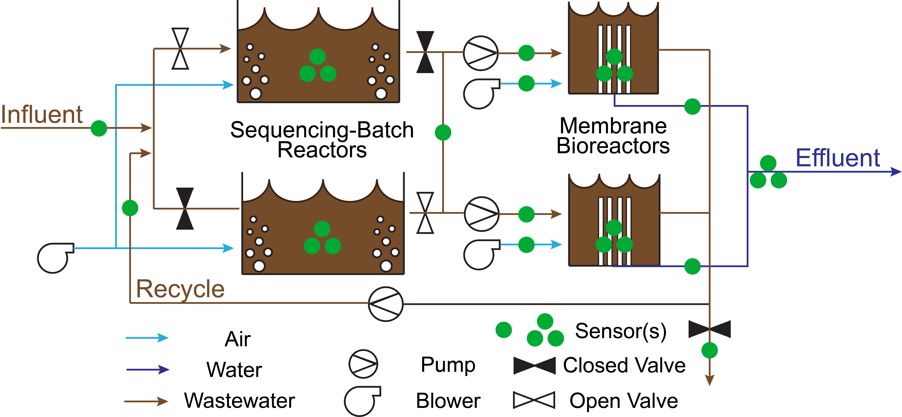
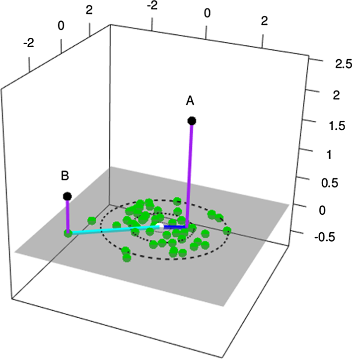

```{r setup, include=FALSE}
#setwd("C:\\Users\\kbnewhart\\Dropbox\\Code\\Fault detection\\R\\clean")
knitr::opts_chunk$set(
	fig.align = "center",
	fig.fullwidth = TRUE,
	fig.path = "figures/",
	fig.width = 6.5,
	message = FALSE,
	warning = FALSE,
	dpi = 600,
	include = FALSE
)
sapply(list.files(path="src", full.names=TRUE), source)
```

```{r Load and format raw data}
library(xts)
if(!("rawData.RData" %in% list.files("results"))) {
  dataLocation <- "C:/Users/kbnewhart/Dropbox/Data/MP_SBMBR_data/LogAllData/"
  rawData <- loadandcleanDBF(dataLocation)
  rawData <- xts(rawData[,-1], order.by = rawData[,1])
  save(rawData, file="results/rawData.RData")
} else {
  load("results/rawData.RData")
}
```


```{r upper and lower control limits, echo=FALSE}
load("results/rawData.RData")

# For testing, let's make this dataset smaller
rawData <- rawData["2016-11-04/2016-11-10"]

# Do not include observations when the system is offline
rawData <- rawData[which(rawData[,"MBR_1\\CURRENT_STATE"]==1),]
rawData <- rawData[which(rawData[,"MBR_1\\CURRENT_MODE"]==1),]
rawData <- rawData[which(rawData[,"MBR_2\\CURRENT_STATE"]==1),]
rawData <- rawData[which(rawData[,"MBR_2\\CURRENT_MODE"]==1),]
rawData <- rawData[which(rawData[,"MBR\\CURRENT_FLUX_MODE"]==0)]
rawData <- rawData[which(rawData[,"BIO_1\\CURRENT_PHASE"]>0),]
rawData <- rawData[which(rawData[,"BIO_2\\CURRENT_PHASE"]>0),]


# Only monitor process variables
processData <- rawData[,which(colnames(rawData) %in% c(varsBR, varsMT))]
processData <- processData[,-(which(colnames(processData) %in% c(stateVarsBR, stateVarsMT)))]

# Training window timeframe
rollingWindow <- 1 # days

# Find start and end of training periods
start <- sapply(index(processData[paste0(index(processData)[1]+rollingWindow*60*60*24,"/")]), function(x) {
  n <- tail(which(index(processData)<=(x-rollingWindow*60*60*24)), n=1)
  if(length(n)==0) NA
  if(length(n)>0) n
})
end <- sapply(index(processData[paste0(index(processData)[1]+rollingWindow*60*60*24,"/")]), function(x) {
  n <- tail(which(index(processData)<x), n=1)
  if(length(n)==0) NA
  if(length(n)>0) n
})
test <- end+1

# Calculate upper and lower control limits
avg.ls <- do.call("rbind", lapply(1:length(test), function(x) apply(processData[start[x]:end[x],],2,mean)))
sd.ls <- do.call("rbind", lapply(1:length(test), function(x) apply(processData[start[x]:end[x],],2,sd)))
ucl.ls <- avg.ls+3*sd.ls
lcl.ls <- avg.ls-3*sd.ls

# Determine which obs are IC
library(data.table)
results.ls <- matrix(data=NA, nrow=length(test), ncol=ncol(processData))
for(i in 1:length(test)) {
  results.ls[i,] <- between(processData[test[i],], lcl.ls[i,], ucl.ls[i,]) 
}
oc.col <- unique(ceiling(which(!results.ls) / nrow(results.ls)))
ob.obs <- unique(which(!results.ls) %% nrow(results.ls))
if(0 %in% ob.obs) ob.obs[which(ob.obs==0)] <- nrow(results.ls)
ob.obs <- sort(ob.obs)

for(i in oc.col) {
  par(mfrow=c(1,2), xpd=TRUE)
  y <- c(as.numeric(processData[,i]), 
         as.numeric(ucl.ls[,i]), 
         as.numeric(lcl.ls[,i]))
  plot(as.zoo(processData[,i]), type="p", pch=20, ylab="", xlab="", ylim=c(min(y), max(y)))
  points(as.zoo(as.xts(ucl.ls[,i],order.by=index(processData)[test])), col="blue", pch=20) 
  points(as.zoo(as.xts(lcl.ls[,i],order.by=index(processData)[test])), col="blue", pch=20)
  points(as.zoo(as.xts(avg.ls[,i],order.by=index(processData)[test])), col="green", pch=20)
  
  hist(as.numeric(processData[,i]), main="", xlab="")
  abline(v=mean(avg.ls[,i]), col="green", lwd=4, xpd=FALSE)
  mtext(colnames(processData)[i], side=3, line=-1, outer = TRUE, font=2)
}
 
```

```{r Do we need a BoxCox Transfomration, eval=FALSE, include=FALSE}
results.ls <- list()
for(col in 1:ncol(processData)) {
  y <- processData[,col]
  if(length(which(y<=0))>0) {y <- y+abs(min(y));y <- y+sort(unique(y))[2]} # add to all values if any values are <=0
  lambda.ls <- list()
  for(lambda in seq(-5,5,by=0.5)) {
    lambda.ls[[length(lambda.ls)+1]] <- lapply(y, function(Y) (Y*lambda - 1)/(lambda*(exp(mean(log(y))))^(lambda-1)))
  }
  
  mov.range.ls <- list()
  for(lambda in 1:length(lambda.ls)) {
    mov.range <- matrix(data=NA, nrow=nrow(lambda.ls[[lambda]][[1]])-1, ncol=1)
    for(i in 2:nrow(lambda.ls[[lambda]][[1]])) {
      mov.range[i-1] <- abs(as.numeric(lambda.ls[[lambda]][[1]][i])-as.numeric(lambda.ls[[lambda]][[1]][i-1]))
    }
    mov.range.ls[[length(mov.range.ls)+1]] <- mov.range
  }
  
  r.bar.ls <- lapply(mov.range.ls, mean)
  
  sigma.ls <- lapply(r.bar.ls, function(x) x/1.128)
  
  plot(y=unlist(sigma.ls), x=seq(-5,5,by=0.5), ylab="Sigma", xlab="Lambda", main=colnames(processData)[col])
  
  results.ls[[length(results.ls)+1]] <- matrix(c(seq(-5,5,by=0.5), unlist(sigma.ls)), ncol=2)
}
```

```{r Transform some vars using BoxCox, eval=FALSE, include=FALSE}
# Which variables could benefit from boxcox transfomration
cols2transform <- which(lapply(lapply(results.ls, function(x) which(x[,2]<=(min(x[which(is.finite(x[,2])),2])+10^-3))), length)==1)
colnames(processData)[cols2transform]
transformedData <- list()
for(col in cols2transform) {
  y <- processData[,col]
  if(length(which(y<=0))>0) {y <- y+abs(min(y));y <- y+sort(unique(y))[2]} # add to all values if any values are <=0
  lambda.ls <- list()
  for(lambda in seq(-10,10,by=0.1)) {
    lambda.ls[[length(lambda.ls)+1]] <- lapply(y, function(Y) (Y*lambda - 1)/(lambda*(exp(mean(log(y))))^(lambda-1)))
  }
  
  mov.range.ls <- list()
  for(lambda in 1:length(lambda.ls)) {
    mov.range <- matrix(data=NA, nrow=nrow(lambda.ls[[lambda]][[1]])-1, ncol=1)
    for(i in 2:nrow(lambda.ls[[lambda]][[1]])) {
      mov.range[i-1] <- abs(as.numeric(lambda.ls[[lambda]][[1]][i])-as.numeric(lambda.ls[[lambda]][[1]][i-1]))
    }
    mov.range.ls[[length(mov.range.ls)+1]] <- mov.range
  }
  
  r.bar.ls <- lapply(mov.range.ls, mean)
  
  sigma.ls <- lapply(r.bar.ls, function(x) x/1.128)
  
  lambda <- seq(-10,10,by=0.1)[which(unlist(sigma.ls)==min(unlist(sigma.ls[is.finite(unlist(sigma.ls))])))]
  
  plot(as.zoo(y^lambda), main=colnames(processData)[col], type="p", pch=20, log="y")
  
  transformedData[[length(transformedData)+1]] <- y^lambda
}

transformedData <- do.call("cbind", transformedData)

# Calculate upper and lower control limits
avg.trans.ls <- do.call("rbind", lapply(1:length(test), function(x) apply(transformedData[start[x]:end[x],],2,mean)))
sd.trans.ls <- do.call("rbind", lapply(1:length(test), function(x) apply(transformedData[start[x]:end[x],],2,sd)))
ucl.trans.ls <- avg.trans.ls+3*sd.trans.ls
lcl.trans.ls <- avg.trans.ls-3*sd.trans.ls


for(i in 1:ncol(transformedData)) {
  par(mfrow=c(1,2), xpd=TRUE)
  y <- c(as.numeric(transformedData[,i]), 
         as.numeric(ucl.trans.ls[,i]), 
         as.numeric(lcl.trans.ls[,i]))
  plot(as.zoo(transformedData[,i]), type="p", pch=20, ylab="", xlab="", ylim=c(min(y), max(y)))
  points(as.zoo(as.xts(ucl.trans.ls[,i],order.by=index(processData)[test])), col="blue", pch=20) 
  points(as.zoo(as.xts(lcl.trans.ls[,i],order.by=index(processData)[test])), col="blue", pch=20)
  points(as.zoo(as.xts(avg.trans.ls[,i],order.by=index(processData)[test])), col="green", pch=20)
  
  hist(as.numeric(transformedData[,i]), main="", xlab="")
  abline(v=mean(avg.trans.ls[,i]), col="green", lwd=4, xpd=FALSE)
  mtext(colnames(transformedData)[i], side=3, line=-1, outer = TRUE, font=2)
}
```


```{r}
# Load in raw data
load("results/rawData.RData")

# For testing, let's make this dataset smaller
rawData <- rawData["2016-11-04/2016-11-10"]

# Only monitor process variables
processData <- rawData[,which(colnames(rawData) %in% c(varsBR, varsMT))]
processData <- processData[,-(which(colnames(processData) %in% c(stateVarsBR, stateVarsMT)))]

# Training window timeframe
rollingWindow <- 1 # days

# State information
stateData <- rawData[,which(colnames(rawData) %in% c(stateVarsBR, stateVarsMT))]

unique(apply(stateData,1,paste,collapse=""))
# There are 164 "state" combinations when you include the BR and MT

unique(apply(stateData[,stateVarsBR],1,paste,collapse=""))
# There are 16 "state" combination when you include just the BR

unique(apply(stateData[,stateVarsMT],1,paste,collapse=""))
# There are 44 "state" combination when you include just the MT

stateData <- cbind("BR.State"=apply(stateData[,stateVarsBR],1,paste,collapse=""),
                   "MT.State"=apply(stateData[,stateVarsMT],1,paste,collapse=""))

```

```{r}
allStates <- stateData[,2] #MT
for(col in which(colnames(processData) %in% varsMT)) {
  for(state in unique(allStates)) {
    if(length(which(allStates==state))<35) next
    possibleError <- tryCatch({
      fitDist(as.numeric(processData[which(allStates==state),col]), k = 2)
      print("All is well")
    }, error=function(e) e)
    
    if(inherits(possibleError, "error")) next
    
    par(mar=c(3,3,3,0))
    fit <- fitDist(as.numeric(processData[which(allStates==state),col]), k = 2)
    print(summary(fit))
    histDist(as.numeric(processData[which(allStates==state),col]), family=fit$family[1], 
             main=paste(colnames(processData)[col], state), xlab="", ylab="")
  }
}


```


`r fig<-0;tab<-0`

**Abstract**

Fault detection in wastewater treatment plants (WWTP) is currently reliant on operator-determined thresholds, which limits detection to faults that have already impacted the treatment process. The ability of statistical process control methods, like principal component analysis (PCA), to monitor the relationships between variables provides an additional layer of monitoring not achieved by the current fault detection paradigm. However, many traditional statistical analysis methods cannot be directly applied due to many unique features of WWTP data including non-stationarity, autocorrelation, and co-correlation. To account for these features, a modified version of PCA that includes adaptive, dynamic, and multistate adaptations is proposed to detect faults in a decentralized municipal WWTP with biological and membrane treatment units. False alarm rate and time-to-detection are used to compare different PCA configurations in order to identify best practices for implementation at WWTP. 

**Highlights**


**Keywords**

1. wastewater treatment
2. statistical process control
3. principal component analysis
4. membrane treatment
5. activated sludge

**Abbreviations**

AD-PCA. Adaptive-dynamic principal component analysis  
ARL. Average run length  
DO. Dissolved oxygen  
FDR. False-detection rate  
FICR. False-in-control rate  
IC. In-control  
MBR. Membrane bioreactor  
MSAD-PCA. Multistate adaptive dynamic principal component analysis  
OC. Out-of-control  
PC. Principal component  
PCA. Principal component analysis  
RAS. Return activated sludge  
SB-MBR. Sequencing-batch membrane bioreactor  
SBR. Sequencing-batch reactor  
SCADA. Supervisory control and data acquisition  
*SPE*. Squared prediction error  
SSAD-PCA. Single-state adaptive dynamic principal component analysis  
*T^2^*. Hotelling’s *T^2^*  
TMP. Transmembrane pressure  
TSS. Total suspended solids  
UF. Ultrafiltration  
WTP. Water treatment plants  
WWTP. Wastewater treatment plants  

# Introduction 

Effective municipal water and wastewater treatment is imperative to protecting the environment and the health of consumers. While treatment technologies themselves have improved over the past few decades, control is still archaic; heavily reliant on human operators to detect and respond to faults. Precision process control can help water treatment plants (WTP) and wastewater treatment plants (WWTP) achieve their effluent quality goals (e.g., regulated nutrient limits) in a cost-effective and reliable manner. A fault could be caused by something as simple as inefficient equipment performance or as severe as a process failure. However, most treatment facilities are monitored and controlled by standard supervisory control and data acquisition (SCADA) systems that use operator-determined upper and lower limits for monitoring individual process variables. Single-variable limits are established based on operator experience and are inherently limited in their capacity to detect process abnormalities or faults prior to system failure. This is due to the variety of operating and environmental conditions experienced at WTP and WWTP throughout the year. Additionally, the multivariate nature of treatment processes weaken the single-variable monitoring paradigm because of the correlation between certain process variables. In these cases, a wider range of static process limits are required to accommodate all “normal” operating conditions. While single-variable setpoints have a low false alarm rate (i.e., if a process variable is measured below an operator setpoint, a failure involving that particular variable has most likely occurred), this approach limits process monitoring and fault detection to substantial disturbances of a single, monitored variable. To consistently meet effluent quality standards at minimum cost, more advanced process control and monitoring methods need to be integrated into WTP and WWTP to avoid costly process disturbances.

Statistically-derived process limits are one advanced monitoring approach that can be used for early fault detection in industrial applications [@kourti1996; @macgregor1995]. Using previously collected data, normal operating conditions (i.e., in-control (IC) conditions) can be defined. By comparing current observations to the previously collected data, abnormal (i.e., out-of-control (OC) conditions) can be identified. However, there are multiple methods of calculating these statistical thresholds, and not all methods can be directly applied to data collected from WTP and WWTP.
Data produced in WTP and WWTP frequently have missing values, contain outliers, and exhibit interdependent, nonlinear, and nonstationary behavior [@banadda2011; @olsson2005; @rosen2001]. Hence, describing the treatment process using strictly mathematical models (e.g., activated sludge models, first order disinfection kinetics) is often insufficient for early fault detection [@durrenmatt2012]. It is also inappropriate to apply most standard statistical methods to WTP and WWTP data because the data are not normally distributed. Changing influent quality and quantity, temperature, internal shifts in microbial ecology, and process control instability are a few causes of the observed non-normal behavior. Without knowledge of how the data are distributed, it is difficult to make inferences about IC or OC conditions. 

Many statistical process control methods have been applied to WTP and WWTP including control charts [@alves2013; @corominas2011; @rosen2003; @wold1994] and partial least squares [@choi2005; @qin2012]. The primary tool used in this work is principal component analysis (PCA); a widely used statistical method to pre-process data in order to monitor multiple variables simultaneously [@jackson1991]. PCA monitors the relationships between variables rather than the variables themselves; identifying independent, linear combinations of principal components (PCs) to capture as much variation in the data as possible while eliminating noise and redundancy [@wise1996]. Some applications of PCA in WTP and WWTP include exploratory data analysis, fault detection [@king2006], data reconstruction [@lee2006a; @schraa2006], variable reduction for multiple regression models [@wallace2016; @wang2017], and microbiological sample analysis [@jalowiecki2016]. 

Within a short period of time, data can be assumed to have a constant mean (i.e., stationary). Updating only the most recent data (as opposed to all historical observations) is called an *adaptive* modification. Adaptive PCA is the most popular extension of PCA for WTP and WWTP monitoring [@baggiani2009; @kazor2016; @lee2004a; @rosen2001]. Adaptive PCA updates the PCA model based on a “rolling window” of training observations. However, the effectiveness of adaptive PCA is sensitive to the size of the training window. If the training window is too large, faults could be ignored because there is too much variation or error in the training dataset [@baggiani2009]. If the training window is too small, normal observations could be flagged as faults because an insufficient amount of variation is included in the training dataset [@rosen2001].

To account for autocorrelation (i.e., relationship of a variable to its previous value), a *dynamic* modification duplicates a variable in a dataset and lags it by a set number of timesteps [@ku1995]. Autocorrelation plots are valuable tools in this instance for identifying the strongest correlation between present and previous timesteps of an individual variable. Dynamic PCA is another common extension of PCA for monitoring WTP and WWTP [@lee2006a; @lee2006b; @mina2007]. By including lagged observations (i.e., duplicating a variable and shifting observations back a certain number of timesteps that best represents the time-dependent nature of the process), the dynamic PCA extension accounts for autocorrelation among variables [@kruger2004; @ku1995]. For most WTP and WWTP applications, a lag of a single-timestep is sufficient [@kazor2016].

Previous work combined PCA extensions to monitor a decentralized municipal WWTP using adaptive-dynamic PCA (AD-PCA). Kazor et al. [-@kazor2016] evaluated a pH fault in the biological WWTP used in this work, caused by a seasonal change of influent water quality, and found that AD-PCA performed much better than conventional PCA at detecting the pH change. Additionally, AD-PCA was able to capture nonlinear process behavior as well as nonlinear dimension reduction approaches (e.g., kernel PCA, locally linear embedding), which are more computationally intense, and that the use of non-parametric thresholds greatly reduced false alarm rate. Odom et al. [-@odom2018]  further improved the AD-PCA paradigm by incorporating “state” information. A “state” is defined as a set of operating parameters that produce unique conditions. At a WTP or WWTP, this is representative of how a process is being operated (i.e., recycle streams, process setpoints). Statistically, this manifests as different covariance matrices. In the case of Odom et al. [-@odom2018] PCA models were built for different states of blower operation. In an activated sludge WWTP, many monitored process variables (e.g., dissolved oxygen or DO) change depending on whether the conditions are aerobic or anaerobic (e.g., whether the air blower is on or off). By applying AD-PCA to different operating states (i.e., multistate AD-PCA or MSAD-PCA), as opposed to all data, the same pH fault evaluated by Kazor et al. [-@kazor2016] was detected more quickly and consistently.

In this work, Kazor et al. [-@kazor2016]’s single-state AD-PCA (SSAD-PCA) and Odom et al [-@odom2018]’s MSAD-PCA is used to continuously monitor the decentralized municipal WWTP for a variety of fault scenarios, beyond the pH fault. Section 2 describes the specific WWTP, AD-PCA, and a generalized analysis approach for each case study. Section 3 compares the traditional, single-variable fault detection paradigm to SSAD-PCA and MSAD-PCA at the WWTP. Section 4 details how the results from each case study are interpreted, and Section 5 provides lessons learned from this work and suggestions for how to best implement AD-PCA at municipal WTP and WWTP.

# Materials and methods

## Wastewater treatment facility

The sequencing-batch membrane bioreactor (SB-MBR) at the Mines Park student housing complex (Colorado School of Mines, Golden, CO) is a coupled activated sludge and membrane system treating municipal wastewater produced by the residents of Mines Park (Figure `r fig<-fig+1;sbmbr.flow<-fig;sbmbr.flow`). The Mines Park research site intercepts the municipal sewer line and diverts raw sewage to a 2,500-gal (9.5 m^3^) underground holding tank where the contents are withdrawn hourly in batch sizes of 324 gal by a submerged grinder pump. Influent is screened (2 mm) before being fed into one of two 4,500-gal (17 m^3^) sequencing-batch reactors (SBRs). The SBRs operate in alternating 2-hour cycles where screened sewage is added, the mixture of sewage and activated sludge is exposed to a combination of aeration conditions in order to remove chemical and biological constituents of interest, and the treated water is separated from the biologically-active solids. In traditional SBRs, the solid-liquid separation phase is achieved using gravity separation. The settled solids that are returned to the SBR are referred to as return activated sludge (RAS) and is measured as a concentration of total suspended solids (TSS). At the Mines Park facility, solid-liquid separation is achieved using ultrafiltration (UF) in the membrane bioreactors (MBRs). The PURON® hollow-fiber UF membranes (Koch Membrane Systems, Inc., Wilmington, Massachusetts) used have a nominal pore size of (i.e., remove contaminants greater than) 0.03 µm. The UF permeate is used for a variety of research purposes including potable and non-potable water reuse [@prieto2013].

<center>

</center>

[Figure `r sbmbr.flow`. Process flow diagram of the SB-MBR integrated system, visualizing gas, liquid, and solid streams as well as the locations of where real-time process measurements are taking place. A single dot indicates one variable where multiple dots indicate multiple variables being measured.]{custom-style="Figure-Label"}

The SB-MBR is controlled and monitored using a SCADA system that collects data from a variety of sensors and controls at high frequency. The data is then saved at a user-defined 1-minute interval (Table `r tab<-tab+1;collected.data<-tab;collected.data`). Water quality measurements are made once a week using 24-hour time composite samples of the influent and effluent. Due to the nature of decentralized systems serving seasonal communities, the influent water quality can be highly variable and affect removal of certain contaminants. For example, at Mines Park, most tenants are undergraduate students whom vacate during holidays and summer months. Hence, decentralized facilities need to closely monitor and respond to process changes caused by a changing influent or other process modifications to prevent failure (i.e., no or impaired contaminant removal). In this work, faults that occurred in the SB-MBR are used as case studies for a fault detection system designed to provide WWTP operators with advance notice of a process change or failure. 

[Table `r collected.data`. Monitored SB-MBR process variables. Variables are indicated as either state variables (indicate how a process is being operated, e.g., blower is on or off) or process variables (sensor measurements used to monitor or control a process). Variables are only included in the AD-PCA model if they directly measure a unit process, indicated here by the SBR-only, MBR-only, or both SBR and MBR AD-PCA models.]{custom-style="Figure-Label"}

```{r Table of collected data}
library(knitr)
table.data <- read.csv("data/table_collected_data.csv", row.names=1, stringsAsFactors=FALSE)
colnames(table.data) <- c("Monitored Variable", "State (S) or Process (P)", "SBR or MBR Subsystem")
kable(table.data, row.names=TRUE, align=c('l','c','c'))
```


## Fault events and testing

Two categories of testing were performed, differentiated by the absence or presence of OC observations in the training dataset:  

* *Ideal*: The initial widow of time used for training includes only IC observations, as initially identified by WWTP operators. The PCA model is tested for various durations (depending on the continuous length of time until the number of sequential OC observations was equal to 24 hours training or 1440 observations). The goal of the continuous testing is to calculate bulk fault detection metrics to compare overall performance of each method.

* *Non-ideal*: A  major fault is identified by operators and PCA models are compared by their ability to adequately alert operators of OC conditions. Due to a lack of  totally IC conditions prior to the events, the training data includes some OC observations. The model is allowed to completely update (e.g., if initially trained on 3 days of observations, model is tested and re-trained on a total of 3 more days of observations) prior to the fault date. The goal of the non-ideal testing is to determine which method is able to overcome inherent inaccuracies and OC conditions at WWTP.

The faults tested in both the ideal and non-ideal approaches are outlined below.

###	Pump failure
Raw wastewater enters the Mines Park WWTP via an interceptor to the municipal sewer. Sewage flows by gravity to a holding tank where a submerged pump provides hourly batches of wastewater to the SBRs. In this event, the interceptor pipe was clogged and flow to the holding tank stopped. The level in the holding tank declined each time a new batch was pumped to the SB-MBR until the previously-submerged pump was exposed, causing the pump to overheat and shutdown each time it attempted to pump a new batch of wastewater to the SB-MBR. The SB-MBR continued to treat water present in the system despite not receiving any influent, albeit at a slower rate due to the lower batch size (as the level in the SBRs is used to calculate the MBR production rate). The first system alarm was triggered when the levels in the SBRs dropped below an operator threshold, which is the lowest level that the SBR should be operated. Due to a recent change in operating conditions, critical alarm levels were not adjusted to the new 6 ft SBR limit, and operators were not notified by the SCADA system until the SBR levels dropped below the previously used alarm level of 5 ft. 

###	Change to influent quality
The SB-MBR is designed to remove grit, suspended solids, organic compounds, and nutrients through a combination of physical, chemical, and biological reactions. However, the SB-MBR is not designed to removed dissolved solids (i.e., salts) and an indication of a changing influent water quality is a temporary increase in dissolved solids concentration of the permeate which is measured using electrical conductivity. In most cases, this change affects additional process variables that are otherwise unexplained such as DO in the SBRs and permeate turbidity in the MBR. 

###	Influent overdose
During routine maintenance, the influent pump to the SB-MBR was left in the manual position by an inexperienced operator. The addition of excess raw wastewater caused a shift fault in SBR level and total suspended solids (TSS) concentration, but was not detected by operators until a high-level threshold was exceeded in the SBRs. In conventional WWTP that rely on gravity for clarification, a substantial shift in TSS could impact settling and the quality of the product water.  Since the Mines Park WWTP uses membranes for solid-liquid separation, solids are retained within the system and can quickly recover from the TSS shift. However, transmembrane pressure (TMP) in the MBR is dependent on TSS and flowrate. TMP may temporarily decrease when TSS declines, but TMP will increase with the need to increase flowrate to treat the additional volume in the bioreactor. 

###	Sensor faults
In the event of a power surge, re-calibration, cleaning, or position adjustment, online sensors can exhibit a brief spike in measurements. During preliminary data analysis for engineering design, it is critical to detect and remove these abnormal values before using the data to estimate average and peak flows and mass loading (e.g., nutrients, TSS).  Manually removing these values is time consuming and often skews the data by removing all values above and below visually-determined (from time-series plots) thresholds. 

## Statistical process control
### Principal component analysis
PCA is a linear transformation process that identifies a data subspace representing the optimal correlation between process variables. Every process variable is first centered to zero mean and scaled to unit variance in order to standardize the comparison among variables of different units and operating ranges. The covariance matrix is calculated from the scaled data and singular value decomposition is performed to calculate the eigenvalues and eigenvectors. The eigenvectors are the PCs of the model and the eigenvalues represent the amount of variation captured by the associated PC.

The subspace defined by the PC loadings (i.e., PCA model) indicates the direction in which the data varies the most. The first PC captures the most variability, the second PC captures the second most variability independent of the first, etc. By capturing the linear relationships among variables in each component, the original dataset can be reduced to contain fewer dimensions. The number of PCs is selected based on the desired percent of variability to be captured by the PCA model (90% here). PCA retains the information provided by each observation in a lower-dimensional space, which can reduce computational time for data analysis and reduce noise for fault detection. A more detailed description of how to apply and interpret PCA can be found in Jackson [-@jackson1991] and Pankavich and Swanson [-@pankavich2015].

### Monitoring statistics and thresholds
When defining a PCA model, a dataset that is known to be fault-free is usually used as the model subspace should represent IC conditions. By plotting new observations in the PCA subspace, a process is considered IC if the observations are within a certain distance from the model subspace. Two measures of distance from the PCA model are the squared prediction error (*SPE*) and Hotelling’s *T^2^*. *T^2^* is a measure of where an observation is within the PCA model; whereas *SPE* is a measure of variation that is not captured by the model (Figure `r fig<-fig+1;kazor.fig<-fig;kazor.fig`). If an observation’s *SPE* or *T^2^* is above the calculated threshold, it is flagged as abnormal. Due to noise and missing data, even in an IC process, multiple sequential observations must be flagged to consider that the process is truly OC. In this work, 5 sequential observations must be above the *T^2^* or *SPE* threshold to trigger an alarm.

<center>

</center>

[Figure `r kazor.fig`. Three-dimensional observations (black) are plotted in their two-dimensional PCA model (green). Observation **A** plotted in the model subspace has a large *SPE* and a small *T^2^* compared to observation **B**, which has a small *SPE* but large *T^2^*. Adopted from Kazor et al. [-@kazor2016]]{custom-style="Figure-Label"}

The conventional method of calculating thresholds for *SPE* and *T^2^* makes assumptions about the distribution of the IC data. However, data produced in WTP and WWTP rarely fit any one distribution [@berthouex1989]. Following Odom et al. [-@odom2018], we calculate nonparametric (i.e., distribution-free) thresholds (Chen et al., 2016; Qiu and Li, 2011) via kernel density estimation with a Sheather-Jones bandwidth  and a Gaussian kernel (Sheather, 2009). A threshold is made more or less strict by decreasing or increasing the α value, respectively. α is defined as the probability that an IC observation will be flagged as an OC observation. If α is too high, then faults could be missed. If α is too low, then the false alarm rate could be high. An α = 0.01 is used for this work.

### Adaptive-dynamic extensions
Kazor et al. [-@kazor2016] found that AD-PCA is capable of overcoming some of the limitations found in WWTP (e.g., nonlinearity, nonstationary, autocorrelation). The adaptive modification uses a “rolling window” of time over which process variables can be assumed to be linearly-related and stationary. Only IC observations are used to update the model as the “window” of time moves forward, and the oldest observations are forgotten (i.e., removed from the training dataset). The dynamic modification accounts for autocorrelation by including a lagged copy of each variable (i.e., 1-lag includes the previous observation and the current observation), doubling the size of the dataset but not the number of PCs (i.e., dimension of the PCA model).

### Multistate extension
In Kazor et al. [-@kazor2016], all past observations were included in the PCA model in a SSAD-PCA configuration. MSAD-PCA repeats the AD-PCA process for each set of operating conditions that may have different relationships among variables. For example, the relationship between TMP and flow through the membranes is entirely dependent on whether the membrane is permeating, backwashing, or undergoing a chemical clean. In MSAD-PCA, an AD-PCA model is constructed for each set to achieve greater precision in the covariance matrix than if all of the sets were aggregated.

Odom et al. [-@odom2018] investigated MSAD-PCA for a pH fault in the SB-MBR including information about whether a blower was on or off. Odom et al. concluded that given the large number of potential states, states should only be included that have at least $p^2/2$ observations (where $p$ is the number of process variables). Additionally, Odom et al. [-@odom2018] recommended only including states that are representative of normal function. For example, a state occurring 1% of the time would be considered too infrequent to be included. In this work, each unique combination of 11 state variables (Table `r collected.data`) is considered a “state.” If the number of observations for a state is less than $p^2/2$, then it is not used in the MSAD-PCA monitoring scheme.

While Odom et al. [-@odom2018] only examined states relative to the function of two air blowers, this work considers all possible equipment and process configurations to define states. Some state variables are binary (e.g., air blower is off, represented by 0, or on, represented by 1) but some can take on more than two values (e.g., bioreactor phase is either 1 for fill, 2 for react, 3 for recirculation with MBR, or 0 for offline). To further improve results, the SBR and MBR are treated separately. Combinations of 4 state variables for the SBR and 7 state variables for the MBR are used (Table `r collected.data`).

## Fault detection metrics

[Klanderman et al. (2019)]{custom-style="Notes"} describe multiple measures of evaluating fault detection methods. For each study, we use the true and false detection rates which quantify a method’s ability to currently identify IC and OC conditions. Here, an “alarm” is defined as three consecutive OC observations for a particular method.  The true detection rate (TDR) is the total number of true alarms (i.e., alarmed OC observations) divided by the total number of OC observations. The false-detection rate (FDR) is calculated by dividing the number of false alarms (i.e., alarmed IC observations) by the total number of IC observations. The OC period is assessed by a method’s time-to-detection (TTD): the time between when a fault occurs and when an alarm is signaled. Each method’s TTD is compared to the TTD for the Mines Park facility’s build-in alarm system that uses single-variable monitoring with operator determined setpoints (i.e., SCADA system). If TTD is positive, it indicates that the *T^2^* or *SPE* alarm predicted the fault prior when operator’s identified it. If the TTD is negative, it indicates that the *T^2^* or *SPE* alarm detected the OC conditions after the fault.

##	Case study procedure

```{r Method SPE & T^2^ threshold calculation, include=FALSE}
# Function that takes in all data, 
# separates it into train/test, and
# calculates SPE/T2/thesholds

# TRAIN AND TEST 

# Function that take in the dates to test, 
# compiles raw data, and executes the
# train.and.test function for all 
# rolling window sizes and metrics

compile.results <- function(rollingWindowDays=c(3,5,7,9,11), dayOne, daysToTest, dynamic=TRUE, adaptive=TRUE) {
  require(lubridate)
  require(xts)
  # Load functions required to process raw DBF files
  invisible(sapply(paste0("src/",c(list.files(path="src/",pattern="DBF"),"setDates.R")), source)) 
  # For SPE / T2 / SPE+T2
  metric.results <- list()
  for(alarm.metric in c(1,2,3)) {
  # Compile, calculate, save each training window size
  all.results <- list()
  for(i in 1:length(rollingWindowDays)) {
    test.results <- list()
    rawData <- loadandcleanDBF(dataLocation, dayOne[i]+daysToTest[i], daysToTest[i])
    rawData <- xts(rawData[,-1], order.by = rawData[,1])
    rawData <- rawData[paste("/",dayOne[i]+daysToTest[i],sep="")]
    cols.to.keep <- which(as.numeric(apply(rawData, 2, function(x) length(unique(x)))) > daysToTest[i])
    rawData <- rawData[,cols.to.keep]
    
    if(adaptive) current.test.results <- train.and.test(rawData=rawData, daysToTrain = rollingWindowDays[i], dynamic=dynamic)
    if(!adaptive) current.test.results <- train.and.test(rawData=rawData[paste0(dayOne[i]+daysToTest[i]-rollingWindowDays[i],"/")], daysToTrain = rollingWindowDays[i], dynamic=dynamic)
    
    test.results[[length(test.results)+1]] <- current.test.results
    
    if(adaptive) {
      test.data <- rawData[index(current.test.results)[which(current.test.results$Alarms != alarm.metric)]]
    newData <- rawData
      while(lubridate::floor_date(last(index(current.test.results)), "day") != dayOne[i]+daysToTest[i]) {
        newData <- newData[paste0(as.Date(first(index(newData)))+1,"/")]
        if(first(index(newData)) < first(index(test.data))) {
          newData <- rbind(newData[paste0("/",first(index(test.data))-1)],
                           test.data,
                           newData[paste0(last(index(test.data))+1,"/")])
        } else {
          newData <- rbind(test.data,
                           newData[paste0(last(index(test.data))+1,"/")])
        }
        current.test.results <- train.and.test(rawData=newData, daysToTrain = rollingWindowDays[i], dynamic=dynamic)
        test.results[[length(test.results)+1]] <- current.test.results
        test.data <- newData[index(current.test.results)[which(current.test.results$Alarms != alarm.metric)]]
      }
    }
  
    all.results[[length(all.results)+1]] <- do.call("rbind", test.results)
  }
  names(all.results) <- as.character(rollingWindowDays)
  metric.results[[length(metric.results)+1]] <- all.results
  }
  names(metric.results) <- c("SPE", "T2", "SPE_T2")  
  return(metric.results)
}

# Calculate TICR, TDR, FICR, FDR
 ic.oc.calc <- function(data, stat, oc.obs) {
    if(stat=="SPE") alarm.metric <- c(1,3)
    if(stat=="T2") alarm.metric <- c(2,3)
    if(stat=="SPE_T2") alarm.metric <- c(3)
    
    n <- grep("Alarms", colnames(data))
    normal.obs <- which(!as.numeric(data[,n]) %in% alarm.metric)
    alarmed.obs <- which(as.numeric(data[,n]) %in% alarm.metric)
    
    correct.ic <- !(normal.obs %in% oc.obs)
    correct.oc <- (alarmed.obs %in% oc.obs)
    incorrect.ic <- (normal.obs %in% oc.obs)
    incorrect.oc <- !(alarmed.obs %in% oc.obs)
    total.obs <- length(normal.obs)+length(alarmed.obs)
    
    TICR <- length(which(correct.ic))/total.obs # TICR
    TDR <- length(which(correct.oc))/total.obs # TDR
    FICR <- length(which(incorrect.ic))/total.obs # FICR
    FDR <- length(which(incorrect.oc))/total.obs # FDR
    
    # return(list(correct.ic, correct.oc, incorrect.ic, incorrect.oc, total.obs))
    return(data.frame(cbind(TICR, TDR, FICR, FDR)))
 }  
```

All data analysis is performed in the open-source statistical software R, and AD-PCA is executed using a modified version the mvMonitoring package developed by Odom et al. [-@odom2018]. To apply SSAD-PCA and MSAD-PCA to the SB-MBR data, the following procedure is followed for each case study:
1. Establish initial case study parameters (e.g., α, faults-to-trigger-alarm, state and process variables, lag-size)
2. Compile and clean raw data (e.g., remove process variables with insufficient unique observations in each state to calculate the covariance matrix and eigenvectors appropriately)
3. Train the PCA model and calculate *SPE* or *T^2^* thresholds
4. Apply the PCA model by calculating *SPE* or *T^2^* for each new observation in 1 day
5. For the adaptive PCA modification: remove observations that exceed the *SPE* or *T^2^* thresholds and remove observations from the earliest training day. Re-train the PCA model and calculate new *SPE* or *T^2^* thresholds
6. Compare the actual IC and OC observations (operator-determined) to the observations alarmed by *SPE* or *T^2^* by calculating detection rate metrics
7. Iterate through Steps 2-6 by varying case study parameters until the desired detection rate is achieved for a given dataset

AD-PCA was performed on the earliest observations in a dataset for the given number of training days (n~training~) (Step 3). Observations from the following day (day [n~training~ + 1]) are classified as IC or OC (Step 4). The training dataset is updated by removing the oldest observations (day 1) and add IC observations from day [n~training~ + 1] (Step 5). Data was compiled such that each case study dataset included [2·n~training~ + n~testing~] days, where ntesting is the number of testing days to compare (Step 2). This ensured that the final AD-PCA model used for testing would not include any of the original/first training dataset, in the event that there were OC conditions not detected by operators.

All case studies described here used the following AD-PCA parameters: PCs retained = 0.9; α = 0.01; faults-to-trigger-alarm = 3; lag-size = 1; re-trained every 1440 observations (e.g., every day at midnight for SSAD-PCA). MSAD-PCA included either SBR or MBR process variables. States were identified by concatenating state variables (Table `r collected.data`) and only retaining those with a sufficient number of observations ($p^2/2$). Additionally, variables were only included that had sufficient number of unique observations to conduct singular value decomposition for PCA (> 7, found by experimental iteration). Autocorrelation function (ACF) plots were used to identify the necessary lag for the dynamic PCA extension. For most variables, a lag of a one timestep is found to account for the most autocorrelation (see [Appendix](#appendix)).


# Results

Multiple instances of process faults occurred at the Mines Park WWTP between January 2018 and August 2018. Here, we highlight select instances to illustrate a range of different type of faults [e.g., isolated, sustained, transient, and drift faults, see @newhart2019] which have varying degrees of consequences for the operation of the SB-MBR. [For the ideal scenarios, Tables 3-5 summarize the number of observations for each study, the TDR, and the FDR. These studies are referred to as “ideal” because the largest initial training window contained no OC observations.]{custom-style="Notes"}

Table 2. Total number of observations used in the initial training and testing/re-training, and the total number of faulty observations for each study.
```{r}
# Number of training, testing, and oc/fault observations for each case study

```


```{r Run case studies, eval=FALSE, message=FALSE, warning=FALSE, include=FALSE}
# import case study constants
source("src/constants.R")
# import case study parameters
case_study_parameters <- read.csv("data/case_study_parameters.csv", stringsAsFactors=FALSE)
all.cases.list <- list()
# for(case in 1:nrow(case_study_parameters)) {
for(case in 1) {
  # Day of event/day to end on
  dayN <- as.Date(case_study_parameters[case, "dayN"])
  # Starting day
  dayOne <- dayN - 2*rollingWindowDays
  # Range of dates to compile
  daysToTest <- as.numeric(difftime(dayN, dayOne)) 
  
  # methods to use
  methods <- t(data.frame("Name"=c("PCA", "DPCA", "APCA", "ADPCA"),
                      "Adaptive"=c(FALSE, FALSE, TRUE, TRUE),
                      "Dynamic"=c(FALSE, TRUE, FALSE, TRUE)))
  all.methods.list <- list()
  for(m in 1:ncol(methods)) {
    adap <- methods[2,m]
    dyna <- methods[3,m]
    
    # Results are saved as: SPE [[1]], T2 [[2]]. and SPE+T2 [[3]]
    # and within each metric are the results by rollingWindowDays
    if(paste0("results/metric-results-",case_study_parameters[case,1],"-",methods[1,m],".RData") %in% list.dirs()) {
      load(file=list.dirs(), envir=.GlobalEnv)
    } else {
      metric.results <- compile.results(rollingWindowDays, dayOne, daysToTest, adaptive=as.logical(adap), dynamic=as.logical(dyna))
      save(metric.results, file=paste0("results/metric-results-",case_study_parameters[case,1],"-",methods[1,m],".RData"))
    }
    
    # Only look at testing day
    dayN.results <- lapply(metric.results, function(test.statistic) {
      lapply(test.statistic, function(training.window) {
        data <- training.window[paste(dayN)]
      })
    })
    ### Loop through all of the training days ###
    all.days.list <- list()
    for(days in 1:length(rollingWindowDays)) {
      for(stat in 1:length(dayN.results)) {
        oc.obs <- which(index(dayN.results[[stat]][[days]]) %within% interval(as.POSIXct(case_study_parameters[case,3]), as.POSIXct(case_study_parameters[case,4]))) 
        ic.oc.results <- data.frame(c(ic.oc.calc(data=dayN.results[[stat]][[days]], stat=names(dayN.results)[stat], oc.obs), rollingWindowDays[days], names(dayN.results[stat]), methods[1,m]), case_study_parameters[case,1])
        colnames(ic.oc.results) <- c("TICR", "TDR", "FICR", "FDR", "Days", "Statistic", "Method", "Case")
        all.days.list[[length(all.days.list)+1]] <- ic.oc.results
      }
    }
    all.methods.list[[length(all.methods.list)+1]]  <- do.call("rbind", all.days.list)
  } # each method
  all.cases.list[[length(all.cases.list)+1]] <- do.call("rbind", all.methods.list)
 } # each case study

```


```{r Run case studies 2, eval=FALSE, message=FALSE, warning=FALSE, include=FALSE}
# Plot results
rawData <- loadandcleanDBF(dataLocation, dayOne[1]+daysToTest[1], 1)
rawData <- xts(rawData[,-1], order.by = rawData[,1])
rawData <- rawData[paste("/",dayOne[1]+daysToTest[1],sep="")]
cols.to.keep <- which(as.numeric(apply(rawData, 2, function(x) length(unique(x)))) > daysToTest[1])
rawData <- rawData[,cols.to.keep]
par(mfrow=c(2,1))
plot(rawData[,"BIO_1\\LEVEL\\PROCESS_VALUE"])
plot(rawData[,"SEWAGE\\LEVEL\\PROCESS_VALUE"])
# Fault Occured, System alarm

par(mfcol=c(length(rollingWindowDays),3), mar=c(2.5,2,2.5,2.5), oma=c(2,0,2.5,0))
for(i in 1:length(rollingWindowDays)) {

plot(as.zoo(metric.results[[1]][[i]][,1]), main="SPE")
points(as.zoo(metric.results[[1]][[i]][,2]), type="l", lty=2)
alarms <- c(which(metric.results[[1]][[i]][,7] == 1),
            which(metric.results[[1]][[i]][,7] == 3))
points(index(metric.results[[1]][[i]])[alarms], y=rep(0,length(alarms)), pch=17)
par(new=TRUE)
plot(as.zoo(rawData[,"SEWAGE\\LEVEL\\PROCESS_VALUE"]), yaxt="n", xaxt="n", col="green", lty=2)
axis(side=4)
abline(v=initialFault, col="red", lty=1)
abline(v=initialAlarm, col="red", lty=2)

mtext(text=paste(names(metric.results[[1]][i]),"days"), side=3, line=2, outer=FALSE)

plot(as.zoo(metric.results[[2]][[i]][,4]), col="blue", main="T2")
points(as.zoo(metric.results[[2]][[i]][,5]), col="blue", type="l", lty=2)
alarms <- c(which(metric.results[[1]][[i]][,7] == 2),
            which(metric.results[[1]][[i]][,7] == 3))
points(index(metric.results[[2]][[i]])[alarms], y=rep(0,length(alarms)), pch=17, col="blue")
par(new=TRUE)
plot(as.zoo(rawData[,"BIO_1\\LEVEL\\PROCESS_VALUE"]), yaxt="n", xaxt="n", col="green", lty=2)
axis(side=4)
abline(v=initialFault, col="red", lty=1)
abline(v=initialAlarm, col="red", lty=2)

plot(as.zoo(metric.results[[3]][[i]][,1]), main="SPE & T2")
points(as.zoo(metric.results[[3]][[i]][,4]), col="blue", type="l")
points(as.zoo(metric.results[[3]][[i]][,2]), type="l", lty=2)
points(as.zoo(metric.results[[3]][[i]][,5]), col="blue", type="l", lty=2)
alarms <- which(metric.results[[1]][[i]][,7] == 3)
points(index(metric.results[[3]][[i]])[alarms], y=rep(0,length(alarms)), pch=17, col="purple")
abline(v=initialFault, col="red", lty=1)
abline(v=initialAlarm, col="red", lty=2)

mtext(text="Pump failure", side=3, line=1, outer=TRUE, font=2)
mtext(text="Time", side=1, line=.5, outer=TRUE, font=2)
}

# Calculate metrics
```


# Appendix {#appendix}
## Timeseries
`r app.fig <- 0`
```{r Timeseries of pump failure, fig.height=1.5}
# import case study constants
source("src/constants.R")
source("src/graph_rawData.R")
# Load functions required to process raw DBF files
invisible(sapply(paste0("src/",c(list.files(path="src/",pattern="DBF"),"setDates.R")), source))
# import case study parameters
case_study_parameters <- read.csv("data/case_study_parameters.csv", stringsAsFactors=FALSE)
case <- 1
# Day of event/day to end on
dayN <- as.Date(case_study_parameters[case, "dayN"])
# Starting day
dayOne <- dayN - 2*rollingWindowDays
# Range of dates to compile
daysToTest <- as.numeric(difftime(dayN, dayOne)) 
rawData <- loadandcleanDBF(dataLocation, dayOne[which(max(daysToTest)==daysToTest)]+daysToTest[which(max(daysToTest)==daysToTest)], daysToTest[which(max(daysToTest)==daysToTest)])
rawData <- xts(rawData[,-1], order.by = rawData[,1])
rawData <- rawData[paste("/",dayOne[which(max(daysToTest)==daysToTest)]+daysToTest[which(max(daysToTest)==daysToTest)],sep="")]
cols.to.keep <- which(as.numeric(apply(rawData, 2, function(x) length(unique(x)))) > daysToTest[which(max(daysToTest)==daysToTest)])
rawData <- rawData[,cols.to.keep]
graph_rawData(rawData)
```
[Figure `r app.fig<-app.fig+1;app.fig`. Pump failure timeseries]{custom-style="Figure-Label"}


```{r Timeseries of influent change 1, fig.height=1.5}
# import case study constants
source("src/constants.R")
source("src/graph_rawData.R")
# Load functions required to process raw DBF files
invisible(sapply(paste0("src/",c(list.files(path="src/",pattern="DBF"),"setDates.R")), source))
# import case study parameters
case_study_parameters <- read.csv("data/case_study_parameters.csv", stringsAsFactors=FALSE)
case <- 2
# Day of event/day to end on
dayN <- as.Date(case_study_parameters[case, "dayN"])
# Starting day
dayOne <- dayN - 2*rollingWindowDays
# Range of dates to compile
daysToTest <- as.numeric(difftime(dayN, dayOne)) 
rawData <- loadandcleanDBF(dataLocation, dayOne[which(max(daysToTest)==daysToTest)]+daysToTest[which(max(daysToTest)==daysToTest)], daysToTest[which(max(daysToTest)==daysToTest)])
rawData <- xts(rawData[,-1], order.by = rawData[,1])
rawData <- rawData[paste("/",dayOne[which(max(daysToTest)==daysToTest)]+daysToTest[which(max(daysToTest)==daysToTest)],sep="")]
cols.to.keep <- which(as.numeric(apply(rawData, 2, function(x) length(unique(x)))) > daysToTest[which(max(daysToTest)==daysToTest)])
rawData <- rawData[,cols.to.keep]
graph_rawData(rawData)
```
[Figure `r app.fig<-app.fig+1;app.fig`. Influent change 1 timeseries]{custom-style="Figure-Label"}

```{r Timeseries of influent change 2, fig.height=1.5}
# import case study constants
source("src/constants.R")
source("src/graph_rawData.R")
# Load functions required to process raw DBF files
invisible(sapply(paste0("src/",c(list.files(path="src/",pattern="DBF"),"setDates.R")), source))
# import case study parameters
case_study_parameters <- read.csv("data/case_study_parameters.csv", stringsAsFactors=FALSE)
case <- 3
# Day of event/day to end on
dayN <- as.Date(case_study_parameters[case, "dayN"])
# Starting day
dayOne <- dayN - 2*rollingWindowDays
# Range of dates to compile
daysToTest <- as.numeric(difftime(dayN, dayOne)) 
rawData <- loadandcleanDBF(dataLocation, dayOne[which(max(daysToTest)==daysToTest)]+daysToTest[which(max(daysToTest)==daysToTest)], daysToTest[which(max(daysToTest)==daysToTest)])
rawData <- xts(rawData[,-1], order.by = rawData[,1])
rawData <- rawData[paste("/",dayOne[which(max(daysToTest)==daysToTest)]+daysToTest[which(max(daysToTest)==daysToTest)],sep="")]
cols.to.keep <- which(as.numeric(apply(rawData, 2, function(x) length(unique(x)))) > daysToTest[which(max(daysToTest)==daysToTest)])
rawData <- rawData[,cols.to.keep]
graph_rawData(rawData)
```
[Figure `r app.fig<-app.fig+1;app.fig`. Influent change 2 timeseries]{custom-style="Figure-Label"}

